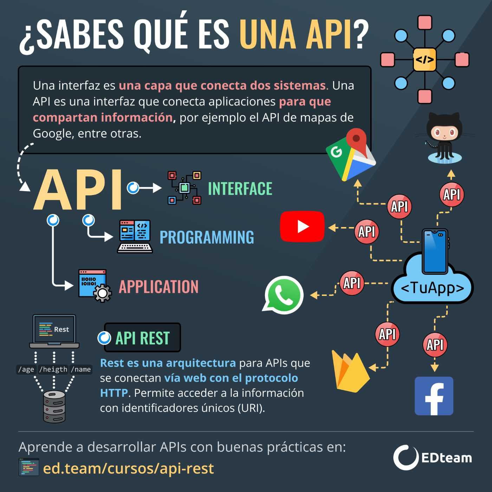

# API / Application Programming Interfaces
<p>
    
</p>

## What is a REST API
*REST APIs provide a flexible, lightweight way to integrate applications and it is the most common method for connecting components in microservices architectures*

**An API**, or *Application Programming Interface*, **is a set of rules that define how applications or devices can connect to and communicate with each other**

**A REST API is an API that conforms to the design principles of the REST** or *Representational State Transfer* architectural style

#### REST design principles
At the most basic level, **an API is a mechanism that enables an applications or service to access a resource within another application or service**. The application or service doing the accessing is called the client, and the application or service containing the resource is called the server.

Some APIs (SOAP or XML-RPC) impose a strict framework on developers. But REST APIs can be developed using virtually any programming language and support a variety of data formats. The only requirement is that they align to the following 6 REST design principles

1. **Uniform interface**: All API request for the same resource should look the same, no matter where the request comes from. The REST API should ensure that the same piece of data, such as the name or email address of an user, belongs to only one uniform resource identifier (URI)

2. **Client-server decoupling**: Client and server apps must be completely independent from each other. The only information the client application should know is the URI of the requested resource; it can't interact with the server application in any other ways. Similarly, a server application shouldn't modify the client application other than passing it to the requested data via HTTP

3. **Statelessness**: REST APIs are stateless, meaning that each request needs to include all the information necessary for processing it. REST APIs do not require any server-side sessions. Server apps aren't allowed to storey any data related to a client request

4. **Cacheability**: When possible, resources should be cacheable on the client or server side. Server responses also need to contain info about wether caching is allowed for the delivered resource. The goal is to improve performance on the client side, while increasing scalability on the server side

5. **Layered system architecture**: In REST APIs, the calls and responses go through different layers. REST APIs need to be designed so that neither the client nor the server can tell wether it communicates with the end application or an intermediary

6. **Code on demand**: This is an optional step, REST APIs usually send static resources, but in certain cases, responses can also contain executable code (Java applets). In these cases, the code should only run on-demand


# How REST APIs work
REST APIs communicate via HTTP request ot perform standard database functions like creating, reading, updating and deleting records (also known as CRUD) within a resource.

A REST API would use
- A **GET** request to retieve a record
- A **POST** request to create one
- A **PUT** request to update a record
- A **DELETE** request to delete one

All HTTP methods can be used in API calls. A well-designed REST API is similar to a website running in a web browser with built-in HTTP functionality

*The state of a resource at any particular instante or timestamp, is known as the resource representation*
This information can be delivered to a client in virtually any format including the popular JSON, HTML, XLT, Pyhton, PHP or plain text

Request headers and parameters are also important in REST API calls because they include important identifier information such as metadata, authorizations, uniform resource identifiers (URIs), caching, cookies and more
Request headers and response headers, along with conventional HTTP status codes, are used within well-designed REST APIs


## Some other concepts
### REST Client
The browser can act as an uncontrolled REST client (the website handles the browser requests).
The browser, for a long time, used an in-built function called XMLHttpRequest for all REST request.
But this was succeeded by FetchAPI, a modern, promise based approach to request.
Others examples are code libraries like axios, superagent and got or some dedicated apps like Postman, or a command line took like cURL.

### REST Service
The server.
There are many popular libraries that make creation of these servers a breeze, like ExpressJS for NodeJS and Django for Python

### REST API
This defines the endpoint and methods allowed to access/submit data to the server.
We will talk about this in great detail below. Other alternatives to this are: GraphQL, JSON-Pure and oData

### How does it work?
In broad terms, you ask the server for a certain data or ask it to save some data, and the server responds to the requests.

In programming terms, there is an endpoint (a URL) that the server is waiting to get a request.
We connect to that endpoint and send in some data about us (REST is stateless, no data about the request is stored) and the server responds with the correct response.

### Anatomy of REST
1. **Endpoint**: It's the URL where the REST Server is listening

2. **Method**: Earlier, I wrote that you can either request data or modify it, but how will the server know what kind of operation the client wants to perform? REST implements multiple 'methods' for different types of request, the following are most popular
*GET*: Get resource from the server
*POST*: Create resource to the server
*PATCH or PUT*: Update existing resource on the server
*DELETE*: Delete existing resource from the server

3. **Headers**: The additional details provided for communication between client and server. Some of the common headers are:

*Request* host (the IP of client), accept-language (language understandable by the client), user-agent (data about client, operating system and vendor)

*Response* status (the status of request or HTTP code), content-type (type of resource sent by server), set-cookie (sets cookies by server)

4. **Data**: Contains info you want to send to the server.


## Another APIs Explanation with examples
An API or *Application Programming Interface* is a way for 2 computers to talk to each other
Using an API would be like using a website on our browser
But instead of clicking buttons and filling out forms, we write code to explicity request data from a server

For example, we could visit the NASA website to look at asteroids or we could use their Rest API to request the raw JSON data that is shown on the screen
There are 3 main types, Private, Public and External

- Private APIs are classified as an in-house application for employees to automate business processes and delivery
- Public/Partner APIs are openly promoted but available for known developers or business partners
- External APIs are available to any third-party developer and are mostly designed or built for end-users/customers

APIs make it easier to access to a variety of resources
**APIs are efficient**, they can significantly reduce the amount of work and will speed up the development process of an application
**APIs make things simpler**

## API Specifications
##### Service Object Access Protocol / SOAP
SOAP is a lightweight protocol for exchanging structured information in a decentralized, distributed environment
This contains rules guiding requests and responses sent from web applications using XML between systems through HTTP

##### GraphQL
GraphQL is a query language for APIs, it provides an absolute and simplified description of the data in APIs, which gives us the power to get the exact data we need
This makes easier to evolve APIs over time and also enables powerful developer tools

##### Representational State Transfer (REST)
*Representational State Transfer* or *REST* is a style of architecture that provides standars on the web between computer systems which makes communication flow easier within applications
REST APIs are stateless and can be used for seperation of concecrns between the client and the server

**RESTful** means they follow a set of rules or constraints known as **Representational State Transfer**, which has been the standard for API development since early 2000s


## How an API organizes the data?
A restful API organizes data entities or resources into a bunch of unique URLs or specifically URIs *Uniform Resource Identifiers*
URIs differentiate different types of data resources on a server *https://api.com/v2/comet*
```sh
https://api.com/v2
# Asteroid data
/asteroid
# Meteor data
/meteor
# Comet data
/comet

# Requesting asteroid data from an API
https://api.com/v2/asteroid
```

**https://api.com/v2** is the *Network Location*
**/comet** is the *Resource*

A client can get data about a resource by making a request to that endpoint over HTTP
The request message has a very specific format

## REQUEST
*The start line contains the URI we want to access* preceded by an HTTP verb or request which signal our intent with the resource
```sh
POST /dinosaur HTTP/1.1 
```
- **GET** / READ data
- **POST** / CREATE data
- **PATCH** / UPDATE data
- **DELETE** / DESTROY data

Below the start line we have the *Headers* that contain metadata about the request
```sh
Accept: application/json
Authorization: <token>
Connection: jeep-alive
```
- **Accept** header can tell the server we want the data in an specific format like *I only accept JSON*
- **Authorization** header can be used to tell the server that we're allowed to make that request

The body contains a custom payload of data
```sh
{
 "face": "anydata"
}
```
The server will receive the request message, then execute some code usualy to read from a database that can then be formatted into a response message

## RESPONSE
The top of the message contains a status code to tell the client what happened to their request
```sh
HTTP /1.1 200 OK
```
- **2xx** GOOD
- **4xx** Something WRONG with the request
- **5xx** Server BROKEN

After the status code we have the *Response Headers* which contain information about the server
```sh
Server: nginx
Age: 2323
Connection: keep-alive
```

Followed by the *Response Body* which contains the data payload and is usually formatted in JSON when talking about APIs
```sh
{
 "id": "123-xyz",
 "status": "success",
}
```

## About the architecture
The important part about this architecture is that it's **Stateless**
This means that the 2 parties don't need to store any info about each other, and every request response cycle is independent from all other communication