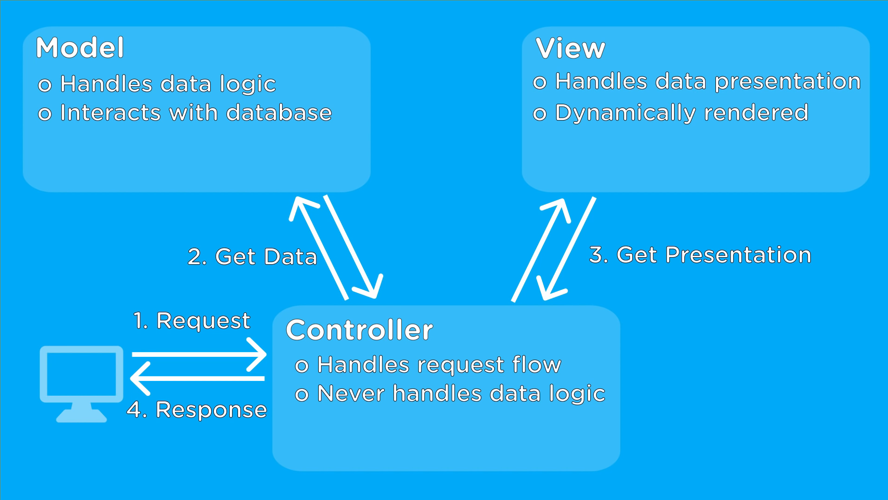
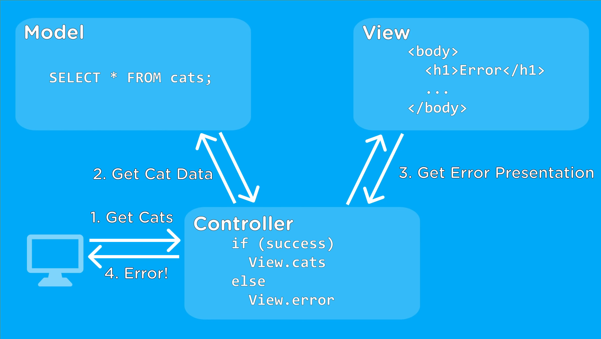

# Design Patterns

Over the last 20 years, websites have changed from simple HTML pages with little CSS to much more complex and powerfull applications
To make these applications easier to develop, programmers use  software design patterns to make the code less complicated


## What is it a Design Pattern?
In software engineering, a **software design pattern** is a description or template for how to solve a problem that can be used in many different situations
Design patterns are formalized best practices that the programmer can use to solve common problems when designing an application or system

They can be seen as a **blueprint**


# MVC - Model View Controller
- MVC is a design patter for computer software, by far one of the most popular ones.
- It's an approach to distinguish between the Data Model, Proccesing Control and User Interface
- The objective is to provide a framework which enforces better and more accurate design, less complex code and easier to work with

#### The Model
The model contains all teh data-related logic that the user works with
From the schemas and interfaces of a project, databases and their fields
A customer object will retrieve the customer information from the database, manipulate or update their record in the database, or use it to render data

#### The View
The view contains the UI and the presentation of an application
The customer view will include all the UI components such as text boxes, dropdowns and everything that the user interacts with

#### The Controller
The controller contains all teh business-related logic and handles incoming requests
It's the interface between the Model and the View

The customer controller will handle all the interactions and inputs from the customer
The same controller will be used to view the customer data

<p align="center">
        
</p>


#### MVC Example with code
First, the browsers sends a request to the Controller
*The Controller then interacts with the Model to send and receive data*

*The Controller then interacts with the View to Render the data*
The View is only concerned about how to present the information and not the final presentation
It will be a dynamic HTML file that renders data based on what the Controller sends it

*Finally the View will sends its final presentation to the Controller and the Controller will send that final data to the user output*

**The important thing is that the View and the Model never interact with each other
The only interaction that takes place between them is through the Controller**

This means the logic of the application and the interface never interacts with each other, which makes writing complex applications easier

1. The user inputs that they want a list of movies through a web browser

2. The browser will send the request to the Controller to get the list of movies

3. The Controller will ask the Model to find the list of movies from the database

*The Controller sending request to ask for Movie List*
```sh
router.get('/',ensureAuth, async (req,res)=>{ 
	try{ 
		const movies = await Movies.find() (*) 
		res.render('movies/index',{ movies }) 
    } 
    
	catch(err){ console.error(err) 
		res.render('error/500') } })    
```

4. Then the Model searches the database and returns the list of movies to the Controller
*Movies Model Schema*
```sh
const mongoose = require('mongoose') 
const MovieSchema = new mongoose.Schema
({ 
	name:{ 
        type:String, 
        required:true 
    }, 
	description:{ 
    	type:String 
    } 
}) 

module.exports = mongoose.model('Movies',MovieSchema)
```

5. If the Controller gets the list of movies from the Model, the Controller will ask the View to present the list of movies
*The Controller sending the Movie list to View to Render the list of movies*
```sh
router.get('/',ensureAuth, async (req,res)=>{ 
	try{ const movies = await Movies.find() 
		res.render('movies/index', { movies (*) }) } 

	catch(err){ 
    console.error(err) res.render('error/500') } 
})
```

6. Then the View will receive the request and returns the rendered list of movies to the Controller in HTML
*The View Returning List of Movies in form of HTML*
```sh
<div class="col" style="margin-top:20px;padding-bottom:20px">
    <div class="ui fluid card"> 
        <div class="content"> 
        <div class="header">{{movie.title}}</div> 
        	</div> <div class="extra content"> 
            <a href="/movies/{{movie._id}}" class="ui blue button"> More from {{movie.description}} </a> 
        </div> 
    </div>
</div>
```

7. Lastly, the Controller will take that HTML and return it back to the user, thus getting the list of Movies as the output


#### MVC How it works
<p align="center">
        
</p>


#### MVC example
<p align="center">
        
</p>

##### [Wikipedia - Software design patterns](https://en.wikipedia.org/wiki/Software_design_pattern) / Wikipedia
##### [MVC Explained in 4 Minutes](https://www.youtube.com/watch?v=DUg2SWWK18I) / MVC Tutorial
##### [How Model-View-Controller Architecture Works](https://www.freecodecamp.org/news/model-view-architecture/) / MVC examples
