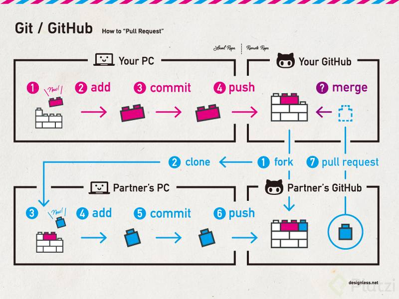
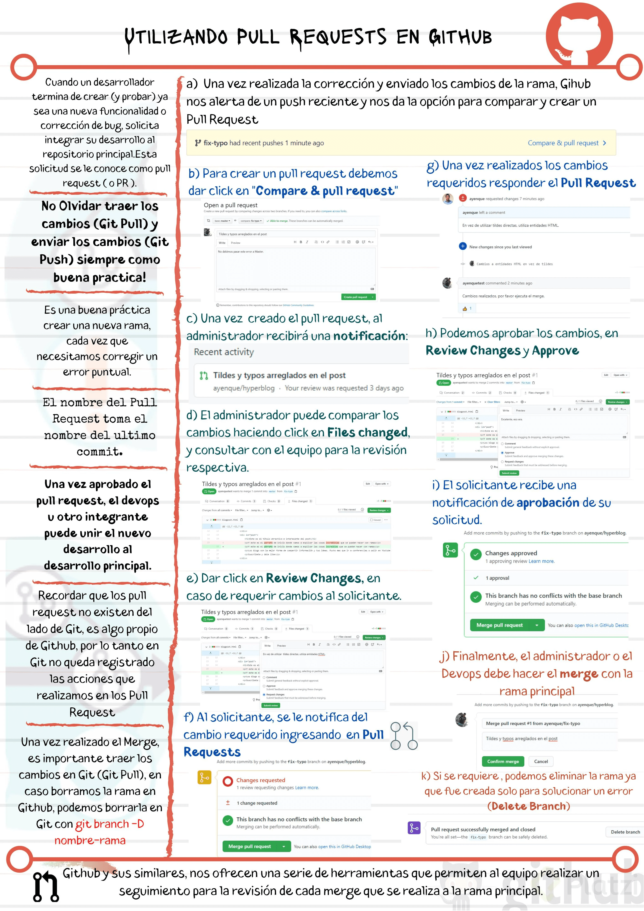
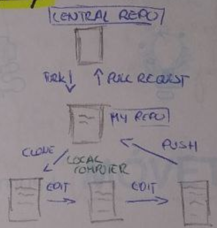

## Pull Request en Git
Es una funcionalidad de github (en gitlab llamada merge request y en bitbucket push request), en la que un colaborador pide que revisen sus cambios antes de hacer merge a una rama, normalmente master.

Al hacer un pull request se genera una conversación que pueden seguir los demás usuarios del repositorio, así como autorizar y rechazar los cambios.

El flujo del pull request es el siguiente

    Se trabaja en una rama paralela los cambios que se desean (git checkout -b <rama>)
    Se hace un commit a la rama (git commit -am '<Comentario>')
    Se suben al remoto los cambios (git push origin <rama>)
    En GitHub se hace el pull request comparando la rama master con la rama del fix.
    Uno, o varios colaboradores revisan que el código sea correcto y dan feedback (en el chat del pull request)
    El colaborador hace los cambios que desea en la rama y lo vuelve a subir al remoto (automáticamente jala la historia de los cambios que se hagan en la rama, en remoto)
    Se aceptan los cambios en GitHub
    Se hace merge a master desde GitHub

Importante: Cuando se modifica una rama, también se modifica el pull request

<p>
	
</p>

<p>
	
</p>

<p align="center">
	
</p>

## GIT
Git is a free and open source distributed version control system created by *Linux Torvalds* and designed to handle from small to very large projects

It's basically a software for us developers to control and manage our apps & projects

## Git Tag
```sh
git tag -a v1.4 -m "my version 1.4"
```

## Forking
Forking a github repository provides a **copy of a repository** in an user's account

Forking is made for *improving* someone's code/software and *reusing* the code in a project (why to reivent the wheel?)

#### Steps
1. Fork a repository
2. Code changes
3. Send changes to the original repository, **Pull Request**

## Discard local changes 
*Remove and revert uncommited Git changes*
```sh
git reset --hard
git clean -fxd
```