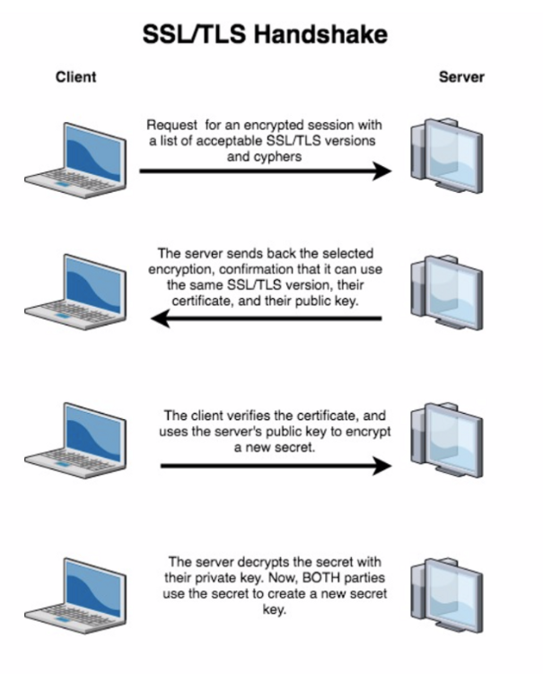
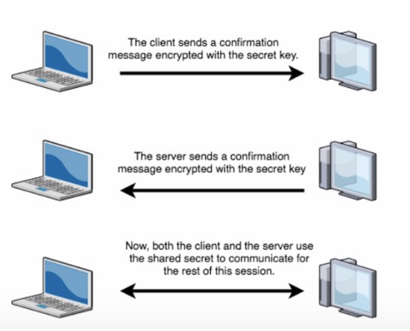

# HTTP, HTTPS, SSL & Internet Protocols

## Introduction to HTTP
HTTP is what web browsers use to connect to web pages, images, etc
It's a **connectionless** text based protocol
Connectionless means that everytime the web browser needs to load a new element, a new connection needs to be made (instead of keeping the connection open all the time as most protocols do)
A protocol is just a set of computer rules that govern how devices connect accross the internet

1. When we type a URL into a browser, the computer will retrieve the IP address (this is DNS)
2. Then the browser connects to the server and sends an HTTP request to the web page
3. The web server checks for the page and loads it. Then the browser receives the page and closes the connection
4. The browser then looks through the page for other parts it needs to load (images, applets, etc)
5. For each new part it needs to load, the browser will make and close another connection
6. Finally the page is completely loaded


## Some problems with HTTP
The problem with HTTP is that it transmits information over cleartext
Which means that anyone who has the technical skills to watch the traffic can see everything that is being transmitted (including usernames and passwords)
HTTPS offers encryption and authentication

Encryption is designed to hide the contents of a message from anyone other than the intended recipient of the message
The idea is to transform the data so that only a certain person, or group of people, can transform the data back into a recognizable message

Authentication verifies identity, it's used to verify that the server that is supposed to send the messages is actually the server which sent the message

Every communication sent through HTTP connections can be read by any hacker that has a connection between our browser and the web server
This is specially important if we are dealing with sensitive data (credit card info, personal data)
With a HTTPS connection, every communication is encrypted, so even in the connection is "sniffed" or intercepted, it's not possible to access the data

HTTPS (Hypertext Transfer Protocol Secure) is the secure version of HTTP
Browsers like Firefox and Chrome show a lock icon on the direction bar to show visually that the communication with the server is encrypted, which means, it has an HTTPS protocol

**HTTPS pages use either SSL or TLS as the secure protocols to encrypt communications**
Both use a PKI, an asymetric system that uses two keys to encrypt communications, a public key and a private key
Every encryption with the public key can only be decrypted with the private key and viceversa


## What is SSL/TLS?
Essentialy SSL and TLS do the same thing, but TLS is a newer version of the same protocol, with stronger encryption and authentication protocols

TLS uses **asymmetric encryption** to set up a link between the two servers using **private/public keys**
Assymetric encryption would be like a lock and key, where one person has the *lock* which encrypts the data, and a second person has the *key* which decrypts the data
Public and private keys are like a lock and key set where one locks up (encrypts) the data, and one unlocks (decrypts ) the data

After the session is initiated, teh servers can securely compute a shared secret and begin communication using symmetric encryption (much faster and can transmit larger packets of data)
Symmetric encryption doesn't have a lock/key pair. Instead it's like talking to someone in a secure location (shared secret)
If the location is secure, yo don't have to worry about guarding specific pieces of information with a lock and a key


## How does SSL/TLS work?
SSL/TLS works via a protocol referred to as the SSL/TLS handshake

<p align="center">
	
</p>
<p align="center">
	
</p>

The handshake sues asymmetric encryption to set up the process and agree on a shared secret
Then the handshake whitches to the faster symmetric encryption
The 'accepted ciphers' part just helps the servers agree on a common protocol to use


## Why is HTTPS important?
HTTPS protects the integrity of website's traffic
That allows a website to protect their users from intentionally malicious attackers who are interested in installing malware or stealing user data, as well as 3rd parties like ISPs who might be interested in injecting ads or pulling data

HTTPS ensures that users have privacy, and it's becoming ubiquitous, in large part due to Google's push for HTTPS
That's why on websites with HTTPS, when you're using a Chrome browser, you'll see a lock symbol

Websites which don't have HTTPS will pop up with a bright red 'not secure' warning
In addition, many new features aren't enabled without HTTPS (particularly for progressive web apps)
Given how key HTTPS is to the security of the web, it's important for anyone working in security to understand why and how it works
In order to secure systems, you need to understand them


## Understanding HTTP requests and responses
HTTP (HyperText Transfer Protocol) is a network protocol, this is a set or rules to follow to publish websites
HTTP is the core foundation of Internet or www (World Wide Web)

HTTP protocol works through a system between requests and responses
A **client**, using a internet browser and a **server**, the computer that hosts websites

The client sents a request to the server (*http request*)
The server response to the  client (*http response*) with data, it may be from HTML, to an image or any file the client knows how to handle
When we are visiting a website using our browser, we're using an http session to obtain everything we see as the final result (HTML, images, JavaScript code, etc)

The URI, known as *URL* that shows the browser on the top bar starts with http, which means that it's using http protocol to show us the page we're visiting


## Example of a HTTP communication
**The clients makes a request to show the main page**
```sh
GET /principal.html HTTP/1.1
Host: www.pagina.com 
```

**The server sends a response to the client**
```sh
HTTP/1.1 200 OK
Date: Tue, 24 Feb 2016 22:38:34 GMT
Content-Type: text/html; charset=UTF-8
Content-Length: 75
Connection: close
<html>
<head>
<title>Título</title>
</head>
<body>
Nada aquí.
</body>
</html> 
```


## SSL, TLS & HTTPS in summary
When the URL starts with HTTPS instead of HTTP, it means that the browser is using an secure schema to protect the data that is being transfered
This HTTPS schema is the one that must use every commercial transaction on the Internet
This schema is known as *TSL*

A secure session adds encryption to cypher the transmitted data, this way, if the data is intercepted, the content cannot be visible without the proper keys
On a secure session there are being used certificates to make sure that the communication is being done properly with the correct person, avoiding an intermediary that could intercept the communication

*Secure Sockets Layer or SSL* is the standard technology that grants a secure internet connection, it also protects any confidential data sent between two systems
Both systems can be a client (browser) and a server (online shopping app), or even two servers

This is done encrypting the data transfered between users and websites, this way even if the data is sniffed (stolen), it cannot be read
This data could be from credit card numbers to bank data, names and directions

*Transport Layer Security or TLS* is a modern version of SSL, being SSL the standard denomination, when we're buying SSL certificates, we're actually buying the latests TLS certifications with encryption options such as ECC, RSA or DSA

*Hyper Text Transfer Protocol Secure or HTTPS* can be seen in the URL direction bar when a website is protected by an SSL certificate
We can check the certificate details clicking on the lock symbol next to the URL bar

The SSL certificate is installed on the server, but it shows visual indications on the browser
Starting from the *https://* instead of just *http://*

When we install an SSL certificate and there is a connection between a browser and our server, the existence of the SSL certificate activates the SSL (TLS actually) protocol that will encrypt the info between both client and servers (or between servers)
SSL protocol works on top of another protocol as *Transmission Control Protocol or TCP* and acts as a security layer
This allows a secure connection and won't make changes on superior layers and layers below SSL can work normally

If our SSL certificate is used properly, the only info that can be seen by a hacker are both port and IP address and the aproximately amount of data sent
Hackers may be able to stop the connection, but both server and user will be able to know that this is because of a third party action, besides that, the hacker will not be able to obtain any data
It may be able to get the hostname, but it won't be able to recognize the entire URL, as the connection is encrypted

1. SSL Protocol starts after a TCP connection is set up
2. The server sends its certificate among some specs, as the SSL/TLS version and the correspondent encrypting methods
3. The user checks the certificate and selects the highest level of encryption admited on both sides and starts a secure session with those methods
4. In order to grant security and authenticity of sent data, both SSL and TLS protocols include an authentication process

This may be seen as a long and slow process but it's done almost instantly!
