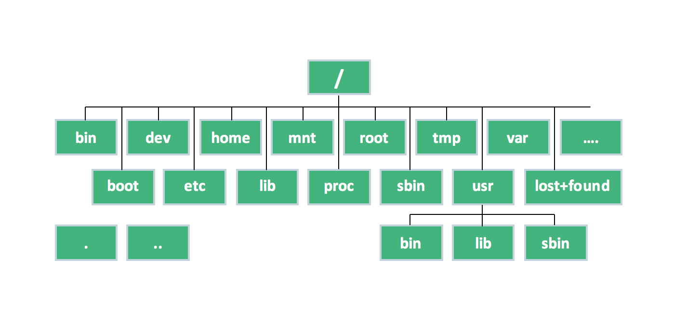

# Linux Filesystem

<p align="center">
	
</p>

The Linux Filesystem is a cryptic labyrinth of directories defined by the file system hierarchy standard

We can navigate through it with both *change directory command* and *list command*
```sh
# Navigate to the root
cd /

# List the content of the directory
ls
```

#### /
Everything, all the files an directories are located under **root** represented by **/**

<p align="center">
        
</p>


#### /bin
Contains binary or executable files that are essential to the entire operative system
We can run this binaries from the command line any time (gzip, curl, ls, cd)

#### /sbin
Contains executable binaries for super user (root)
It could be thought as a /sudobin folder or /superbin
Includes commands from mount to deluser

#### /lib
Libraries are codes that can be used by the executable binaries
The **/lib** directory holds the libraries needed by the binaries

#### /usr
It has its own **/bin** and **/sbin** directories
In **/usr** go all the non essential binaries to the OS itself but for the end user
All the executable files, libraries and source of most of the system programs for the user are stored here

- **/usr/bin** contains basic user commands
- **/usr/sbin** contains additional commands for the administrator
- **/usr/lib** contains the system libraries
- **/usr/share** contains documentation or common to all libraries ('/usr/share/backgrounds' contains background pictures)

We also have a **/local** under the **/usr** directory
It contains any binaries that we compile manually to provide a safe place that won't conflict with any software installed by a system package manager

All these binaries get mapped together with a **$PATH** environment variable
That's why we can execute them from any directory in the terminal
To know where a binary "lives" or is located, we'll use *which* command to see its full path
```sh
which curl
# /usr/bin/curl

which cd
# cd: shell built-in command

which npm
# /usr/bin/npm

which flutter
# /mnt/c/src/flutter/bin/flutter
```

#### /etc


<p align="center">
        
</p>
