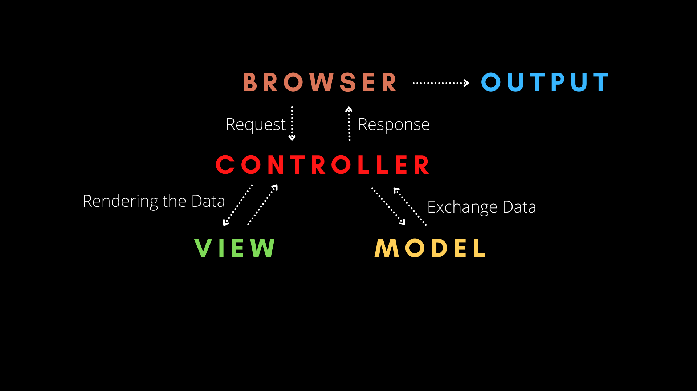
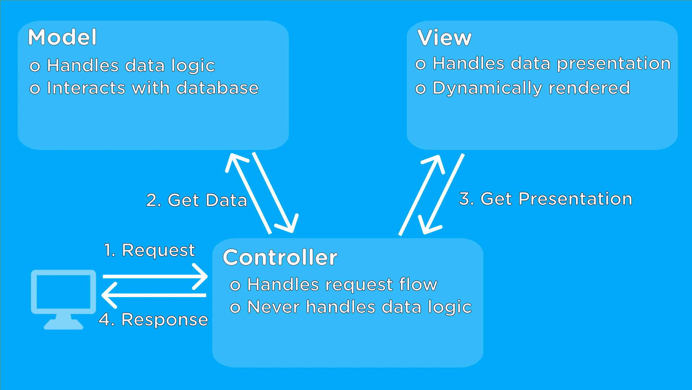
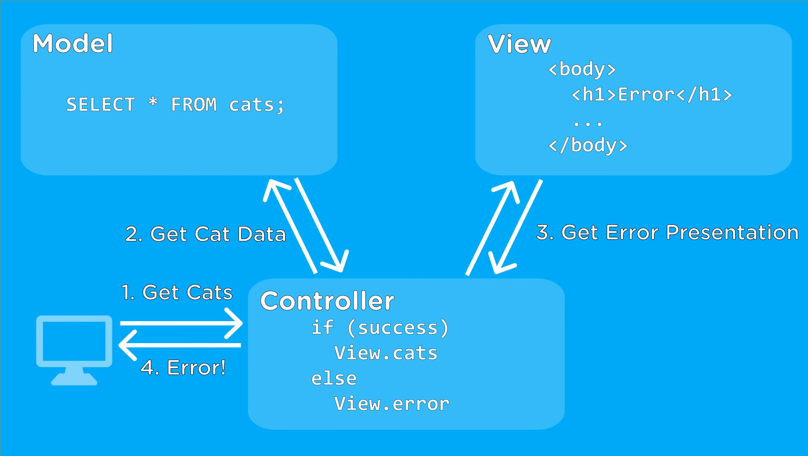

# MVC y otros modelos de arquitectura de software
## **📌 Modelo Vista Controlador (MVC)**  
El **Modelo Vista Controlador (MVC)** es un patrón de arquitectura de software que separa una aplicación en **tres componentes principales** para mejorar la organización y mantenimiento del código.  

### **📌 Estructura de MVC**  
1️⃣ **Modelo (Model)**  
   - Representa los datos y la lógica de negocio.  
   - Se encarga de acceder a la base de datos y gestionar los datos.  
   - No interactúa directamente con la interfaz de usuario.  
   
   🔹 **Ejemplo en JavaScript (Express + MySQL)**  
   ```js
   class Usuario {
       constructor(id, nombre, email) {
           this.id = id;
           this.nombre = nombre;
           this.email = email;
       }
   }
   ```

2️⃣ **Vista (View)**  
   - Se encarga de la interfaz de usuario (HTML, CSS, JavaScript).  
   - Recibe datos del modelo y los muestra al usuario.  
   - No contiene lógica de negocio.  
   
   🔹 **Ejemplo de una vista en HTML con EJS (Plantilla en Express.js)**  
   ```html
   <h1>Bienvenido, <%= usuario.nombre %>!</h1>
   ```

3️⃣ **Controlador (Controller)**  
   - Gestiona la interacción entre el usuario, el modelo y la vista.  
   - Recibe las solicitudes del usuario, procesa la lógica y actualiza el modelo o la vista.  

   🔹 **Ejemplo de un controlador en Express.js**  
   ```js
   app.get('/usuario/:id', async (req, res) => {
       const usuario = await obtenerUsuario(req.params.id);
       res.render('perfil', { usuario });
   });
   ```

### **📌 Flujo de Trabajo en MVC**  
1. El usuario interactúa con la **Vista** (ejemplo: hace clic en un botón).  
2. El **Controlador** recibe la solicitud y la procesa.  
3. El **Modelo** obtiene los datos de la base de datos.  
4. La **Vista** muestra los datos al usuario.  

✅ **Ventajas de MVC:**  
✔ Código más organizado y modular.  
✔ Facilita la escalabilidad.  
✔ Separa la lógica de negocio de la interfaz.  

❌ **Desventajas de MVC:**  
✖ Puede ser complejo en aplicaciones pequeñas.  
✖ Más código y archivos para gestionar.  

---

## **📌 Otros Modelos de Arquitectura en Desarrollo de Aplicaciones**  

### **1️⃣ Modelo MVVM (Modelo-Vista-VistaModelo)**  
Este modelo se usa mucho en **frameworks frontend** como **Vue.js y Angular**.  

📌 **Diferencia con MVC:**  
- Usa un **ViewModel** en lugar de un controlador, que actúa como intermediario entre el modelo y la vista.  

🔹 **Ejemplo en Vue.js**  
```vue
<template>
  <p>{{ mensaje }}</p>
</template>

<script>
export default {
  data() {
    return { mensaje: "Hola Mundo" };
  }
};
</script>
```

✅ **Ventajas:**  
✔ Excelente para interfaces dinámicas.  
✔ Facilita el desarrollo frontend.  

❌ **Desventajas:**  
✖ Puede ser más difícil de depurar que MVC.  

---

### **2️⃣ Modelo MVP (Modelo-Vista-Presentador)**  
📌 **Diferencia con MVC:**  
- El **Presentador** toma el rol del controlador, pero la vista es más pasiva y solo muestra lo que recibe.  
- Se usa en aplicaciones con interfaces gráficas como **Android y Windows Forms**.  

✅ **Ventajas:**  
✔ Separa mejor la lógica de la interfaz.  
✔ Facilita la realización de pruebas unitarias.  

❌ **Desventajas:**  
✖ Puede requerir más código y archivos.  

---

### **3️⃣ Modelo Cliente-Servidor**  
Este modelo separa una aplicación en **dos partes**:  
1️⃣ **Cliente** (Frontend) → Es la interfaz de usuario.  
2️⃣ **Servidor** (Backend) → Procesa las solicitudes y maneja la base de datos.  

📌 **Ejemplo de una petición en este modelo con JavaScript (Fetch API + Express.js)**  
```js
// Cliente (Frontend)
fetch('/api/datos')
  .then(res => res.json())
  .then(data => console.log(data));

// Servidor (Backend con Express)
app.get('/api/datos', (req, res) => {
    res.json({ mensaje: "Hola desde el servidor" });
});
```

✅ **Ventajas:**  
✔ Escalable para aplicaciones web.  
✔ Se puede usar con múltiples tecnologías (React, Angular, Vue).  

❌ **Desventajas:**  
✖ Requiere una buena gestión de seguridad.  

---

### **4️⃣ Modelo Microservicios**  
En este modelo, en lugar de tener una sola aplicación grande (**monolito**), se dividen los servicios en **múltiples módulos independientes** que se comunican entre sí a través de APIs.  

📌 **Ejemplo:**  
- **Servicio de Autenticación:** Gestiona login y registro.  
- **Servicio de Pedidos:** Maneja compras.  
- **Servicio de Notificaciones:** Envío de emails/SMS.  

✅ **Ventajas:**  
✔ Más escalabilidad y flexibilidad.  
✔ Cada microservicio puede usar un lenguaje diferente.  

❌ **Desventajas:**  
✖ Mayor complejidad en la comunicación entre servicios.  

---

## **📌 Conclusión: ¿Qué Modelo Usar?**
| Modelo       | Ideal Para | Ejemplo de Uso |
|-------------|-----------|---------------|
| **MVC** | Aplicaciones web estructuradas | Laravel, Express.js, Django |
| **MVVM** | Aplicaciones frontend dinámicas | Vue.js, Angular |
| **MVP** | Aplicaciones con interfaces gráficas | Android, Windows Forms |
| **Cliente-Servidor** | Aplicaciones web con frontend y backend separados | React + Node.js |
| **Microservicios** | Aplicaciones grandes y escalables | Netflix, Amazon |

### ✅ **Si desarrollas una web con Express.js, MVC es una de las mejores opciones.**  
### ✅ **Si trabajas en un frontend dinámico, usa MVVM con Vue.js o Angular.**  

🚀 **Elige el modelo según las necesidades de tu proyecto.**
---

# Arquitecturas de diseño de software
Las **arquitecturas de diseño de software** representan el conjunto de principios, estructuras y patrones utilizados para organizar un sistema de software. La elección de una arquitectura es crucial, ya que define cómo los diferentes componentes interactúan entre sí, cómo se estructuran y cómo evolucionará el sistema con el tiempo.

---

## **1. Qué es una Arquitectura de Software**

La **arquitectura de software** define el diseño de alto nivel de un sistema. Incluye decisiones sobre:
- Componentes principales del sistema.
- Relaciones y dependencias entre componentes.
- Patrones de diseño utilizados.
- Restricciones técnicas.

### **Propiedades Clave**
1. **Modularidad:** Divide el sistema en módulos o componentes independientes.
2. **Escalabilidad:** Permite que el sistema maneje más carga o se expanda.
3. **Mantenibilidad:** Facilita la corrección de errores y la implementación de nuevas características.
4. **Rendimiento:** Optimiza tiempos de respuesta y eficiencia.
5. **Seguridad:** Protege los datos y evita accesos no autorizados.

---

## **2. Clasificación de las Arquitecturas de Software**

### **2.1. Monolítica**
En una arquitectura monolítica, todo el sistema está diseñado como una sola unidad indivisible. Todos los componentes (interfaces de usuario, lógica de negocio, acceso a datos) están integrados en un solo programa.

#### **Características:**
- Simplicidad en la implementación inicial.
- Más fácil de depurar y probar en aplicaciones pequeñas.

#### **Desventajas:**
- Difícil de escalar horizontalmente.
- Mantenimiento complejo a medida que crece.

#### **Ejemplo:**
Un sistema de comercio electrónico donde el código para el catálogo de productos, el carrito de compras y el procesamiento de pedidos está en una única aplicación.

---

### **2.2. Cliente-Servidor**
Esta arquitectura divide el sistema en dos componentes principales:
- **Cliente:** Interactúa directamente con el usuario.
- **Servidor:** Maneja la lógica de negocio, almacenamiento y procesamiento de datos.

#### **Características:**
- Separación clara entre la presentación y la lógica de negocio.
- Escalabilidad en el lado del servidor.

#### **Desventajas:**
- Puede haber problemas de rendimiento si muchos clientes acceden al servidor simultáneamente.

#### **Ejemplo:**
Un sistema bancario en el que la aplicación móvil (cliente) envía solicitudes al servidor central para realizar transacciones.

---

### **2.3. Arquitectura en Capas**
Divide el sistema en niveles o capas, donde cada capa tiene una responsabilidad específica y depende únicamente de la capa directamente inferior.

#### **Capas comunes:**
1. **Presentación:** Maneja la interfaz de usuario.
2. **Aplicación:** Contiene la lógica de negocio.
3. **Persistencia:** Maneja el acceso a bases de datos.
4. **Base de Datos:** Almacena los datos del sistema.

#### **Características:**
- Modularidad y separación de responsabilidades.
- Fácil de escalar y mantener.

#### **Desventajas:**
- Puede haber sobrecarga en el rendimiento debido a la interacción entre capas.

#### **Ejemplo:**
Un sistema de gestión de inventarios con una capa de interfaz web, una capa de lógica que calcula los niveles de inventario, y una base de datos para almacenar los productos.

---

### **2.4. Arquitectura de Microservicios**
Divide el sistema en múltiples servicios pequeños e independientes, cada uno con su propia lógica de negocio y base de datos.

#### **Características:**
- Cada servicio puede desarrollarse, desplegarse y escalarse de forma independiente.
- Uso extensivo de APIs para la comunicación entre servicios.

#### **Desventajas:**
- Mayor complejidad de integración y monitoreo.
- Requiere un diseño cuidadoso de la comunicación entre servicios.

#### **Ejemplo:**
Un sistema de streaming de video donde:
- Un microservicio gestiona usuarios.
- Otro gestiona recomendaciones.
- Otro almacena y distribuye videos.

---

### **2.5. Arquitectura Event-Driven**
Basada en eventos. Los componentes reaccionan a eventos (notificaciones) generados por otros componentes.

#### **Características:**
- Alta flexibilidad y desacoplamiento.
- Escalabilidad inherente.

#### **Desventajas:**
- Dificultad en el rastreo y depuración debido a la asincronía.

#### **Ejemplo:**
Un sistema de pedidos en línea:
- Cuando un usuario realiza un pedido, se genera un evento que activa servicios de pago, inventario y notificaciones.

---

### **2.6. Arquitectura Orientada a Servicios (SOA)**
Divide el sistema en servicios reutilizables que exponen una interfaz común. Los servicios interactúan entre sí a través de protocolos estándar como SOAP o REST.

#### **Características:**
- Reutilización de servicios.
- Escalabilidad.

#### **Desventajas:**
- Puede ser pesado en sistemas pequeños.
- Mayor costo inicial de implementación.

#### **Ejemplo:**
Un sistema de reservas de vuelos donde:
- Un servicio maneja vuelos.
- Otro maneja hoteles.
- Otro se encarga de alquiler de autos.

---

### **2.7. Arquitectura de Serverless**
En esta arquitectura, el desarrollador no gestiona servidores. Se enfoca en escribir funciones que se ejecutan en la nube solo cuando son necesarias.

#### **Características:**
- Reducción de costos operativos.
- Escalabilidad automática.

#### **Desventajas:**
- Dependencia de un proveedor de nube (AWS Lambda, Azure Functions, etc.).
- Restricciones en el tiempo de ejecución.

#### **Ejemplo:**
Una aplicación que procesa y envía notificaciones por correo electrónico basada en eventos.

---

### **2.8. Arquitectura de Componentes**
Divide el sistema en componentes autónomos reutilizables, cada uno con una responsabilidad específica.

#### **Características:**
- Enfocada en la reutilización.
- Los componentes pueden combinarse para crear nuevas funcionalidades.

#### **Ejemplo:**
Un sistema de CRM donde:
- Un componente maneja contactos.
- Otro gestiona ventas.
- Otro se encarga de la facturación.

---

## **3. Comparación de Arquitecturas**

| Arquitectura         | Ventajas                           | Desventajas                           | Casos de Uso                                |
|----------------------|------------------------------------|---------------------------------------|--------------------------------------------|
| **Monolítica**       | Fácil de implementar inicialmente | Difícil de escalar                    | Aplicaciones pequeñas o MVPs               |
| **Cliente-Servidor** | Separación de responsabilidades   | Problemas de rendimiento              | Aplicaciones web o móviles simples         |
| **Capas**            | Modularidad, fácil mantenimiento  | Sobrecomplicación en sistemas simples | Sistemas empresariales                     |
| **Microservicios**   | Escalabilidad, independencia      | Complejidad técnica                   | Sistemas grandes con muchos módulos        |
| **Event-Driven**     | Desacoplamiento                   | Difícil de depurar                    | Sistemas de alto tráfico                   |
| **SOA**              | Reutilización de servicios        | Configuración compleja                | Integración entre sistemas heterogéneos    |
| **Serverless**       | Bajo costo, escalabilidad         | Dependencia del proveedor             | Tareas basadas en eventos o funciones breves|

---

## **4. Cómo Elegir una Arquitectura**

1. **Tamaño del Proyecto:** Proyectos pequeños suelen beneficiarse de arquitecturas simples como monolíticas o en capas.
2. **Escalabilidad:** Si se espera un crecimiento rápido, considera microservicios o serverless.
3. **Flexibilidad:** Arquitecturas como SOA o event-driven son adecuadas para sistemas que necesitan interactuar con otros sistemas.
4. **Requerimientos de Rendimiento:** Para sistemas de alto tráfico, microservicios o event-driven son opciones viables.
5. **Presupuesto y Recursos:** Arquitecturas complejas como microservicios pueden ser costosas de implementar.

---

## **5. Conclusión**

La elección de una arquitectura de software debe basarse en los requisitos técnicos, las expectativas de escalabilidad y el contexto del proyecto. No existe una arquitectura universalmente "mejor"; cada una tiene ventajas y desventajas según el caso de uso. Entender estas diferencias es crucial para diseñar sistemas robustos, escalables y fáciles de mantener.


---


# Design Patterns
Over the last 20 years, websites have changed from simple HTML pages with little CSS to much more complex and powerfull applications
To make these applications easier to develop, programmers use  software design patterns to make the code less complicated


## What is it a Design Pattern?
In software engineering, a **software design pattern** is a description or template for how to solve a problem that can be used in many different situations
Design patterns are formalized best practices that the programmer can use to solve common problems when designing an application or system

They can be seen as a **blueprint**


# MVC - Model View Controller
- MVC is a design patter for computer software, by far one of the most popular ones.
- It's an approach to distinguish between the Data Model, Proccesing Control and User Interface
- The objective is to provide a framework which enforces better and more accurate design, less complex code and easier to work with

### The Model
The model contains all teh data-related logic that the user works with
From the schemas and interfaces of a project, databases and their fields
A customer object will retrieve the customer information from the database, manipulate or update their record in the database, or use it to render data

### The View
The view contains the UI and the presentation of an application
The customer view will include all the UI components such as text boxes, dropdowns and everything that the user interacts with

### The Controller
The controller contains all teh business-related logic and handles incoming requests
It's the interface between the Model and the View

The customer controller will handle all the interactions and inputs from the customer
The same controller will be used to view the customer data

<p align="center">
        
</p>


## Modelo, Vista, Controlador
En una arquitectura Modelo-Vista-Controlador (MVC), un modelo es uno de los tres componentes principales que trabajan juntos para organizar y estructurar el código de una aplicación. Aquí hay una descripción de las responsabilidades de cada componente en una arquitectura MVC:

1. **Modelo (Model):** El modelo representa la estructura y la lógica de la aplicación. Es responsable de gestionar los datos y el estado de la aplicación, así como de realizar operaciones sobre esos datos. En otras palabras, el modelo encapsula la lógica empresarial y los datos de la aplicación. Puede interactuar con la base de datos, realizar cálculos y actualizar su estado interno según las instrucciones de la lógica de la aplicación.

2. **Vista (View):** La vista se encarga de mostrar la información al usuario y de interpretar las acciones del usuario. Muestra la interfaz de usuario y presenta los datos del modelo de una manera comprensible. La vista no realiza ninguna manipulación de datos; simplemente muestra la información y envía las acciones del usuario al controlador.

3. **Controlador (Controller):** El controlador actúa como intermediario entre el modelo y la vista. Recibe las acciones del usuario desde la vista, procesa esas acciones (por ejemplo, actualiza el modelo correspondiente) y actualiza la vista según sea necesario. El controlador gestiona el flujo de datos entre la vista y el modelo, asegurando que ambos permanezcan independientes entre sí.

En resumen, el modelo en una arquitectura MVC es responsable de la gestión de datos y lógica empresarial. Realiza operaciones en los datos, responde a las solicitudes de la vista y se comunica con la base de datos si es necesario. Separar estas responsabilidades facilita la mantenibilidad y la escalabilidad de las aplicaciones, ya que cada componente puede evolucionar de manera independiente.


## [Controllers & Handlers](https://softwareengineering.stackexchange.com/questions/82262/difference-between-handler-manager-and-controller)
- Usually a controller is the interface between a UI component and a model. Controllers should be thin classes, doing little more than mapping user interface events to model functions
- A Handler is usually a single function wrapped in an object.


# MVC
- **Views**: Mostly to keep graphical design
- **Models**: Wrapper around database tables
- **Controllers**: Classes where every function is called from a route and returns a http response, like view or redirect or error.
- Handlers: Mostly for Exception handling and Event handling
- Services: Wrappers around APIs
- Requests: To describe some inputs, it also can handle validation, authorization and some basic data processing
- Middleware: To abstract out some common logic from the multiple routes, like authentication and authorization
- Helpers: Some tiny classes and functions used throughout the project


## Handler
- A handler is a routine/function/method which is specialized in a certain type of data or focused on certains special tasks
- **Event handler**: *Receives and digests events and signals from the surrounding system (OS or GUI)*
- **Memory handler**: Performs certain special tasks on memory
- **File input handler**:  A function receiving file input and performing special tasks on the data, all depending on context of course.


#### MVC How it works
<p align="center">
        
</p>


#### MVC example
<p align="center">
        
</p>

##### [Wikipedia - Software design patterns](https://en.wikipedia.org/wiki/Software_design_pattern) / Wikipedia
##### [MVC Explained in 4 Minutes](https://www.youtube.com/watch?v=DUg2SWWK18I) / MVC Tutorial
##### [How Model-View-Controller Architecture Works](https://www.freecodecamp.org/news/model-view-architecture/) / MVC examples
