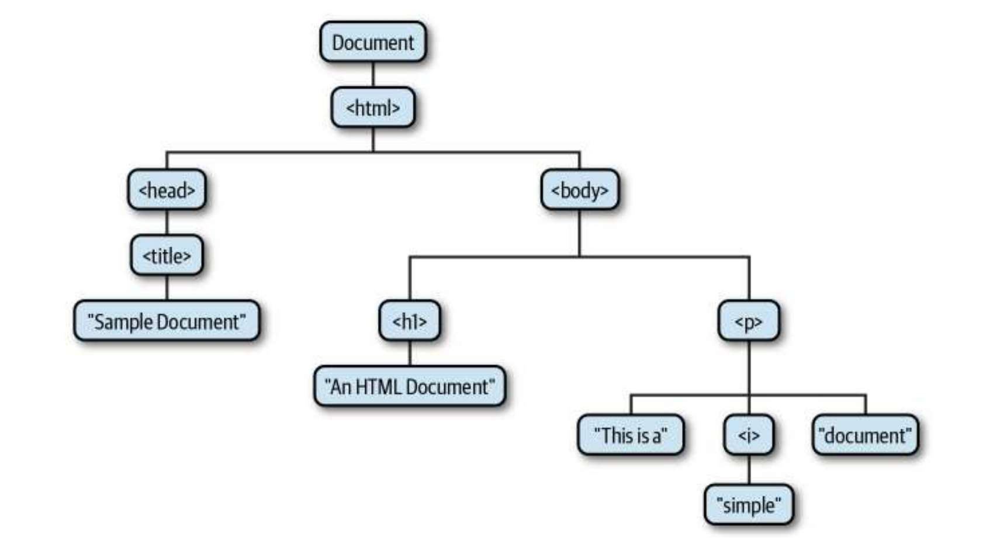

# DOM / Document Object Model

## What is DOM?

The DOM or Document Object Model is a object-oriented representation of the web page

DOM represents the document as nodes and objects which can be modified with a scripting language such as JavaScript

The Document Object is the core of DOM. To perform any manipulation, you must access the document object first


<p align="center">
	
</p>

## How to select elements in the DOM

**getElementById()**
The most common way to access an HTML element

```html
<p id="master">This is a paragraph</p>
<script>
	const masterEl = document.getElementById("master");
	console.log(masterEl); // <p id="master">This is a paragraph</p>
</script>
```


**getElementsByClassName()**
Returns a collecions of all elements with the specified class name

```html
<p class="master2">This is paragraph 1</p>
<p class="master2">This is paragraph 2</p>
<p class="master2">This is paragraph 3</p>
<script>
	let master = document.getElementsByClassName("master2");
	master[2].innerHTML = "This is the new text of paragraph 3!";
</script>
```


**getElementsByTagName()**
Returns all elements of the specified tag name in the order which they appear in the document

```html
<p>This is paragraph 1</p>
<p>This is paragraph 2</p>
<p>This is paragraph 3</p>

<script>
	let master = document.getElementsByTagName("p");
	let masterEl = master[1].innerHTML = "This is paragraph 2.1!"
	console.log(masterEl) = "This is paragraph 2.1!";
</script>
```


**querySelector()**
Returns the first value that matches the selector it's given
It can accept all CSS style selectors, allowing it to select by tag, class or ID

```html
<div id="master">This is a div</div>
<script>
	const mater = document.querySelector("#master");
</script>
```


**querySelectorAll()**
Works similar to querySelector, but returns a node list collection of all matching elements
```html
<p id="master">This is paragraph 1</p>
<p id="master">This is paragraph 2</p>
<p id="master">This is paragraph 3</p>
<script>
	let master = document.querySelectorAll(".master");
	master[2].innerHTML = "This is the new text of paragraph 3!";
</script>
```


## How to get over the document
Since everything in an HTML is a node
The text inside an HTML element is a text node

With the HTML DOM, it's possible to navigate the node tree and access nodes in the tree using node relationships (parent, children, siblings, etc).

- The node directly above a node is the *parent* of that node
- The nodes one level directly below another node are the *children* of that node
- Nodes at the same level, and with the same parent, are *siblings*
- The set of nodes any number of levels below another node are the *descendants* of that node
- And the parent, grandparent, and all other nodes above a node are the *ancestors* of that node

Every node has exactly one parent, except the top node
A node can have more than one child
Siblings are nodes with the same parent

- **parentNode**
- **childrenNodes**
- **firstElementChild**
- **lastElementChild**
- **nextElementSibling**
- **previousElementSibling**

```html
 <div id="parent">
        <div id="firstchild">i am a first child</div>
        <p id="secondchild">i am the second child</p>
        <h4>i am alive</h4>
        <h1>hello world</h1>
        <p>i am the last child</p>
    </div>  
    
    const parent = document.getElementById('parent').lastElementChild
    console.log(parent) //<p>i am the last child</p>
    
    const parent2 = document.getElementById('parent').children[3]
    console.log(parent2) //<h1>hello world</h1>
    
    const secondchild = document.getElementById('secondchild')
    console.log(secondchild) //<p id="secondchild">i am the second child</p>
    
    console.log(secondchild.parentNode) //<div id="parent">...</div>
    console.log(secondchild.nextElementSibling) //<h4>i am alive</h4>
    console.log(secondchild.previousElementSibling) //<div id="firstchild">i am a first child</div>
```

#### Equivalent classes in JavaScript
There is a JavaScript class corresponding to each HTML tag type, and each occurrence of the tag in a document is represented by an instance of the class
```html
<body>
HTMLBodyElement

<table>
HTMLTableElement
```
Most of the **JavaScript Element Classes** just mirror the attributes of an HTML tag, but some define aditional methods
```html
HTMLAudioElement 
HTMLVideoElement

# This classes define methods for controlling playback of audio and video files
play();
pause();
```


## How to manipulate elements in the DOM

##### How to create elements
We'll create a new element with **createElement()** method

```html
const createEl = document.createElement('div');
console.log(createEl); //<div></div>
```


##### How to set the innerHTML/ text content of an element
Our new div doesn't have any text node
We'll use **innerHTML()** to add its text node

```html
const innerhtml = createEl.innerHTML = "I'm a frontend developer";
console.log(createEl); //<div>I'm a frontend developer</div>
```


##### How to append an element
Our new element with its text is still not part of the DOM tree yet
We'll append it to that HTML page

```html
const parentEl = document.getElementById('parent');
parentEl.appendChild(createEl);
```


##### How to insert one element before another
The appended child **div** tag was added at the bottom automatically
If we want to add it before we'll use **insertBefore()**

This method accepts two parameters, **newNode** and **existingNode**
*document.insertBefore(newNode, existingNode)*

```html
const firstChildEl = document.getElementById('firstchild');
const parentEl = document.getElementById('parent');
const createEl = document.createElement('div');
const innerhtml = createEl.innerHTML = 'I am a frontend developer'

parentEl.insertBefore(createEl, firstchildEl);
```


##### How to replace a child element
**replaceChild()** method accepts two paramenters to replace our first element with the newly created
*document.replaceChild(newNode, existingNode)*

```html
const firstChildEl = document.getElementById('firstchild');
const parentEl = document.getElementById('parent');
const createEl = document.createElement('div');
const innerhtml = createEl.innerHTML = 'I am a frontend developer'

parentEl.replaceChild(createEl, firstchildEl);
```


##### How to remove a child element
We'll use the method **removeChild()**

```html
const firstchildEl = document.getElementById('firstchild');
const parentEl = document.getElementById('parent');
parentEl.removeChild(firstchildEl);
```


## Add styling with CSS

##### Add a CSS class
```html
<style>
	.button { background-color: blueviolet; }
</style>
buttonEl.classList.add('button');
```

##### Remove a CSS class
```html
<style>
	.button { background-color: blueviolet; }
</style>
buttonEl.classList.remove('button');
```

##### Toggle a CSS class
```html
<style>
	.button { background-color: blueviolet; }
</style>
buttonEl.classList.toggle('button');
```
