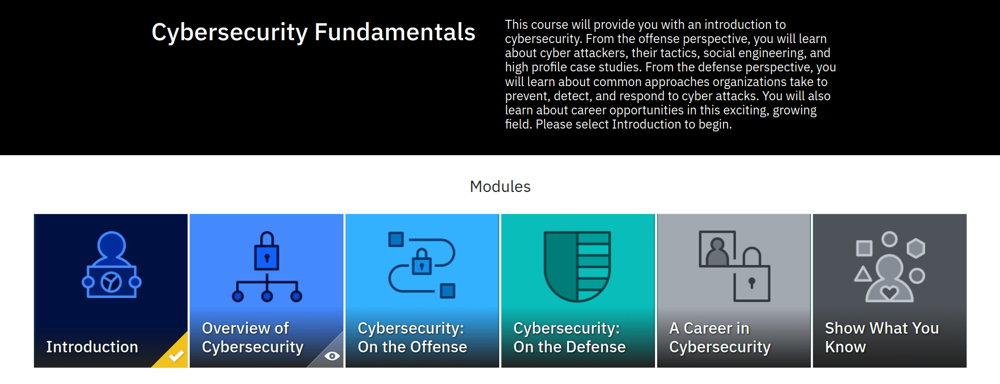

# 1 Cybersecurity Fundamentals
# 1.1 Introduction

    

## 5 Fast Facts
- The global average total cost of a data breach is USD 4.35 million, the highest it has ever been.
- Cyber crime is predicted to cost the world USD $8 trillion in 2023. If it were measured as a country, then cyber crime would be the world’s third largest economy after the U.S. and China.
- The average number of days it takes a business to fully recover from an attack is 287 days.
- Even after filtering, 1 in 3,000 email messages an organization receives will still contain malware.
- Cybersecurity job opportunities will grow 35% from 2021 to 2031, much faster than the average growth rate for all occupations.

## What it is the Cyberspace
*The interdependent network of information technology infrastructures that includes the Internet, telecommunications networks, computer systems, internet ­connected devices and embedded processors and controllers. It may also refer to the virtual world or domain as an experienced phenomenon, or abstract concept.*

# 1.2 Overview of Cybersecurity