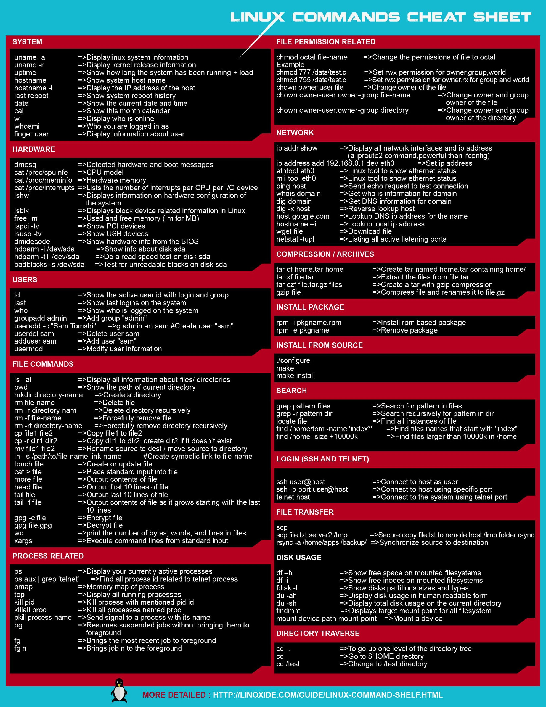

# Linux

##### [Understand Linux & Free Software](https://www.youtube.com/watch?v=UUJ0dFpj1-M) - Brief and entertaining history about Linux

##### [Basic Linux commands](https://www.freecodecamp.org/news/basic-linux-commands-bash-tips-you-should-know/) - Basic guide of Linux Terminal

##### [Beginners tutorial of Linux and GNU](https://www.youtube.com/watch?v=h1gSb9qn0Bo&list=PLpOqH6AE0tNjiU5erEwrvoTEqY36ArbCu) - Linux tutorial in Spanish

 
### Spreadsheet

