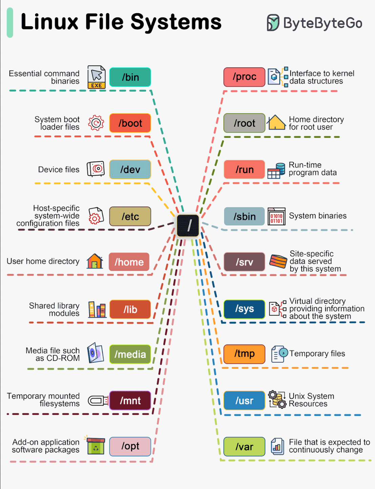

# Linux

### [Understand Linux & Free Software](https://www.youtube.com/watch?v=UUJ0dFpj1-M) - Brief and entertaining history about Linux

### [Basic Linux commands](https://www.freecodecamp.org/news/basic-linux-commands-bash-tips-you-should-know/) - Basic guide of Linux Terminal

### [Beginners tutorial of Linux and GNU](https://www.youtube.com/watch?v=h1gSb9qn0Bo&list=PLpOqH6AE0tNjiU5erEwrvoTEqY36ArbCu) - Linux tutorial in Spanish


# Linux Filesystem

<p align="center">
        
</p>


The Linux Filesystem is a cryptic labyrinth of directories defined by the file system hierarchy standard

We can navigate through it with both *change directory command* and *list command*
```sh
# Navigate to the root
cd /

# List the content of the directory
ls
```

## /
Everything, all the files an directories are located under **root** represented by **/**

## /bin
Contains binary or executable files that are essential to the entire operative system
We can run this binaries from the command line any time (gzip, curl, ls, cd)


## /sbin
Contains executable binaries for super user (root)
It could be thought as a /sudobin folder or /superbin
Includes commands from mount to deluser


## /lib
Libraries are codes that can be used by the executable binaries
The **/lib** directory holds the libraries needed by the binaries


## /usr
It has its own **/bin** and **/sbin** directories
In **/usr** go all the non essential binaries to the OS itself but for the end user
All the executable files, libraries and source of most of the system programs for the user are stored here

- **/usr/bin** contains basic user commands
- **/usr/sbin** contains additional commands for the administrator
- **/usr/lib** contains the system libraries
- **/usr/share** contains documentation or common to all libraries ('/usr/share/backgrounds' contains background pictures)

We also have a **/local** under the **/usr** directory
It contains any binaries that we compile manually to provide a safe place that won't conflict with any software installed by a system package manager

All these binaries get mapped together with a **$PATH** environment variable
That's why we can execute them from any directory in the terminal
To know where a binary "lives" or is located, we'll use *which* command to see its full path
```sh
which curl
# /usr/bin/curl

which cd
# cd: shell built-in command

which npm
# /usr/bin/npm

which flutter
# /mnt/c/src/flutter/bin/flutter
```


## /etc
Stands for Etcetera or Editable Text Configuration
Many of the files end in .conf and they're normally just text-based config files that we can modify on our editor
This are the core configuration files of the system, use primarily by the admin and services such as the password file and networking files

If we need to make changes in the system config, like changing the hostname, here we'll find the respective files


## /home
As an OS, Linux can support multiple users
In the home directory we'll find a folder named after each user registered on the system
It contains the files config and the software for that user and we need to be logged in as that user or as a root user to modify it

When we open up a terminal session, our starting location is **/home**
There's a shortcut to home: **~**

Home directory contains personal directories for the users and its user-specific configuration files
As users, all our personal files, notes, programs will be in our home directory


## /boot
Contains the files needed to boot
The **/boot** directory contains the files of the kernel and boot image, in addition to LILO and Grub


## /dev
Stands for Device Files
Here we can interface with hardware or drivers as if they were regular files
We may create disk aprtitions here or interface with our floppy drive
This directory only contains special files, including those relating to the devices
These are virtual files, not physically on the disk

We have interesting examples like
- **/dev/null** can be sent to destroy any file or string
- **/dev/zero** contains an infinite sequence of 0
- **/dev/random** contains an infinite sequence of random values


## /opt
Contains optional or add-on software and we'll rarely interact with it
Traditionally, the **/opt** directory is used for installing/storing the files of third-party applications that are not available from the distribution's repositroy

The normal practice is to keep the software code in opt and then link the binary file in the **/bin** directory so that all the users can run it


## /var
Contains variable files that will change as the OS is being used
Is where programs store runtime information like system logging, user tracking, caches and other files that system programs create and manage

The files stored here are not cleaned automatically and hence it provides a good place for system admins to look for information about their system behavior
```sh
# To check the login history in our Linux system
/var/log/wtmp
```


## /temp
Is for temporary files that won't be persisted between reboots
This directory holds temporary files
Many applications use this directory to store temporary files, we can even use it to store temporary files

But those files onto the **/tmp** folder will be deleted when the system restarts


## /proc
Is an "illusionary" file system that doesn't actually exists on the disk
It's created in memory on the fly by the linux kernel to leep track on running processes

It comes from Process and kernel files
The **/proc** directory contains info about currently running processes and kernel parameters
The conter of this directory is used by a number of tools to get runtime system information

If we want to check processor information in Linux, we can simply refer to the file */proc/cpuinfo*
If we want to check memory usage of our Linux system, we can check the content of */proc/meminfo* file