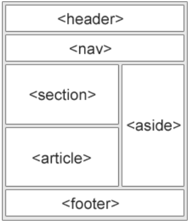

# HTML Inputs
<p align="center">
	
	
</p>

## HTML CSS
Inline CSS 
```html
<h1 style="color:blue;">A blue heading</h1>
```

Internal CSS
```html
<style>body{background-color:blue;}</style>
```

External CSS
```html
<link rel="stylesheet" href="styles.css">
```

## HTML Table
```html
<table>
	<tr> # Table Row
		<th>Table Header</th>
	</tr>
	<tr>
		<td>Table Data</td>
	</tr>
</table>
```

## HTML List
```html
<ul> # Unordered list
	<li>List item</li>
</ul>

<ol></ol> # Ordered list
```

## Block level elements
- Always start on a new line
- Always take the full width available
- Has a top & bottom margin

```html
<article>
<div>
<fieldset>
<footer>
<form>
<h1-h6>
<header>
<hr>
<li>
<main>
<nav>
<ol>
<p>
<section>
<table>
<ul>
<video>
```

## Inline elements
- Doesn't start on a new line
- Only takes neccesary width

```html
<a>
<br>
<button>

<input>
<label>
<script>
<span>
<textarea>
```

## HTML Head element
The head element is a **container for metadata**, which is data about data
HTML metadata is data about the HTML document
Tipically define the doc title, character sset, styles, scripts

## meta element
```html
<meta charset="UTF-8">
```
Define the **character set** used
```html
<meta name="keywords" content="HTML, CSS, JavaScript">
# Defines keywords for search engines

# Description of your website
<meta name="description" content="Free web tutorials">

# Define the author of a page
<meta name="author" content="Johnny Melavo">

# Refresh document every 30 seconds
<meta http-equiv="refresh" content="30">

# Setting the viewport to make your website looking good on all devices
<meta name="viewport" content="width=device-width, initial-scale=1.0">

# Viewport should be included always!
# The viewport is the user's visible area of a web page

# Sets the width of a page to follow the screen-width of the device
width=devide-width

# Sets the initial zoom level when the page is first  loaded by the browser
initial-scale=1.0
```

## HTML Layout elements
<p align="center">
	
</p>

```html
<header> # Defines a header for a document or a section
<nav> # Defines a set of navigation links
<section> # Defines a section in a document
<article> # Defines an independent, self-contained content
<aside> # Defines content aside from the context (sidebar)
<footer> # Defines a footer for a document or a section
```

## HTML Forms
An HTML form is used to **collect user input**
The user input is most often sent to a server for processing

```html
<form> # Element is a container for different types of input elements
	<input type="text"> # Single-line text input field
	<input type="radio"> # Displays a radio button (selection 1 of many choices)
	<input type="checkbox"> # Displays a checkbox (selecting 0 or many choices)
	<input type="submit"> # Displays a submit button (for submiting the user input)
	<input type="button"> # Displays a submit button (for submitting the form)
</form>
```

#### Input types

button, checkbox, color, date, datetime-local, email, number, password, radio, range, reset, submit, tel, text, time, url, week

#### Input restrictions
checked, disabled, max, maxlength, min, pattern, readonly, required, size, step, value

#### Input attributes
value, readonly, disabled, size, maxlength, min, max, multiple, pattern, placeholder, required, autofocus, list

#### Form elements
input, textarea, label, fieldset, legend, select, option, button, datalist, output

#### Form attributes
action, autocomplete, enctype, method, name, novalidate, target


## iframe
The iframe element is able to display another website inside on our own website. An inline frame is used to embed another document withing the current HTML document
