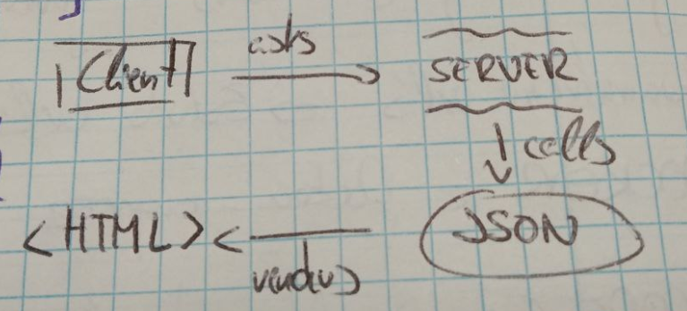

# JSON Crash Course
**JSON is a syntax for storing and exchanging data**
**JSON is text, written in JavaScript object notation**

JSON is extremely important in web development, specially when working with APIs

- JSON stands for **JavaScript Object Notation**
- It's a lightweight data-interchange format
- Based on a subset of JavaScript, it's easy to read and write
- Often used with AJAX
- Can be used with most modern languages

### Quick Intro
When exchanging data between a browser and a server, the data can only be text
*JSON is text, and we can convert any JavaScript object into JSON and send JSON to the server*
*We can also convert any JSON received from the server into JavaScript Objects*
This way we can work with the data as JavaScript objects, with no complicated parsing and translations

**Sending data**
```sh
var myObj = {name: "John", age: 31, city: "New York"};

var myJSON = JSON.stringify(myObj);
```

**Receiving data**
```sh
var myJSON = '{"name":"John", "age":31, "city":"New York"}';

var myObj = JSON.parse(myJSON);
```


### What is AJAX?
*AJAX* is used for send data back and forth from client and server

**AJAX** stands for **A**synchoronous **J**avaScript **A**nd **X**ML
AJAX uses a combination of both:
A browser built-in **XMLHttpRequest** object (to request data from a web server)
JavaScript and HTML DOM (to display or use the data)

The XMLHttpRequest object can be used to exchange data with a server behind the scenes
This means it's possible to update parts of a web page without reloading the whole page
```sh
var xhttp = new XMLHttpRequest();

# Sending a request to a server
xhttp.open("GET", "ajax_info.txt", true);
xhttp.send();

# Server response
function loadDoc() {

	var xhttp = new XMLHttpRequest();
	
	xhttp.onreadystatechange = function() {

		if(this.readyState == 4 && this.status == 200) {

			document.getElementById("demo").innerHTML = this.responseText;
		}
	};

	xhttp.open("GET", "ajax_info.txt", true);
	xhttp.send();
}
```

With AJAX is possible to
- Update a web page without reloading the page
- Request data from a server (after the page has loaded)
- Receive data from a server (after the page has loaded)
- Send data to a server in the background


### Data Types
**Number**: No difference between integer and floats

**String**: String of Unicode characters. Use double quotes

**Boolean**: True or false

**Array**: Ordered list of 0 or more values

**Object**: Unordered collection of key/value pairs

**Null**: Empty value


### JSON Syntax Rules
- Uses **key/value pairs** {"name":"Javito"}
- Uses **double quotes** around KEY and VALUE
- Must use the specified data types
- File type is ".json"
- MIME type is "Application/json"


### JSON Example
```sh
{
	"name":"Juan Sanchez",
	"age": 30,
	"address": {
		"street": "Av Figueroa Alcorta",
		"city": "Buenos Aires"
	},
	"children":["Marcelo","Marcela"]
}
```


### JSON.stringify() & JSON.parse()
A common use of JSON is to exchange data to/from a server
When sending data to a web server, the data *has to be a string*
We can convert a JavaScript object with **JSON.stringify()**

Let's say we have in our index.html a js object
```sh
<script>
	var person = {
		name: "Tomas",
		age: 25
	}

	# Converting our person object into a valid JSON
	person = JSON.stringify(person);

	# Returns a JSON string formated correctly
	console.log(person)
</script>
```
We can do the exact opposite and turn our string into a JavaScript object with **JSON.parse()**
```sh
	person = JSON.parse(person)
```

Now with another complex example
```sh
var person = {
	name:"Juan Sanchez",
	age: 30,
	address: {
		street: "Av Figueroa Alcorta",
		city: "Buenos Aires"
	},
	children:["Marcelo","Marcela"]
}

# Accessing the address object and getting the street property
console.log(person.address.street); # Av Figueroa Alcorta

# Accessing the first children
console.log(person.children[0]);

# Creating an array of objects
var people = [
	{
		name: "David",
		age: 40
	},
	{
		name: "Andrea",
		age: 30
	},
	{
		name: "Andres",
		age: 50
	}
];

# Accesing the second person's age
console.log(people[1].age); # 30

# Looping through an array
var output = "";

for(var i = 0; i < people.length; i++) {

	console.log(people[i].name); # David Andrea Andres

	# Appending a new list of people into our HTML
	output += "<li>" + people[i].name + "</li>";

}

document.getElementById("people").innerHTML = output;
```

### Fetching a JSON with AJAX and outputing onto the screen
Creating a JSON file with a people array
On *people.json*
```sh
{
	"people": [
		{
			"name": "David",
			"age": 40
		},
		{
			"name": "Andrea",
			"age": 30
		},
		{
			"name": "Andres",
			"age": 50
		}
	]
}
```
Now we'll send a get request to that people.json file

On *index.html* placed on our localhost
```sh
var xhttp = new XMLHttpRequest();
	
xhttp.onreadystatechange = function() {

	if(this.readyState == 4 && this.status == 200) {

		# Getting the data
		console.log(xhttp.responseText);

		# Creating a new variable and turning our JSON into a JavaScript object
		var people = JSON.parse(xhttp.responseText);

		var output = "";

		for(var i = 0; i < people.length; i++) {

			output += "<li>" + people[i].name + "</li>";

		}

		# Now we're getting our info from the JSON onto the screen
		document.getElementById("people").innerHTML = output;
	}
};

xhttp.open("GET", "people.json", true);
xhttp.send();
```


### Another example sending JSON Data to a Server
```sh
const url = 'https://example.example.com/todos/1';

# Sending a GET request without any data to the server
fetch(URL, {method: "GET"})

# Getting JSON data from the raw response
.then(rest => res.json())

# Print the result
.then(console.log);
```


### Another example receiving JSON Data to a Server
```sh
const url = 'https://example.example.com/todos/1';

const data = {
	"id": 1,
	"title": "My title",
	"completed": false
};

# Sending a post request
fetch(URL, {
	method: "POST",
	body: JSON.stringify(data),
	headers: {
		"Content-type": "application/json; charset=UTF-8"
	}
});
```

## JSON Summary
#### Basics
- Data representation format
- Commonly used for APIs & Configs
- Lightweight and easy to read & write
- Superset of JavaScript (anything written in JSON is valid JavaScript)

#### JSON Types "key":"value"
Strings
Numbers
Booleans
null
Arrays [1,2,3], ["Hello","World"]
Objects {"key":"value"}, {"age":30}

#### Example myWebsites.json
As JSON is a data format for store, send and receive data, we can also store and render our websites with JSON!
<p align="center">
	
</p>
```sh
"myWebs":{
	"web1":{"<!DOCTYPE html><html>..."},
	"web2":{"<!DOCTYPE html><html>..."}
}
```

#### Example user.json
```sh
{
	"name":"Kyle",
	"friends":[{
		"name":"Joey",
		"friends":["..."]
	}]
}
```

#### Example list.json
```sh
[
	{
		"name":"Big Corporation",
		"numberOfEmployees": 10000,
		"CEO":"Mary",
		"rating":3.6
	},
	{
		"name":"Small Startup",
		"numberOfEmployees": 3,
		"CEO":null,
		"rating":4.3
	}
]
```
