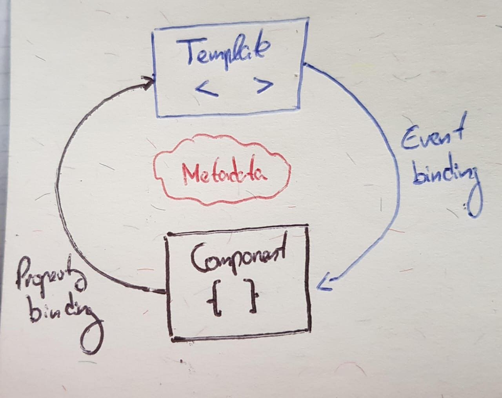
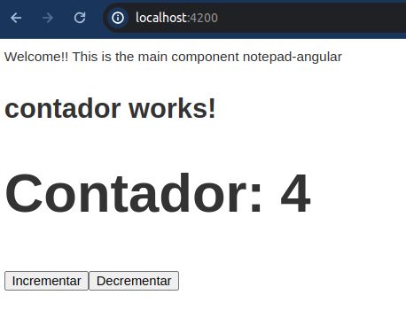

# Angular :a:
# 0. Conceptos basicos

### 0.1 Que es una SPA?
Una SPA es una forma moderna de construir aplicaciones web que ofrece una experiencia de usuario más fluida y receptiva al cargar una sola página HTML inicial y actualizar dinámicamente el contenido en respuesta a las acciones del usuario, todo dentro del navegador web.
En lugar de cargar páginas completamente nuevas desde el servidor, en una SPA, toda la interfaz de usuario se construye y se actualiza dinámicamente en el navegador web a medida que el usuario interactúa con la aplicación, sin la necesidad de recargar la página. Entre sus características están:

1. **Carga inicial rápida**: Cuando un usuario accede a una SPA por primera vez, se carga una única página HTML inicial que contiene la estructura básica de la aplicación y los recursos necesarios, como JavaScript, CSS y posiblemente algunas plantillas de contenido.

2. **Interacciones sin recarga de página**: Una vez que la SPA se ha cargado inicialmente, todas las interacciones del usuario, como hacer clic en enlaces, enviar formularios o interactuar con elementos de la interfaz, se manejan a través de JavaScript. En lugar de cargar páginas completamente nuevas desde el servidor, la SPA utiliza JavaScript para hacer solicitudes al servidor y actualizar dinámicamente el contenido de la página actual en función de la respuesta del servidor.

3. **Navegación fluida**: La navegación en una SPA es fluida y rápida, ya que las transiciones entre vistas se realizan de forma dinámica en el navegador, sin la necesidad de cargar una nueva página desde el servidor.

4. **Mejora de la experiencia del usuario**: Debido a su enfoque en la actualización dinámica del contenido y la navegación fluida, las SPAs suelen ofrecer una experiencia de usuario más interactiva y receptiva en comparación con las aplicaciones web tradicionales.

5. **Frameworks y bibliotecas populares**: Hay varios frameworks y bibliotecas populares para desarrollar SPAs, como React, Angular, Vue.js, entre otros. Estas herramientas proporcionan funcionalidades avanzadas y patrones de desarrollo que facilitan la construcción de aplicaciones web modernas y eficientes.

6. **Gestión del estado**: Dado que las SPAs tienden a ser más complejas en términos de interacciones y vistas dinámicas, a menudo *requieren una gestión avanzada del estado de la aplicación*. Los frameworks y bibliotecas modernas proporcionan *herramientas para facilitar esta gestión del estado, como el uso de componentes reactivos, patrones de diseño como Flux o Redux, y el enlace de datos bidireccional*.


### 0.2 Que es el estado en una SPA?
El estado se refiere a la representación de los datos de la aplicación en un momento dado. 
Define cómo se comporta y se presenta la aplicación en cualquier momento. Un manejo eficiente del estado es crucial para crear aplicaciones web interactivas y responsivas.

El estado es un objeto que contiene toda la información necesaria para que la interfaz de usuario de la SPA funcione y se muestre correctamente. Este concepto es crucial para el manejo y la actualización dinámica de la UI sin necesidad de recargar la página completa. Entre sus componentes destacan:

1. **Datos de la Aplicación**: Información como los datos del usuario, el contenido mostrado, los resultados de búsquedas, etc.
2. **Estado de la UI**: Datos sobre el estado visual de la aplicación, como cuál pestaña está activa, si un modal está abierto, etc.
3. **Datos Temporales**: Información que puede no necesitarse permanentemente, como valores de formularios no guardados.
4. **Configuraciones y Preferencias**: Preferencias del usuario, configuraciones de la aplicación, etc.


### 0.2 Que es Angular?
Angular es un framework de desarrollo de aplicaciones que permite crear aplicaciones de una sola página, SPAs. Es de codigo abierto y utiliza TypeScript. 

Es un framework o marco de trabajo rígido y robusto, lo que nos permite construír apps sólidas y estrictas. Se trabaja de una forma muy particular y poco flexible, al contrario que la librería React.js. 

Entre sus características se destacan:

1. **Arquitectura MVC**: Sigue el patron Modelo-Vista-Controlador para separar la lógica de presentación de los datos y la interfaz de usuario
2. **Componentes**: Angular se basa en una estructura de componentes, lo que permite a los desarrolladores crear aplicaciones modulares y reutilizables
3. **Data Binding Bidireccional**: Angular ofrece enlaces de datos bidireccionales, lo que implica que *los cambios realizados en el modelo de datos se reflejan automáticamente en la IU y viceversa*.
4. **Inyección de dependencias**: Angular proporciona un sistema de inyección de dependencias que facilita la creación y gestión de dependencias entre los distintos componentes de una app.
5. **Directivas**: Angular incluye un conjunto de directivas predefinidas que permiten extender el comportamiento de HTML y añadir funcionalidades dinámicas a las vistas.
6. **Enrutamiento**: Angular ofrece un enrutador incorporado que permite a los desarrolladores gestionar las rutas y la navegación dentro de una app de forma eficiente
 

### 0.3 Que es MVC?
#### MVC en Angular con ejemplos
Angular se basa en el patrón de diseño Modelo-Vista-Controlador (MVC), que es un enfoque de arquitectura de software que separa la aplicación en tres componentes principales: Modelo, Vista y Controlador.

1. **Modelo (Model)**:
   - El Modelo representa los datos y el estado de la aplicación. Esto puede incluir datos de usuario, datos de la aplicación, información de configuración, etc.
   - En Angular, los Modelos se definen utilizando clases TypeScript o interfaces para representar la estructura de los datos.

   Ejemplo en Angular:
   ```typescript
   export class Usuario {
       id: number;
       nombre: string;
       email: string;
   }
   ```

2. **Vista (View)**:
   - La Vista es la interfaz de usuario con la que interactúa el usuario final. Muestra los datos al usuario y recibe las interacciones del usuario, como clics de botones o entradas de formulario.
   - En Angular, las Vistas están definidas usando plantillas HTML que están vinculadas a los datos y comportamientos definidos en los componentes de Angular.

   Ejemplo en Angular (archivo `usuario.component.html`):
   ```html
   <div>
       <p>Nombre: {{ usuario.nombre }}</p>
       <p>Email: {{ usuario.email }}</p>
   </div>
   ```

3. **Controlador (Controller)**:
   - El Controlador actúa como intermediario entre el Modelo y la Vista. Se encarga de manejar las interacciones del usuario, actualizar el Modelo en consecuencia y actualizar la Vista para reflejar los cambios en los datos.
   - En Angular, los Controladores se implementan mediante componentes, que son clases TypeScript decoradas con el decorador `@Component`.

   Ejemplo en Angular (archivo `usuario.component.ts`):
   ```typescript
   import { Component, OnInit } from '@angular/core';
   import { Usuario } from './usuario.model';

   @Component({
       selector: 'app-usuario',
       templateUrl: './usuario.component.html',
       styleUrls: ['./usuario.component.css']
   })
   export class UsuarioComponent implements OnInit {
       usuario: Usuario;

       ngOnInit(): void {
           // Aquí podrías obtener los datos del usuario desde una API
           this.usuario = { id: 1, nombre: 'Juan', email: 'juan@example.com' };
       }
   }
   ```

En este ejemplo, el Modelo (`Usuario`) representa los datos del usuario, la Vista (`usuario.component.html`) muestra la información del usuario utilizando la sintaxis de interpolación de Angular (`{{ usuario.nombre }}`, `{{ usuario.email }}`), y el Controlador (`UsuarioComponent`) proporciona la lógica para obtener los datos del usuario y manejar su representación en la Vista.


### No siempre tiene por que haber un Modelo
Aunque Angular se considera un framework que sigue el patrón de diseño Modelo-Vista-Controlador (MVC), en la práctica, el uso del modelo puede variar según la complejidad y los requisitos de la aplicación. Hay varias razones por las cuales algunas aplicaciones de Angular pueden no tener modelos explícitos:

1. **Simplicidad de la Aplicación**:
   - En aplicaciones pequeñas o simples, puede no ser necesario definir modelos explícitos. Los datos pueden manejarse directamente dentro de los componentes o servicios sin la necesidad de crear clases de modelo separadas.
   - Ejemplo: Una aplicación que solo muestra datos estáticos o realiza operaciones muy básicas puede no requerir una capa de modelos.

2. **Prototipos y MVPs**:
   - Durante las etapas iniciales de desarrollo, como en la creación de prototipos o productos mínimos viables (MVP), los desarrolladores pueden optar por una estructura más simple para acelerar el proceso de desarrollo. En estas fases, los modelos pueden parecer innecesarios hasta que la aplicación se vuelva más compleja.

3. **Uso de Interfaces en lugar de Clases de Modelo**:
   - En muchos casos, los desarrolladores de Angular utilizan interfaces TypeScript para definir la forma de los datos en lugar de clases de modelo completas. Las interfaces proporcionan una estructura ligera y son suficientes para definir contratos de datos.
   - Ejemplo:
     ```typescript
     export interface User {
       id: number;
       name: string;
       email: string;
     }
     ```

4. **Aplicaciones de Formulario o CRUD Simples**:
   - Las aplicaciones que simplemente manejan formularios o realizan operaciones CRUD básicas pueden no necesitar una capa de modelo compleja. Los datos pueden manejarse directamente en los componentes, y los servicios pueden manejar la comunicación con la API sin necesidad de definir modelos separados.

5. **Uso de Bibliotecas y Servicios Externos**:
   - Algunas aplicaciones pueden depender de bibliotecas o servicios externos que proporcionan sus propias estructuras de datos. En estos casos, los desarrolladores pueden utilizar directamente las estructuras proporcionadas por esas bibliotecas en lugar de definir sus propios modelos.

6. **Evolución del Proyecto**:
   - A medida que un proyecto evoluciona, la necesidad de modelos puede surgir más adelante. Inicialmente, un proyecto puede comenzar sin modelos explícitos y, con el tiempo, a medida que la complejidad crece, los desarrolladores pueden refactorizar el código para incluir modelos.

*Aunque Angular está diseñado para soportar el patrón MVC, la presencia de modelos explícitos depende del contexto y los requisitos específicos de la aplicación. No todas las aplicaciones necesitan una capa de modelos completa desde el principio, y algunas pueden nunca necesitarla si permanecen simples. La flexibilidad de Angular permite a los desarrolladores adaptar la arquitectura según las necesidades del proyecto, lo que puede resultar en aplicaciones sin modelos definidos explícitamente.*


#### MVC Teoría
Es un patron de diseño de software muy popular cuyo objetivo es dividir una app en tres componentes para mejorar la modularidad, mantenibilidad y escalabilidad del código.

En Angular, el patrón Modelo-Vista-Controlador (MVC) se aplica de manera similar a otros frameworks que siguen este patrón, pero con algunas diferencias debido a la arquitectura específica de Angular:


1. **Modelo (Model)**:
   - El modelo en Angular representa los datos de la aplicación y su lógica subyacente. 
   - *Por ejemplo, en el caso de un banco, el modelo representa su lógica de negocios. Si el cliente tiene cuenta corriente, caja de ahorro, el login de usuarios. Toda esa info la maneja el modelo para que cuando se necesite consumir por la vista, se pueda manipular esos datos*
   - Los modelos en Angular son generalmente clases TypeScript que definen la estructura y el comportamiento de los datos.
   - Los modelos pueden contener métodos para recuperar, actualizar o manipular los datos.


2. **Vista (View)**:
   - La vista en Angular es la representación visual de los datos del modelo en la interfaz de usuario.
   - En Angular, las vistas están escritas en HTML con directivas y enlaces de datos que permiten mostrar dinámicamente los datos del modelo.
   - Las vistas pueden contener directivas estructurales y atributos de enlace de datos que permiten una manipulación dinámica de la interfaz de usuario.

3. **Controlador (Componentes y Servicios)**:
    - *Actúa como intermediario entre el modelo y la vista. Se encarga de manejar las interacciones del usuario, como los clicks, eventos de entrada, y coordina las acciones necesarias para que el modelo y la vista se mantengan sintonizados.* **Es decir, el controlador controla el flujo de datos entre el modelo y la vista.** 
   - En Angular, el controlador se divide en dos partes: componentes y servicios.
   - Los componentes actúan como controladores en Angular. Cada componente controla una parte específica de la interfaz de usuario y está asociado con una vista HTML.
   - Los servicios en Angular encapsulan la lógica de negocio y proporcionan funcionalidades compartidas entre componentes.
   - Los componentes y los servicios trabajan juntos para controlar la lógica de la aplicación, manipular los datos del modelo y manejar las interacciones del usuario.

En Angular, el patrón MVC se implementa mediante la separación de responsabilidades entre modelos (datos y lógica), vistas (interfaz de usuario) y controladores (componentes y servicios) para crear aplicaciones web escalables y mantenibles.


### 0.4 Angular CLI
**Angular Command Line Interface** es una herramienta de línea de comandos para crear, desarrollar y administrar apps web en Angular.
El CLI proporciona una serie de utilidades y comandos que simplifican muchas tareas comunes en el proceso de desarrollo.
```sh
# Crear una app en Angular
ng new nombre-aplicacion

# Nuevo componente en Angular
ng generate component <component-name>
```


# 1. Estructura de directorios Angular
```
|-- e2e/
|   |-- app.e2e-spec.ts
|   |-- app.po.ts
|-- node_modules/
|-- src/
|   |-- app/
|   |   |-- components/
|   |   |-- services/
|   |   |-- models/
|   |   |-- app-routing.module.ts
|   |   |-- app.component.html
|   |   |-- app.component.scss
|   |   |-- app.component.spec.ts
|   |   |-- app.component.ts
|   |   |-- app.module.ts
|   |-- assets/
|   |-- environments/
|   |   |-- environment.prod.ts
|   |   |-- environment.ts
|   |-- index.html
|   |-- main.ts
|   |-- styles.scss
|-- angular.json
|-- package.json
|-- tsconfig.json
|-- README.md
```

- **e2e/**: Contiene pruebas de extremo a extremo (end-to-end) escritas utilizando Protractor.
  - **app.e2e-spec.ts**: Archivo de especificaciones de prueba de extremo a extremo.
  - **app.po.ts**: Page Object utilizado para interactuar con elementos en las pruebas de extremo a extremo.
  
- **node_modules/**: Contiene las dependencias de npm instaladas para el proyecto.

- **src/**: Contiene el código fuente de la aplicación.
  - **app/**: El directorio principal de la aplicación.
    - **components/**: Componentes de la aplicación.
    - **services/**: Servicios de la aplicación.
    - **models/**: Modelos de datos de la aplicación.
    - **app-routing.module.ts**: Módulo de enrutamiento de la aplicación.
    - **app.component.html**: Plantilla HTML principal de la aplicación.
    - **app.component.scss**: Estilos SCSS para el componente principal de la aplicación.
    - **app.component.spec.ts**: Especificaciones de prueba para el componente principal.
    - **app.component.ts**: Lógica del componente principal.
    - **app.module.ts**: Módulo raíz de la aplicación.
  - **assets/**: Contiene archivos estáticos como imágenes, fuentes, etc.
  - **environments/**: Contiene archivos de configuración para diferentes entornos, como desarrollo y producción.
    - **environment.prod.ts**: Configuración para el entorno de producción.
    - **environment.ts**: Configuración para el entorno de desarrollo.
  - **index.html**: Punto de entrada HTML de la aplicación.
  - **main.ts**: Punto de entrada de la aplicación Angular.
  - **styles.scss**: Archivo de estilos globales de la aplicación.

- **angular.json**: Archivo de configuración de Angular CLI que define la configuración del proyecto. *Es importante no tocar nada! Es la configuración clave de nuestra aplicación. Aca podremos poner estilos de terceros, como bootstrap en "styles" así como los archivos de JavaScript que necesite alguna librería externa en "scripts"*

- **package.json**: Archivo de configuración de npm que define las dependencias del proyecto y los scripts de comandos.
*Este es el archivo en el que se fija Node.js para poder instalar los paquetes*

- **tsconfig.json**: Archivo de configuración de TypeScript que define las opciones de compilación de TypeScript.

- **README.md**: Archivo de documentación que proporciona información sobre el proyecto.

- **.gitignore**: Es el archivo de git que nos permite excluir directorios que no queremos subir a un repositorio, como un archivo environment `.env` donde ubicamos nuestros usuarios y contraseñas. De esta manera, cada usuario parte de nuestro proyecto tendrá que tener sus propias variables de entorno secretas en su repositorio.

También incluiremos aquí al directorio `node_modules` para no subir gigas de módulos de node que podemos instalarlos con npm install cuando bajemos nuestro repositorio.


#### src/
Todo por fuera de la carpeta source es configuración de nuestro proyecto angular. El código de nuestra aplicación Angular está en source o `src`

- **styles.css**: Archivo general de estilos globales de la app
- **main.ts**: No se suele tocar, archivo de configuración general de typescript
- **index.html**: Es el archivo inicial que buscan todos los servidores. La clave acá está en `<app-root>` que indica el punto de entrada de la aplicación Angular


#### El elemento `<app-root>`
En una aplicación de Angular, `<app-root>` es la etiqueta raíz que se utiliza en el archivo HTML principal (`index.html`) para indicar el punto de entrada de la aplicación Angular. Esta etiqueta se define en el archivo `app.component.html` del proyecto Angular.

Cuando Angular inicia la aplicación, busca la etiqueta `<app-root>` en el archivo HTML principal y reemplaza esta etiqueta con el componente principal de la aplicación, que generalmente se llama `AppComponent` y está definido en el archivo `app.component.ts`.

Por lo tanto, `<app-root>` es esencialmente el contenedor principal de toda la aplicación Angular. Todos los demás componentes y contenido de la aplicación se renderizan dentro de este contenedor.

Es importante destacar que `<app-root>` es solo una convención de nomenclatura predeterminada, y puedes cambiar este nombre si lo deseas, pero asegúrate de ajustar también la configuración correspondiente en los archivos de configuración de Angular.

#### El directorio src/app
Es el directorio principal de nuestra aplicación Angular, acá tenemos tres archivos fundamentales como son 
- `app-routing-module`: El archivo de enrutamiento o **routing**
- `app-module-module`: El archivo de **modulo**
- `app-component-module`: El archivo de **componente**


# 2. Modulos
Son una parte fundamental de la arquitectura de la aplicación. Ayudan a dividir una aplicación en partes más pequeñas y manejables, lo que facilita el desarrollo, mantenibilidad y escalabilidad. Un modulo es por tanto una division organizativa de una aplicacion.

Un módulo es un mecanismo de organización y encapsulación que se utiliza para agrupar componentes, directivas, pipes (filtros) y servicios para proporcionar funcionalidades específicas a una aplicación. 

Un módulo en Angular se define mediante la decoración `@NgModule`, que se importa desde `@angular/core`. *Al definir un módulo, puedes especificar qué componentes, directivas, pipes y servicios pertenecen a ese módulo, así como también qué otros módulos necesita importar.*

Los módulos en Angular pueden dividirse en dos tipos principales:

1. **Módulos de la aplicación (App Module)**: Este tipo de módulo es el módulo raíz de la aplicación Angular y se utiliza para inicializar y configurar la aplicación. Contiene componentes principales, servicios globales y otros módulos de la aplicación. Por lo general, se nombra `AppModule` y se encuentra en el archivo `app.module.ts`.

2. **Módulos de funcionalidad (Feature Modules)**: Estos son módulos que encapsulan características específicas de la aplicación, como funcionalidades relacionadas con la autenticación, el enrutamiento, el formulario, etc. Los módulos de funcionalidad permiten organizar el código de la aplicación en unidades lógicas y promueven la reutilización. Por lo general, cada característica importante de la aplicación tiene su propio módulo de funcionalidad.

En resumen, **el modulo es la división organizativa**, los módulos son contenedores que encapsulan y organizan el código de la aplicación en unidades lógicas y cohesivas, lo que facilita su desarrollo, mantenimiento y escalabilidad.

*Son la forma en que se organiza la aplicación, los módulos no se ven, los componentes sí. Son unidades organizativas, encapsulan funcionalidades, dividen la aplicación, importan y exportan elementos, registran proveedores y evitan conflictos de nombres.*

```sh
ng generate module module-name
```

```ts
// Importaciones, este modulo tendra disponible informacion y caracteristicas de otros modulos
import { NgModule } from '@angular/core';
import { BrowserModule } from '@angular/platform-browser';

import { AppRoutingModule } from './app-routing.module';
import { AppComponent } from './app.component'; // Mi componente

// NgModule indica que es un Modulo, adentro mandamos un objecto
@NgModule({
  declarations: [
    AppComponent
  ],
  imports: [
    BrowserModule,
    AppRoutingModule, // Modulo que nos permite enrutar y navegar la app
    bootstrap: [AppComponent] // Configuracion por defecto de Angular para renderizar dinamicamente el AppModule
  ],
// Podemos exportar nuestro modulo con exports: []
})
export class AppModule { }
```


# 3. Componentes
Son bloques para la construccion de IUs en una aplicacion web. Definen como se ve y e comporta una parte especifica de la IU. Cada componente represente un elemento visual o funcional, header, footer, form, etc.

Los componentes son piezas reutilizables de código que pueden contener plantillas HTML, estilos CSS y lógica TypeScript, todo ello trabajando juntos para definir cómo se ve y se comporta una parte de la interfaz de usuario de la aplicación.

Cada componente consta de tres partes principales:

1. **Clase de componente (Component Class)**: Esta es una clase TypeScript que define la lógica del componente, incluidas las propiedades y métodos que controlan su comportamiento. La clase de componente se puede decorar con metadatos de Angular para configurar su comportamiento y su apariencia.

2. **Plantilla (Template)**: La plantilla HTML define la estructura visual del componente y cómo se muestran los datos en la interfaz de usuario. La plantilla puede contener enlaces de datos, directivas estructurales y de atributos, y referencias a estilos CSS.

3. **Estilos (Styles)**: Los estilos CSS definen la apariencia visual del componente. Pueden ser estilos en línea, estilos embebidos o estilos externos importados.

Los componentes son la piedra angular de la arquitectura de una aplicación Angular y se utilizan para construir la interfaz de usuario de manera modular y reutilizable. Cada componente representa una parte específica de la aplicación y se puede integrar fácilmente en otras partes de la aplicación según sea necesario.

Angular utiliza el Atomic Design, consiste en diseñar en cadena bloques reutilizables. Toda la pantalla acaba siendo un componente grande compuesto a su vez por otros componentes


Para crear un componente en Angular, se utiliza el comando `ng generate component` o su forma abreviada `ng g c nombre-componente`. Este comando crea automáticamente los archivos necesarios para el componente, incluida la clase de componente, la plantilla y los estilos, y los coloca en la ubicación adecuada dentro del proyecto. El más recomendado es `ng g c components/nuevo-componente`


### El comando `n g c components/padre` nos agrega automaticamente nuestro nuevo componente al modulo raiz! `app.module.ts`
```ts
import { NgModule } from '@angular/core';
import { BrowserModule } from '@angular/platform-browser';

import { AppRoutingModule } from './app-routing.module';
import { AppComponent } from './app.component';
import { PadreComponent } from './padre/padre.component';

@NgModule({
  declarations: [
    AppComponent,
    PadreComponent // Se agrego automaticamente, por eso ahora podemos poner <app-padre> en app.component.html
  ],
  imports: [
    BrowserModule,
    AppRoutingModule
  ],
  providers: [],
  bootstrap: [AppComponent]
})
export class AppModule { }

```

- **El archivo del componente**: `component-name.component.ts`
```ts
// nombre-del-componente.component.ts
import { Component, OnInit } from '@angular/core';

@Component({
  selector: 'app-nombre-del-componente',
  templateUrl: './nombre-del-componente.component.html',
  styleUrls: ['./nombre-del-componente.component.css']
})

export class AppComponent implements OnInit {
  
  // Propiedades del componente
  title = 'notepad-angular';

  // Constructor
  constructor() { }

  // Metodo de inicializacion
  ngOnInit(): void {

  }

  // Otros metodos y logica del componente
}

```

- **El archivo HTML de la plantilla**: `component-name.component.html`
- **El archivo de estilos**: `component-name.component.css`
- **El archivo de prueba**: `component-name.component.specs.ts`


# 4. Binding o Enlace de datos
Es el ida y vuelta de datos entre la vista y el controlador (componente). 

<p>
  
</p>

En Angular, el data binding es una característica fundamental que permite establecer una conexión bidireccional entre el modelo de datos de la aplicación y la interfaz de usuario (UI). Esto *significa que los cambios en el modelo de datos se reflejan automáticamente en la UI, y viceversa, sin necesidad de escribir código manualmente para sincronizar los datos*.

El data binding en Angular se puede dividir en tres tipos principales:

1. **Interpolación ({{ }})**: La interpolación se utiliza para mostrar valores de propiedades del componente en la plantilla HTML. Se utiliza la sintaxis de doble llave `{{ }}` para insertar dinámicamente el valor de una expresión del componente en la plantilla.

   Ejemplo:
   ```html
   <h1>{{ title }}</h1>
   ```

2. **Enlace de propiedades (Property Binding)**: El enlace de propiedades permite establecer el valor de un atributo de HTML dinámicamente en función de una propiedad del componente. Se utiliza la sintaxis de corchetes `[]` para enlazar una propiedad del componente con un atributo HTML.

   Ejemplo:
   ```html
   
   ```

3. **Enlace de eventos (Event Binding)**: El enlace de eventos permite responder a eventos del usuario, como clics de botón, pulsaciones de teclas, etc., y ejecutar funciones en respuesta a esos eventos en el componente. Se utiliza la sintaxis de paréntesis `()` para enlazar eventos del DOM con métodos del componente.

   Ejemplo:
   ```html
   <button (click)="onClick()">Click me</button>
   ```

Además de estos tipos de data binding, Angular también ofrece la capacidad de realizar data binding bidireccional con `ngModel`, que combina la funcionalidad de enlace de propiedades y enlace de eventos para permitir la sincronización automática de datos entre un elemento de formulario HTML y una propiedad del componente.

En resumen, el data binding en Angular facilita la sincronización de datos entre el modelo y la vista de una aplicación, lo que permite una experiencia de usuario dinámica y receptiva sin la necesidad de escribir mucho código manualmente. Entre sus características están:

- **Conexión automática**: Sincroniza datos entre el modelo y la vista
- **Unidireccional**: Los cambios en el modelo se reflejan en la vista
- **Bidireccional**: Los cambios en la vista actualizan el modelo
- **Reactivo**: utiliza observables para actualizaciones en tiempo real
- **Simplifica la interacción**: Facilita la creación de aplicaciones interactivas
- **Automatiza las actualizaciones**: Los cambios se reflejan sin intervención manual

En nuestro nuevo componente `ng g c components/contador`
```ts
// contador.component.ts
import { Component } from '@angular/core';

@Component({
  selector: 'app-contador',
  templateUrl: './contador.component.ts',
  stylesUrls: ['./contador.component.css']
})
export class ContadorComponent {
  valorContador: number = 0; // binding de propiedad

  incrementar() {
    this.valorContador++;
  }

  decrementar() {
    this.valorContador--;
  }
}
```

```html
<!-- contador.component.html -->
<p>contador works!</p>
<h1>Contador: {{ valorContador }}</h1>
<button (click)="incrementar()">Incrementar</button>
<button (click)="decrementar()">Decrementar</button>
```

<p>
  
</p>


### Metadata
La metadata es la información adicional que se proporciona mediante decoradores para configurar y definir el comportamiento de una clase, un componente, un servicio o cualquier otra estructura en una aplicación Angular.

La metadata se utiliza en Angular para decorar clases y proporcionar información sobre cómo deben comportarse esas clases en tiempo de ejecución. Los decoradores son funciones que modifican el comportamiento de las clases a las que se aplican.

La metadata en Angular se define utilizando decoradores especiales proporcionados por el framework. Algunos de los decoradores más comunes utilizados para definir metadata en Angular incluyen:

1. **@NgModule**: Se utiliza para decorar clases de módulo y proporcionar información sobre cómo se compila y ejecuta el módulo.

2. **@Component**: Se utiliza para decorar clases de componente y proporcionar información sobre cómo se debe crear y procesar el componente.

3. **@Injectable**: Se utiliza para decorar clases de servicio y proporcionar información sobre cómo se debe crear y proporcionar el servicio en la aplicación.

4. **@Directive**: Se utiliza para decorar clases de directiva personalizada y proporcionar información sobre cómo se debe comportar la directiva.

5. **@Input** y **@Output**: Se utilizan para decorar propiedades y eventos de componente respectivamente, para permitir el enlace de datos y la comunicación entre componentes.

Entre sus características:
- **Configuración**: Define cómo se comportan las partes de la aplicación
- **Decoradores**: Se utiliza con decoradores como `@Component`, `@NgModule` o `@Injectable`
- **Personalización**: Ajusta el comportamiento con propiedades clave
- **Componente**: Metadata para componentes, incluye plantilla y estilos
- **Módulo**: Configuración de módulos como declaraciones e importaciones
- **Servicio**: Metadata para servicios, define su alcance y proveedores
- **Directiva**: Define metadata de directivas personalizadas como selectores


# 5. Comunicacion entre Componentes / Input-Output
### Resumen Input Output
En Angular, se pueden enviar datos entre componentes utilizando las propiedades de entrada (`@Input`) y las propiedades de salida (`@Output`). 

1. **Propiedades de entrada (`@Input`)**:
   - Las propiedades de entrada se utilizan para pasar datos desde un componente padre a un componente hijo.
   - Se definen en el componente hijo utilizando el decorador `@Input`.
   - En el componente padre, se enlazan con valores de la plantilla utilizando la sintaxis de enlace de propiedades `[]`.
   - Cuando el valor de la propiedad de entrada cambia en el componente padre, se refleja automáticamente en el componente hijo.

   Ejemplo:
   ```typescript
   // En el componente hijo
   @Input() inputValue: string;
   ```

   ```html
   <!-- En el componente padre -->
   <app-child [inputValue]="parentValue"></app-child>
   ```

2. **Propiedades de salida (`@Output`)**:
   - Las propiedades de salida se utilizan para emitir eventos desde un componente hijo hacia un componente padre.
   - Se definen en el componente hijo utilizando el decorador `@Output`, que se asocia con un EventEmitter.
   - Cuando ocurre un evento en el componente hijo, se emite a través de la propiedad de salida y puede ser capturado por el componente padre.
   - En el componente padre, se enlazan con manejadores de eventos utilizando la sintaxis de enlace de eventos `()`.
   
   Ejemplo:
   ```typescript
   // En el componente hijo
   @Output() outputEvent = new EventEmitter<string>();

   emitEvent() {
     this.outputEvent.emit('data from child');
   }
   ```

   ```html
   <!-- En el componente padre -->
   <app-child (outputEvent)="handleEvent($event)"></app-child>
   ```


### Padre -> Hijo / @Input() 
1. En el componente hijo, puedes definir propiedades de entrada utilizando el decorador `@Input()`. Estas propiedades representarán los datos que se esperan recibir del componente padre
```ts
// Componente hijo
@Input() datoEntrada : string;
```

2. En el componente padre, puedes vincular datos a la propiedad de entrada del componente hijo utilizando la sintaxis de corchetes `[]` en el template
```html
<!-- padre.component.html -->
<app-hijo [datoEntrada]="valorDesdePadre"></app-hijo>
```


3. Cuando el valor de la propiedad en el componente padre cambia, Angular actualiza automaticamente la propiedad de entrada en el componente hijo, asi se mantienen sincronizados los datos entre componentes
```ts
// Componente padre
valorDesdePadre = "Hola mundo!";
```

4. En el componente hijo, puedes utilizar la propiedad de entrada (datoEntrada) como cualquier otra propiedad local y mostrarla en el template
```html
<!-- Componente hijo html -->
<p>{{ datoEntrada }}</p
```


### Hijo -> Padre / @Output()
1. Se usa `@Output` y `EventEmitter` para lograr la comunicación entre un componente hijo y su componente padre. Declaras una propiedad con `@Output` en el componente hijo y emites eventos con `EventEmitter`
```ts
// hijo.component.ts
@Output() messageEvent = new EventEmitter<string>();
message: string = '';

sendMessage() {
  this.messageEvent.emit(this.message);
}
```

2. Este archivo HTML contiene la IU del componenente hijo. Incluye un input para que el usuario ingrese un mensaje y un boton para enviarlo. Utiliza `ngModel` para vincular el input con la propiedad message del componente TypeScript.
```html
<!-- hijo.component.html -->
<div>
  <label for="childInput">Mensaje:</label>
  <input id="childInput" [(ngModel)]="Message" />
  <button (click)="sendMessage()">Enviar Mensaje</button>
</div>
```

3. El archivo TypeScript define el componente ParentComponent, que tiene una propiedad (receivedMessage) que actualiza esta propiedad cuando se emite el evento desde el componente hijo
```ts
// padre.component.ts
receivedMessage: string = '';

receiveMessage(message: string) {
  this.receivedMessage = message;
}
```

4. La plantilla HTML del componente padre incluye el componente hijo app-child y utiliza el evento de salida messageEvent para llamar al método receiveMessage cuando se emite un mensaje desde el componente hijo. Muestra el mensaje recibido en la interfaz del componente padre.
```html
<!-- padre.component.html -->
<div>
  <app-child (messageEvent)="receiveMessage($event)"></app-child>
  <p>Mensaje recibido en el padre: {{ receivedMessage }}</p>
</div>
```


# 5. Servicios y Dependencias
### Resumen de servicios, inyección y dependencias
En Angular, **los servicios** son clases que se utilizan para organizar y compartir lógica de negocio, funciones y datos entre diferentes partes de una aplicación. **Se utilizan para centralizar la lógica que no pertenece directamente a un componente en particular, como el acceso a datos externos, la manipulación de datos, la autenticación, etc.**

Los servicios en Angular se definen como clases decoradas con el decorador `@Injectable()`. Esto les permite ser inyectados como dependencias en otros componentes, directivas o servicios utilizando el mecanismo de inyección de dependencias de Angular.

La inyección de dependencias es un patrón de diseño que se utiliza en Angular para gestionar las dependencias entre diferentes partes de una aplicación de manera eficiente y desacoplada. **Con la inyección de dependencias, los servicios se pueden inyectar en los componentes que los necesitan en lugar de que los componentes** creen o gestionen directamente las instancias de los servicios.

**Las dependencias en Angular son los objetos o instancias que un componente, directiva o servicio necesita para realizar su trabajo. Estas dependencias pueden ser otros servicios, módulos, servicios externos**, o incluso instancias de clases personalizadas. Angular se encarga de gestionar la creación y la inyección de dependencias automáticamente, lo que simplifica la configuración y el mantenimiento de la aplicación.

En resumen, los servicios y las dependencias son conceptos fundamentales en Angular que se utilizan para organizar y compartir la lógica de la aplicación de manera modular, reutilizable y desacoplada. Los servicios encapsulan la lógica de negocio y los datos, mientras que la inyección de dependencias permite a los componentes y otros servicios acceder a estas funcionalidades de manera sencilla y eficiente.


### Que son los Servicios?
Otra manera de comunicar nuestros componentes es a través de los servicios.

Un servicio es una clase typescript que se utiliza para organizar y compartir lógica, datos o funcionalidades comunes entre diferentes componentes de una aplicación. Los servicios son una parte fundamental de la arquitectura de Angular y proporcionan una **forma de centralizar y reutilizar la lógica que no está relacionada directamente con la IU**.
*Así como los componentes nos permiten reutilizar fragmentos de código en la IU, los servicios nos permiten reutilizar fragmentos de código de lógica. Entre sus características destacamos*

- **Reutilización**: Lógica compartida
- **Separación de preocupaciones**: Divide lógica e IU
- **Inyección de dependencias**: Instancias proporcionadas
- **Centralización de datos**: Almacena y gestiona datos compartidos
- **Comunicación entre componentes**: Facilita la comunicación
- **Lifecycle independiente**: No vinculado a vistas
- **Testeabilidad**: Fácil de probar

```sh
ng generate service nombre-servicio

ng g s nombre-servico
```

```ts
import { Injectable } from '@angular/core';

@Injectable({
  provideIn: 'root'
})
export class MiServicioService {
  
  constructor() { }
  // Metodos y lógica del servicio
}
```
En nuestro componente se puede inyectar el servicio de la siguiente manera
```ts
// Metodo 1 de inyeccion de dependencias
constructor(
  private _nuevoServicio: NuevoServicioService
) { }

// Metodo 2 de inyeccion de dependencias
private _nuevoServicio = inject(NuevoServicioService)
```


# 6. Directivas
### Que son las directivas?
Son instrucciones en el marcado HTML que proporcionan funcionalidad adicional a los elementos DOM o personalizan su comportamiento. Son un componente clave en la construcción de aplicaciones web en Angular ya que permiten extender y manipular el DOM de manera declarativa, lo que facilita la creación e interfaces de usuario dinámicas e interactivas.

- **Instrucciones HTML**: Extienden o personalizan elementos HTML
- **Directivas Incorporadas**: Ofrecen funcionalidad predefinida
- **Directivas Estructurales**: Manipulan la estructura del DOM
- **Directivas de Atributos**: Cambian atributos y propiedades
- **Directivas de Eventos**: Capturan y responden a eventos del usuario
- **Directivas Personalizadas**: Creadas para necesidades específicas
- **Inyección de Dependencias**: Acceso a servicios y datos
- **Flexibilidad de Aplicación**: Se pueden aplicar como atributos o elementos

```sh
# Crear una directiva
ng generate directive nombre-directiva
ng g d nombre-directiva
```
Nuestra directiva se ve de la siguiente forma
```ts
// nombre-directiva.directive.ts
import { Directive, ElementRef } from '@angular/core';

@Directive({
  selector: '[appMiDirectiva]'
})
export class MiDirectivaDirective {
  constructor(private el: ElementRef) {
    // Accede al elemento del DOM en el que se aplica la directiva (this.el.nativeElement)
    this.el.nativeElement.style.backgroundColor = 'yellow';
  }
}
```
Se llama a nuestra directiva con el tag HTML
```html
<div appMiDirectiva>
  <!-- Se pondra de color amarillo como indicamos arriba -->
  Este es un elemento con mi directiva personalizada.
</div>
```

La directiva no sólo sirve para poner estilos, se usa mucho para ocultar si no tiene permisos, poner en mayúsculas el texto, etc.
Todo lo que se escribe al lado de los tags son directivas


# 7. Pipes
### Resumen
Los pipes en Angular son una característica que permite transformar datos en la interfaz de usuario de manera declarativa en las plantillas HTML. Los pipes se utilizan para formatear, filtrar y transformar datos antes de que se muestren en la vista de la aplicación.

1. **Formateo de Datos**: Los pipes se utilizan comúnmente para formatear datos en diferentes formatos, como fechas, números, monedas, etc. Angular proporciona varios pipes integrados para este propósito, como `DatePipe`, `DecimalPipe`, `CurrencyPipe`, entre otros.

   ```html
   <p>{{ fecha | date:'dd/MM/yyyy' }}</p>
   <p>{{ cantidad | currency:'USD':'symbol':'1.2-2' }}</p>
   ```

2. **Filtrado de Datos**: Los pipes también se pueden utilizar para filtrar datos en una lista o colección, mostrando sólo los elementos que cumplan ciertos criterios.

   ```html
   <ul>
     <li *ngFor="let producto of productos | filter:'categoria':'electrónica'">{{ producto.nombre }}</li>
   </ul>
   ```

3. **Ordenación de Datos**: Los pipes pueden ordenar una lista de elementos basados en ciertos criterios, como el nombre, la fecha, el valor numérico, etc.

   ```html
   <ul>
     <li *ngFor="let producto of productos | orderBy:'nombre'">{{ producto.nombre }}</li>
   </ul>
   ```

4. **Personalización de Pipes**: También puedes crear tus propios pipes personalizados para adaptarse a tus necesidades específicas. Esto se hace creando una clase TypeScript que implementa la interfaz `PipeTransform` y proporciona la lógica de transformación deseada.

   ```typescript
   import { Pipe, PipeTransform } from '@angular/core';

   @Pipe({
     name: 'miPipePersonalizado'
   })
   export class MiPipePersonalizado implements PipeTransform {
     transform(valor: any, ...args: any[]): any {
       // Implementa la lógica de transformación aquí
     }
   }
   ```

   ```html
   <p>{{ dato | miPipePersonalizado }}</p>
   ```

En resumen, los pipes en Angular son una forma poderosa y flexible de transformar datos en las plantillas HTML, permitiendo formatear, filtrar y ordenar datos de manera declarativa y mantener así una interfaz de usuario dinámica y rica en funcionalidades.


### Que son los Pipes?
Son una característica que permite formatear y transformar datos en la vista de una aplicación web de manera sencilla y legible.
Los pipes son funciones que toman un valor de entrada y lo procesan para proporcionar una representación modificada o formateada en la IU.

Los pipes se usan en las plantillas HTML de Angular y se aplican utilizando el símbolo `|`. Algunos ejemplos comunes de uso de pipes incluyen el formateo de fechas, números, monedas, texto en mayúsculas o minúsculas, etc.

*Angular proporciona una serie de pipes integrados, como DatePipe, UpperCasePipe, LowerCasePipe, CurrencyPipe, DecimalPipe, PercentPipe, etc.*
También podes crear tus propios pipes personalizados cuando necesites realizar transformaciones específicas.

- **Formateo de Datos**: Transforma datos para presentarlos
- **Sintaxis de Pipe**: Se aplica en plantillas con `|`
- **Pipes Integrados**: Angular propociona pipes predefinidos
- **Pipes Encadenados**: Se pueden combinar varios pipes
- **Pipes Personalizados**: Creados para necesidades específicas
- **Parámetros de Pipe**: Aceptan configuración adicional
- **Inmutabilidad**: No alteran los datos originales

```sh
# Generar un pipe
ng generate pipe nombre-pipe
ng g p nombre-pipe
```
Nuestro pipe se ve de la siguiente forma
```ts
// nombre-pipe.pipe.ts
import { Pipe, PipeTransform } from '@angular/core';

@Pipe({
  name: 'miPipe'
})
export class MiPipe implements PipeTransform {

  transform(valor: any): any {

    // Implementa la logica de transformacion
    return valor.toUpperCase();
  }
}
```

Se aplica de la siguiente manera
```html
<p>{ texto | miPipe }}</p>
```
La inmutabilidad quiere decir que la variable mantiene su formato original. El pipe muestra la forma que queremos pero sin cambiar el valor original


# 8. Routes / Enrutamiento
El enrutamiento (routing) en Angular es un sistema que permite la navegación entre diferentes vistas o componentes dentro de una aplicación Angular sin recargar la página completa. Es una característica esencial para crear aplicaciones SPA donde la navegación entre secciones de la aplicación se maneja mediante la manipulación del estado de la URL y la actualización dinámica del contenido de la página.

### Características principales del enrutamiento en Angular

1. **Definición de Rutas**: Las rutas se definen en un archivo de configuración de rutas, generalmente llamado `app-routing.module.ts`, utilizando el módulo `RouterModule` de Angular. Cada ruta se asocia con un componente específico que se renderiza cuando la ruta está activa.

2. **Enlace a Rutas**: Angular proporciona directivas como `routerLink` para enlazar a diferentes rutas dentro de las plantillas HTML.

3. **Parámetros de Ruta**: Permite pasar parámetros a través de las rutas, que pueden ser utilizados por los componentes para mostrar contenido dinámico.

4. **Protección de Rutas**: Utiliza `Guards` (guardias) para proteger rutas, asegurando que solo usuarios autorizados puedan acceder a ciertas partes de la aplicación.

5. **Carga Diferida (Lazy Loading)**: Permite cargar módulos y componentes bajo demanda, mejorando el rendimiento de la aplicación.

### Ejemplo de Configuración de Rutas

1. **Instalación y Configuración Básica**

Primero, asegúrate de que tienes instalado el módulo de enrutamiento en tu proyecto Angular. Luego, crea el archivo de enrutamiento, generalmente `app-routing.module.ts`:

```typescript
// app-routing.module.ts
import { NgModule } from '@angular/core';
import { RouterModule, Routes } from '@angular/router';
import { HomeComponent } from './home/home.component';
import { AboutComponent } from './about/about.component';
import { NotFoundComponent } from './not-found/not-found.component';

const routes: Routes = [
  { path: '', component: HomeComponent },
  { path: 'about', component: AboutComponent },
  { path: '**', component: NotFoundComponent }  // Wildcard route for a 404 page
];

@NgModule({
  imports: [RouterModule.forRoot(routes)],
  exports: [RouterModule]
})
export class AppRoutingModule { }
```

2. **Importar el Módulo de Enrutamiento**

A continuación, importa el `AppRoutingModule` en el módulo principal de la aplicación (`app.module.ts`):

```typescript
// app.module.ts
import { NgModule } from '@angular/core';
import { BrowserModule } from '@angular/platform-browser';
import { AppRoutingModule } from './app-routing.module';
import { AppComponent } from './app.component';
import { HomeComponent } from './home/home.component';
import { AboutComponent } from './about/about.component';
import { NotFoundComponent } from './not-found/not-found.component';

@NgModule({
  declarations: [
    AppComponent,
    HomeComponent,
    AboutComponent,
    NotFoundComponent
  ],
  imports: [
    BrowserModule,
    AppRoutingModule
  ],
  providers: [],
  bootstrap: [AppComponent]
})
export class AppModule { }
```

3. **Utilizar Enlaces de Ruta en Plantillas**

En tus componentes, utiliza la directiva `routerLink` para enlazar a las diferentes rutas definidas:

```html
<!-- app.component.html -->
<nav>
  <a routerLink="/">Home</a>
  <a routerLink="/about">About</a>
</nav>
<router-outlet></router-outlet>
```

El `<router-outlet>` es un marcador de posición donde Angular renderiza los componentes correspondientes a las rutas activas.

### Parámetros de Ruta

Para manejar rutas con parámetros, define la ruta con un parámetro en el archivo de configuración de rutas:

```typescript
// app-routing.module.ts
const routes: Routes = [
  { path: '', component: HomeComponent },
  { path: 'about', component: AboutComponent },
  { path: 'user/:id', component: UserComponent }, // Route with parameter
  { path: '**', component: NotFoundComponent }
];
```

Luego, en el componente que recibe el parámetro, puedes acceder a él usando `ActivatedRoute`:

```typescript
// user.component.ts
import { Component, OnInit } from '@angular/core';
import { ActivatedRoute } from '@angular/router';

@Component({
  selector: 'app-user',
  templateUrl: './user.component.html',
  styleUrls: ['./user.component.css']
})
export class UserComponent implements OnInit {
  userId: string;

  constructor(private route: ActivatedRoute) { }

  ngOnInit(): void {
    this.userId = this.route.snapshot.paramMap.get('id');
  }
}
```

### Resumen

El enrutamiento en Angular es una herramienta poderosa que facilita la creación de aplicaciones SPA. Permite definir rutas, manejar parámetros, proteger rutas y mejorar el rendimiento mediante la carga diferida, todo dentro del marco robusto de Angular.