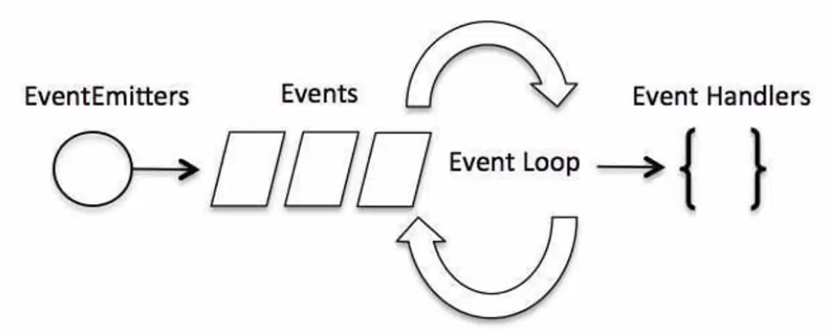

# Node.js Basics
## What is Node.js?
Node.js is an open-source web development framework written in JavaScript
Node.js is a runtime that allows JavaScript running on the server
Used to build powerful, fast & scalable web apps
Uses an event-driven, non-blocking I/O model


#### Non-blocking I/O
When using traditional server-side technologies, like PHP and Apache
Each connection or request spawns a new thread which takes up system memory and eventually maxes out the memory load
So it needs to wait for one process to finish before starting and this works in it asynchronous way

Node.js operates on a single thread and uses non-bloking i/o calls which allows it to support tens of thousands of concurrent connections, held in an event loop, this is why it's called an event-driven system

- Works on a single thread using non-blocking I/O calls
- Support tens of thousands concurrent connections
- Optimizes throughput and scalability in web apps with many I/O operations
- This makes Node.js apps extremely fast and efficient


#### Event Loop
- Single-threaded
- Supports concurrency via events and callbacks
- **EventEmitter** class is used to bind events and event listeners
<p align="center">
        
</p>

The main idea is that with traditional server-side programming you would have to just wait for one task to finish before you can start the next
With Node.js it's on a single thread and you can have tens of thousands connections at once


## What can we build with Node.js?
- REST APIs & Backend apps
- Real-time services (chats, games, etc)
- Blogs, CMS, Social apps
- Utilities & Tools
- Anything that is not CPU-intensive

## What it is NPM / Node Package Manager?
- Node.js Package Manager
- Used to install node programs/modules
- Easy to specify and link dependencies
- Modules get installed into the "node_modules" folder
```sh
# It will install the Express module into a node modules folder
npm install express

# Installing modules globally, not only in just one directory
npm install -g express
```

## Popular Modules
- **Express** - Web development framework
- **Connect** - Extensible HTTP server framework
- **Socket.io** - Server side component for websockets
- **Pug/Jade** - Template engine inspired by HAML
- **Mongo/Mongoose** - Wrappers to interact with MongoDB
- **Coffee-Script** - CoffeeScript compiler
- **Redis** - Redis client library


## package.json
**package.json** is a really important file that is used in node packages and applications
- It goes in the root of your package/application
- Tells npm how your package is structured and what will do to install it
```sh
{
	"name": "mytasklist",
	"version": "1.0.0",
	"description": "Simple task manager",
	# main describes the file that it's the entry point of our application like index.js
	"main": "server.js",
	"author": "Johnny Melavo",
	"license": "ISC",
	"dependencies": {
		"body-parser": "^1.15.2",
		"express": "^4.14.0",
		"mongojs": "^2.4.0"
	}
}
```
We can create a package.json manually or we can run
```sh
npm init
```
With Node.js we can run the JavaScript files from the command line!


## Creating a basic web server
When we upload our PHP file to Apache, this takes care of all the requests
With Node.js is a little different, you have to create your own server

So we're gount yo build a simple server that's on the node.js website
```sh
# We're including a Node module that it's already including in the system (no need to install it)
const http = require('http');

# We're bringing the filesystem module
const fs = require('fs');

# We're working on our localhost so we'll use the loopback address
const hostname = '127.0.0.1'
const port = 3000;

fs.readFile('index.html', (err, html) => {

	if(err) {
		throw err;
	}

	const server = http.createServer((req, res) => {

		res.statusCode = 200;
		res.setHeader('Content-type', 'text/html');
		res.write(html);
		res.end();
	});

	server.listen(port, hostname, () => {

		console.log('Server started on port ' + port);
	});
});
```
Now our server is running and parsing the HTML!