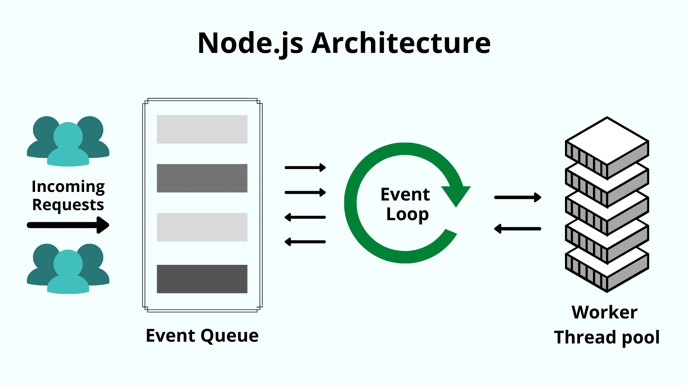

# [Node.js](https://www.w3schools.com/nodejs/default.asp)
- **Node.js is a server environment** based on JavaScript. You can download it and run it on Windows, Linux and Mac
- **Node.js uses asynchronous programming**: while a typical server handles 1 request per time. Node.js is very efficient because it accepts all the requests and handles them one by one in a manner that does not block other requests

## NPM Basics
- NPM is the **package manager for Node.js packages**. It contains thousands of free packages available to download
- With the **CLI** or **command line interface** it's easy to download and update those packages
- NPM is commonly used with Node.js, so it is installed with the server environment.
- The way to install a package is with the command *npm install package_name*
- With each new app, NPM creates a **package.json** in which you can specify versions, dependencies and custom scripts

## Popular Node.js packages
- **Express**, the standard web development package. It's a framework that allos us to create a Node server
- **MongoDB**, brings the API for object databases in Nodejs
- **Socket.io**, it allows real-time bidiretional event-drive communication
- **Passport**, Authentication package

## Creando un servidor mediante Express
- Un servidor es responsable de tomar las solicitudes de los clientes a través de su software (Apache, Nginx), realizando el conjunto de tareas requeridas y finalmente enviando las respuestas a los clientes
- **Express es un framework que nos ayudará a crear un servidor en Node**
- Express.js es un framework de aplicaciones web Node.js mínimo y flexible que proporciona características para aplicaciones web y móviles

```sh
# Installing express
npm install express --save

# Creating the file
touch serverExpress.js

# Executing our express server
node serverExpress.js
```

```js
const express = require('express');
// Initialize app
const app = express();
const port = 3500;

// GET callback function returns a response message
app.get('/', (req, res) => {
	res.send('Hello World! Welcome to Node.js');
	});

app.listen(port, () => {
	console.log(`Server listening at http://localhost:${port}`);
	});
```

## Acerca de Node.js
- Node.js es un entorno de ejecución para utilizar JavaScript fuera del navegador
- No es un framework, ya que el tiempo de ejecución de Node.js se construye sobre un lenguaje de programación, como JavaSCript y ayuda a la ejecución de los propios frameworks
- Node.js no es ni un lenguaje de programación ni un framework, es un entorno para ellos
- Ideado como entorno de ejecución de JavaScript orientado a eventos asíncronos
- Node.js está diseñado para crear aplicaciones de red y del lado del servidor escalables
- Se ejecuta en el motor de ejecución de JavaScript V8 y utiliza una **arquitectura de E/S basada en eventos y sin bloqueos**, lo que la hace eficiente y adecuada para apps en tiempo real
- En el ejemplo **nodeServer.js** creamos un *Hello World!* donde pueden atenderse muchas conexiones en simultáneo. En cada conexión, se activa la devolución de llamada o callback, pero si no hay trabajo que hacer, Node.js se dormirá
- Node.js entra en el bucle de eventos después de ejecutar el script de entrada y sale cuando no hay más devoluciones callbacks para realizar
- HTTP es un elemento destacado en Node.js, diseñado teniendo en cuenta la transmisión de operaciones con streaming y baja latencia. Lo que hace de Node algo muy adecuado para la base de una librería o framework web

```js
const http = require('http');
const hostname = '127.0.0.1';
const port = 3000;

const server = http.createServer((req, res) => {
	res.statusCode = 200;
	res.setHeader('Content-Type', 'text/plain');
	res.end('Hello World!');
});

server.listen(port, hostname, () => {
	console.log(`Server running at http://${hostname}:${port}`);
});
```

## Arquitectura de Node.js
- Node.js utiliza la arquitectura *Single Threaded Event Loop* para manejar múltiples clientes al mismo tiempo
- En un modelo de solicitud-respuesta multihilo, varios clientes envían una solicitud y el servidor procesa cada una de ellas antes de devolver la respuesta. Se utilizan múltiples hilos para procesar las llamadas concurrentes, estos hilos se definen en un pool de hilos y cada vez que llega una petición, se asigna un hilo individual para manejarla
- Dado que Node.js utiliza menos hilos, utiliza menos recursos/memoria, lo que resulta en una ejecución más rápida de las tareas
- Para procesar tareas con muchos datos, tiene más sentido usar lenguajes multihilo como Java. Pero para apps en tiempo real, Node.js es la opción obvia

<p>
  
</p>

1. Node.js mantiene un pool de hilos limitado para atender las peticiones
2. Cada vez que llega una solicitud, Node.js la coloca en una cola
3. Ahora el event loop de un sólo hilo entra en escena. Este bucle de eventos espera las peticiones indefinidamente
4. Cuando llega una solicitud, el bucle la recoge de la cola y comprueba si require una operación de E/S de bloqueo, si no, procesa la solicitud y envía una respuesta
5. Si la solicitud tiene una operación de bloquo que realizar, el bucle de eventos asigna un hilo del pool de hilos internos para procesar la solicitud. Los hilos internos disponibles son limitados. Este grupo de hilos auxiliares se llama grupo de trabajadores
6. El bucle de eventos rastrea las solicitudes que se bloquean y las coloca en la cola una vez que se procesa la taerea que se bloquea. Así es como mantiene su naturaleza no bloqueante

## Apps de Node.js
1. **Chats en tiempo real**: Debido a su naturaleza asíncrona de un sólo hilo, Node.js es muy adecuado para procesar la comunicación en tiempo real
2. **IoT**: IoT suelen estar formadas por multiples sensores, ya que suelen enviar pequeños trozos de datos que pueden acumularse en un gran número de peticiones. Node.js es capaz de gestionar estas peticiones concurrentes con rapidez
3. **Streaming de datos**: Node.js es ligero y rápido, además de que proporciona una API de streaming nativa.
4. **SPAs**: En las Single Page Applications toda la app se carga en una sola página. Lo que significa que hay un par de peticiones realizadas en segundo plano para componentnes específicos. El bucle de evnetos de Node.js procesa las solicitudes de forma no bloqueante.
5. **Apps basadas en REST API**: Un servidor puede comunicarse fácilmente con el frontend a través de APIs REST utilizando Node.js, ya que también proporciona paquetes como Express.js y Koa que facilitan la creación de aplicaciones web