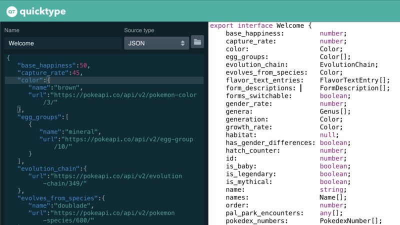
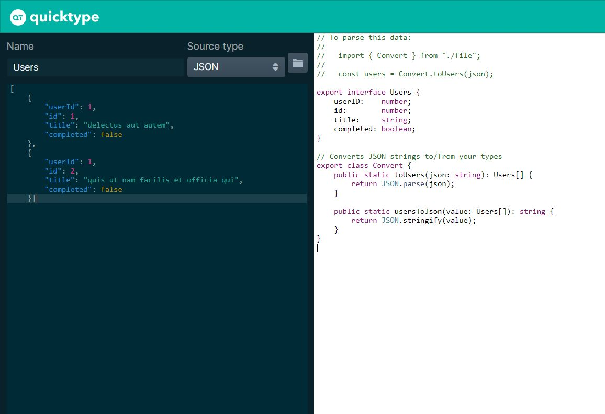

# JavaScript Index
## [HTTP Networking in JavaScript, Handbook](https://www.freecodecamp.org/news/http-full-course/)

## JS Array Methods

        

## ES6 Cheatsheet

        

        

## JS Array Methods

        

## console.log alternatives

        
        
        
        
        
        
        
        

## Parse JSON to other languages [Tool](https://app.quicktype.io/)

        
        

> Herramienta para parsear codigo JSON a varios lenguajes.
> Me resultó muy práctica para crear interfaces y tipos en base a los datos traídos por una API en Typescript. Ya que muchas veces tenemos que crear las interfaces nosotros mismos esto podría ahorrar bastante tiempo.
> También posee una extensión para VSCode y Visual Studio. 
