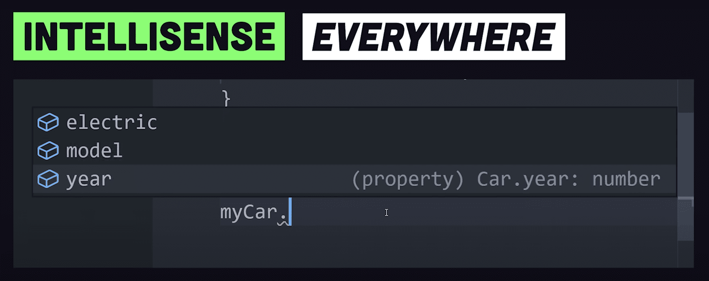

# Breve resumen de TypeScript

### Características Principales de TypeScript
TypeScript es un lenguaje de programación desarrollado y mantenido por Microsoft, que actúa como un **superset de JavaScript**, lo que significa que cualquier código JavaScript válido también es código TypeScript válido Esta característica permite una integración gradual en proyectos existentes sin necesidad de reescribir todo el código

**Una de las características principales de TypeScript es el tipado estático opcional, que permite a los desarrolladores especificar tipos de datos para variables, parámetros de funciones y valores de retorno**. Esto ayuda a detectar errores en tiempo de compilación en lugar de en tiempo de ejecución, lo que mejora la robustez, seguridad y mantenibilidad del código El tipado estático también permite que los editores de código ofrezcan una mejor experiencia con autocompletado y sugerencias precisas

TypeScript se compila a JavaScript puro, lo que significa que el código generado puede ejecutarse en cualquier entorno que soporte JavaScript, como navegadores web o servidores Node.js Esta compilación permite utilizar características modernas de JavaScript (ECMAScript) y transpilar el código a versiones anteriores para garantizar compatibilidad con navegadores más antiguos

**Además, TypeScript incluye características avanzadas como interfaces, clases mejoradas, genéricos, tipos de unión (union types), tipos intersección (intersection types), alias de tipo y tuplas, que facilitan la creación de código más expresivo y estructurado También soporta programación orientada a objetos con características como herencia y encapsulamiento**

El lenguaje se integra fácilmente con el amplio ecosistema de librerías y frameworks de JavaScript, como React, Angular y Vue.js, lo que lo convierte en una herramienta fundamental para el desarrollo web moderno, especialmente en proyectos grandes y complejos donde la calidad y mantenibilidad del código son cruciales

---

### **¿Qué es TypeScript?**  
**TypeScript (TS)** es un *superset* de JavaScript que añade **tipado estático** y características avanzadas de programación orientada a objetos. Fue creado por Microsoft y se compila a JavaScript puro.  

#### Características clave:  
1. **Tipado estático**: Permite definir tipos para variables, funciones y objetos, detectando errores *antes* de ejecutar el código.  
   ```typescript
   let nombre: string = "Juan"; // Tipo explícito
   let edad: number = 25;
   ```
2. **Compatibilidad con JS**: Cualquier código JavaScript válido es TypeScript válido.  
3. **Autocompletado inteligente**: Mejora la productividad en editores como VSCode.  
4. **Interfaces y tipos avanzados**: Facilita el diseño de estructuras de datos complejas.  

---

### **¿Qué es una interfaz (`interface`)?**  
Una **interfaz** en TypeScript es una estructura que define la *forma* (propiedades y tipos) que debe tener un objeto o clase. No genera código en JavaScript, solo sirve para verificación durante el desarrollo.  

#### Ejemplo básico:  
```typescript
interface Usuario {
  id: number;
  nombre: string;
  email: string;
  edad?: number; // Propiedad opcional
}

// Objeto que cumple con la interfaz
const usuario1: Usuario = {
  id: 1,
  nombre: "Ana",
  email: "ana@example.com",
  edad: 30 // Opcional
};
```

#### Usos comunes:  
1. **Tipar objetos**:  
   ```typescript
   function imprimirUsuario(usuario: Usuario) {
     console.log(`Nombre: ${usuario.nombre}`);
   }
   ```  
2. **Tipar respuestas de APIs**:  
   ```typescript
   interface Producto {
     id: number;
     nombre: string;
     precio: number;
   }
   fetch("/api/productos").then((res) => res.json() as Producto[]);
   ```  
3. **Implementar en clases**:  
   ```typescript
   class Cliente implements Usuario {
     id: number;
     nombre: string;
     email: string;
   }
   ```

---

### **Diferencia clave entre TypeScript y JavaScript**  
| Característica       | JavaScript          | TypeScript          |  
|----------------------|--------------------|---------------------|  
| **Tipado**           | Dinámico (en tiempo de ejecución) | Estático (en tiempo de compilación) |  
| **Interfaces**       | No existe          | Sí (`interface`)    |  
| **Errores**          | Se ven al ejecutar | Se detectan al escribir código |  
| **Herramientas**     | Básicas            | Autocompletado avanzado |  

TypeScript es ideal para proyectos grandes o equipos que necesitan mayor robustez y mantenibilidad. JavaScript sigue siendo más flexible para scripts pequeños o prototipos rápidos.  


---


## ¿Qué son las interfaces en TypeScript?

Las interfaces en TypeScript son **estructuras que definen la forma que debe tener un objeto**, **especificando qué propiedades debe contener y qué tipos de datos deben tener esas propiedades**. Son una poderosa herramienta para definir contratos dentro de tu código y entre diferentes partes de tu aplicación.

**Características clave:**
- Definen la estructura de objetos
- No generan código JavaScript en tiempo de ejecución
- Son exclusivas de TypeScript para el desarrollo
- Proporcionan autocompletado y validación en tiempo de compilación

## ¿Por qué son necesarias las interfaces?

### 1. Seguridad de tipos
Las interfaces previenen errores al garantizar que los objetos tengan la estructura correcta. Si intentas asignar un objeto que no cumple con la interfaz, TypeScript mostrará un error.

### 2. Documentación autocontenida
Sirven como documentación viva de tu código. Al leer una interfaz, sabes exactamente qué propiedades esperar y qué tipo de datos contienen.

### 3. Mejor experiencia de desarrollo
Proporcionan autocompletado inteligente en IDEs, lo que acelera el desarrollo y reduce errores.

### 4. Mantenibilidad
Facilitan cambios en la estructura de datos. Si modificas una interfaz, TypeScript te indicará dónde necesitas actualizar tu código.


---

# 2. Fundamentos de la Programación Orientada a Objetos en TypeScript

#### 1. **Clases**
Una clase en TypeScript es una plantilla para crear objetos. Define propiedades y métodos que los objetos creados a partir de la clase tendrán. 

```typescript
class Animal {
  // Propiedad
  name: string;

  // Constructor
  constructor(name: string) {
    this.name = name;
  }

  // Método
  makeSound(): void {
    console.log(`${this.name} makes a sound`);
  }
}

// Crear una instancia de la clase
const dog = new Animal('Dog');
dog.makeSound(); // Dog makes a sound
```

#### 2. **Herencia**
La herencia permite que una clase derive las propiedades y métodos de otra clase. La clase derivada se llama subclase y la clase base se llama superclase.

```typescript
class Animal {
  name: string;

  constructor(name: string) {
    this.name = name;
  }

  makeSound(): void {
    console.log(`${this.name} makes a sound`);
  }
}

class Dog extends Animal {
  constructor(name: string) {
    super(name); // Llamar al constructor de la superclase
  }

  bark(): void {
    console.log(`${this.name} barks`);
  }
}

const dog = new Dog('Dog');
dog.makeSound(); // Dog makes a sound
dog.bark(); // Dog barks
```

#### 3. **Encapsulación**
La encapsulación es el principio de restringir el acceso a ciertos detalles de un objeto y sólo exponer lo necesario. Esto se logra mediante modificadores de acceso (`public`, `private`, y `protected`).

```typescript
class Animal {
  // Propiedad privada
  private name: string;

  constructor(name: string) {
    this.name = name;
  }

  // Método público
  public makeSound(): void {
    console.log(`${this.name} makes a sound`);
  }

  // Método privado
  private secretMethod(): void {
    console.log('This is a secret');
  }
}

const dog = new Animal('Dog');
dog.makeSound(); // Dog makes a sound
// dog.secretMethod(); // Error: Property 'secretMethod' is private and only accessible within class 'Animal'.
```

#### 4. **Abstracción**
La abstracción es el principio de esconder los detalles de implementación y mostrar sólo la funcionalidad necesaria. En TypeScript, esto se logra mediante clases y métodos abstractos.

```typescript
abstract class Animal {
  // Método abstracto
  abstract makeSound(): void;

  // Método concreto
  move(): void {
    console.log('Moving...');
  }
}

class Dog extends Animal {
  makeSound(): void {
    console.log('Bark');
  }
}

const dog = new Dog();
dog.makeSound(); // Bark
dog.move(); // Moving...
```

#### 5. **Polimorfismo**
El polimorfismo permite que se trate a objetos de diferentes clases derivadas de una misma superclase de manera uniforme.

```typescript
class Animal {
  makeSound(): void {
    console.log('Some generic sound');
  }
}

class Dog extends Animal {
  makeSound(): void {
    console.log('Bark');
  }
}

class Cat extends Animal {
  makeSound(): void {
    console.log('Meow');
  }
}

const animals: Animal[] = [new Dog(), new Cat()];
animals.forEach(animal => animal.makeSound()); // Bark, Meow
```

### Getters y Setters
Los getters y setters permiten definir métodos especiales para acceder y modificar las propiedades de una clase de manera controlada.

```typescript
class Animal {
  private _name: string;

  constructor(name: string) {
    this._name = name;
  }

  // Getter
  get name(): string {
    return this._name;
  }

  // Setter
  set name(name: string) {
    if (name.length > 3) {
      this._name = name;
    } else {
      console.log('Name too short');
    }
  }
}

const dog = new Animal('Dog');
console.log(dog.name); // Dog
dog.name = 'Do'; // Name too short
dog.name = 'Buddy';
console.log(dog.name); // Buddy
```

### Interfaces
Las interfaces en TypeScript definen la estructura de los objetos y garantizan que las clases implementen ciertos métodos o propiedades.

```typescript
interface Animal {
  name: string;
  makeSound(): void;
}

class Dog implements Animal {
  name: string;

  constructor(name: string) {
    this.name = name;
  }

  makeSound(): void {
    console.log('Bark');
  }
}

const dog = new Dog('Buddy');
dog.makeSound(); // Bark
```

### Mixins
Los mixins permiten combinar múltiples clases para crear nuevas clases. Esto se logra mediante la composición en lugar de la herencia.

```typescript
type Constructor<T = {}> = new (...args: any[]) => T;

function CanEat<T extends Constructor>(Base: T) {
  return class extends Base {
    eat() {
      console.log('Eating');
    }
  };
}

function CanBark<T extends Constructor>(Base: T) {
  return class extends Base {
      bark() {
      console.log('Barking');
    }
  };
}

class Dog {
  name: string;

  constructor(name: string) {
    this.name = name;
  }
}

const DogMixin = CanEat(CanBark(Dog));

const dog = new DogMixin('Buddy');
dog.eat(); // Eating
dog.bark(); // Barking
```


# Resumen POO en TypeScript
1. **Clases**: Las clases son la base de la programación orientada a objetos en TypeScript. Se definen utilizando la palabra clave `class` y pueden contener propiedades y métodos.

   ```typescript
   class Persona {
       nombre: string;
       edad: number;

       constructor(nombre: string, edad: number) {
           this.nombre = nombre;
           this.edad = edad;
       }

       saludar() {
           console.log(`Hola, soy ${this.nombre} y tengo ${this.edad} años.`);
       }
   }
   ```

2. **Objetos**: Los objetos son instancias de una clase. Se crean utilizando el operador `new`.

   ```typescript
   let persona1 = new Persona("Juan", 30);
   ```

3. **Propiedades y Métodos**: Las clases pueden tener propiedades (variables) y métodos (funciones) que definen su comportamiento.

4. **Herencia**: TypeScript soporta la herencia de clases, lo que permite que una clase herede propiedades y métodos de otra clase.

   ```typescript
   class Estudiante extends Persona {
       grado: string;

       constructor(nombre: string, edad: number, grado: string) {
           super(nombre, edad);
           this.grado = grado;
       }

       estudiar() {
           console.log(`${this.nombre} está estudiando en ${this.grado}.`);
       }
   }
   ```

5. **Interfaces**: Las interfaces en TypeScript se utilizan para definir la estructura de los objetos y garantizar que las clases implementen ciertos métodos o propiedades.

   ```typescript
   interface Animal {
       nombre: string;
       hacerSonido(): void;
   }

   class Perro implements Animal {
       nombre: string;

       constructor(nombre: string) {
           this.nombre = nombre;
       }

       hacerSonido() {
           console.log("Guau");
       }
   }
   ```

6. **Modificadores de Acceso**: TypeScript proporciona modificadores de acceso (`public`, `private` y `protected`) para controlar el acceso a propiedades y métodos de una clase.

   ```typescript
   class Coche {
       private marca: string;
       protected modelo: string;

       constructor(marca: string, modelo: string) {
           this.marca = marca;
           this.modelo = modelo;
       }
   }
   ```

7. **Getters y Setters**: Los getters y setters son métodos especiales que permiten acceder y modificar propiedades de una clase de manera controlada.

   ```typescript
   class Producto {
       private _precio: number;

       get precio(): number {
           return this._precio;
       }

       set precio(nuevoPrecio: number) {
           if (nuevoPrecio > 0) {
               this._precio = nuevoPrecio;
           } else {
               console.error("El precio debe ser mayor que 0");
           }
       }

       constructor(precio: number) {
           this._precio = precio;
       }
   }

   let producto = new Producto(50);
   console.log(producto.precio); // Devuelve 50
   producto.precio = 60; // Utiliza el setter
   console.log(producto.precio); // Devuelve 60
   ```


# [ES TypeScript](https://ed.team/cursos/typescript)
## Lenguajes dinámicos vs lenguajes tipados
Al no ser un lenguaje tipado, JavaScript puede traer problemas a veces, si sumamos un entero con un string, JavaScript simplemente suma:
```js
let sum = (a,b) => a+b;
suma(3, "test"); // 3test
``` 
En JavaScript los parámetros de las funciones y las variables no tienen ningún tipo de información! De manera que los desarrolladores tienen que recurrir a la documentación o adivinar basándose en la implementación.

En un lenguaje tipado como GO, especificamos que tanto a como b son números enteros, y el resultado también será entero.
Así se asegura los datos de entrada y de salida:
```go
func sum(a, b int) int{
    return a + b
}
```
Esto es porque JavaScript es un lenguaje dinámicamente tipado, por tanto asigna el tipo de dato según las circunstancias. Por tanto permite que un tipo de dato se convierta a otro tipo de dato.
A esto se le llama **casting**.

JavaSript puede castear un texto a un número, un número a un boolean, un boolean a un texto, etc, según el flujo del programa.

Esto quiere decir que no lo controla el programador. Por ahí ese dato viene de una función anterior y no sabemos qué devuelve. JavaScript no lanza alertas de error y acepta todo lo que venga, esos errores se ven en producción cuando es tarde.

Por eso JavaScript no suele gustar mucho a los programadores y siempre buscaron reemplazaron por opciones que compilen a JavaScript. Por tanto, ante la imposibilidad de sustituír JavaScript, se hizo necesario **extender JavaScript**.

## Qué es TypeScript?
**TypeScript extiende a JavaScript agregandole tipos**.
Por tanto cada vez que usamos un dato, le decimos si el dato es un número, un texto o un boolean, etc.
Así el programa sabe qué dato se recibe, qué dato se devuelve y el flujo del programa está en orden.
 
De ahí el nombre **type / script**

Volviendo al ejemplo anterior, nos devolveria un error:
```ts
let sum = (a:number, b:number) => {
    return a + b
}
sum(3 + "test"); // ERROR Argument of type 'string' is not assignable to parameter of type 'number'.
```
Además no tenemos que esperar a que la aplicación esté en producción para darnos cuenta de que algo falla, los errores saltan ya desde el editor.

## Ventajas de TypeScript sobre JavaScript
1. No hace falta aprender un lenguaje nuevo
2. No hay que esperar a que la aplicación esté en producción. TypeScript alerta desde el propio editor mientras escribimos el código.
3. Las tecnologías de frontend funcionan con TypeScript. React, Angular, Vue, etc
4. Se puede usar TypeScript en el backend, así como en cualquier lugar donde se puede utilizar JavaScript
5. TypeScript le agrega funciones adicionales a JavaScript, como clases e interfaces

## TypeScript behaves like a compiled language
- TypeScript extends JavaScript by adding **static typing**
- TypeScript behaves like a compiled language
- A common way to use TypeScript is to use the official TypeScript compiler, which transpiles TypeScript code into JavaScript
- Some popular code editors, such as Visual Studio Code, have built-in TypeScript support and can show errors as you write code
- TypeScript has an official compiler which can be installed using npm.
- We can run the typescript compiler using the **tsc command**, it will take the .ts file and transpile it into vanilla JS

## [About TypeScript](https://www.w3schools.com/typescript/index.php)
- We can choose any flavour of JS we want to target acient browsers, from ES1, ES3, ES5, ES6
- Therefore we can use the latest syntax of JavaScript without having to worry if they'll be supported in an older environment
- The TypeScript compiler can be configured using a tsconfig.json
- Our TypeScript project will have a **tsconfig.json** file which provides an infinite number of ways to customize the behaviour of the compiler

*tsconfig.json*
```json
{
"compilerOptions" : {
    "module" : "system",
    "noImplicityAny" : true,
    "removeComments" : true,
    "preserveConstEnums" : true,
    "outFile" : "../dist/bundle.js",
    "sourceMap" : true
    },
    "include": ["src/**/*"],
    "exclude" : ["node_modules"]
}
```

## Explicit, Implicit and Special Types
```ts
// EXPLICIT TYPE
// We can strongly type a variable using a colon followed by its type
// string, boolean or number
let appName: string;
appName = 23; // ERROR Type 'number is not assignable (...)


// IMPLICIT TYPE
// If we set an initial value, it will implicitly infer the type
let appName = 'test';


// ANY TYPE for Opt Out type checking
// There may be cases when we want to opt out of this behaviour
// We use the any type for a loosely type or opt out type checking
let appName: any = 'test';
appName = 23;


// UNKNOWN TYPE, similar to ANY but safer
// TypeScript will prevent unknown types from being used
// unknown is best used when you don't know the type of data being typed
// To add a type later, you'll need to cast it
// Casting is when we use the "as" keyword to say property or variable is of the casted type
let w: unknown = 1;
w = "string"; // no error


// ARRAYS
// We use brackets in an array to strongly type a list
let list: number[] = [1,2,3];


// CUSTOM TYPES AND INTERFACES
// We can define our own custom types and iterfaces
// We can then apply the interface to a plain JavaScript Object
interface Car {
    year: number;
    model: string;
    electric: boolean;
}

let myCar: Car;
```
With our stongly typed code, we get **autocomplete** on our IDE!
<p>
    
</p>

## TS Simple Types
There are 3 main primitives in JavaScript and TypeScript
- **boolean**: true or false values
- **number**: whole numbers and floating point values
- **string**: text values

There are also 2 less common primitives used in later versions of JS and TS
- **bigint**: whole numbers and floating point values, but allows larger negative and positive numbers than *number* type
- **symbol**: used to create a globally unique identifier

## TS Arrays
```ts
const names: string[] = [];
names.push["tony"]; // no error
names.push(3); // ERROR: Argument of type 'number' is not assignable to aprameter of type 'string'


// The readonly keyword can prevent arrays from being changed
const names2: readonly string[] = ["Dylan"];
names.push("Jack"); // ERROR: Property 'push does not exist on type 'readonly string[]'


// TypeScript can infer the type of an array if it has values
const numbers = [1, 2, 3]; // inferred to type number[]
numbers.push(4); // no error
// comment line below out to see the successful assignment
numbers.push("2"); // Error: Argument of type 'string' is not assignable to parameter of type 'number'.
```
## TS Tuples
- **A tuple is a typed array with a pre-defined length and types** for each index.
- Tuples are great because they allow each element in the array to be a known type of value.
```ts
// Define our tuple
let ourTuple: [number, boolean, string];

// Initialize correctly
ourTuple = [5, false, 'hello world'];

// the order matters in our tuple and will throw an error
// initialized incorrectly which throws an error
ourTuple = [false, 'Coding God was mistaken', 5];

// A good practice is to make your tuple readonly
const ourReadonlyTuple: readonly [number, boolean, string] = [5, true, 'The Real Coding God'];
// throws error as it is readonly.
ourReadonlyTuple.push('Coding God took a day off');
```

## TS Object Types
```ts
const car: {type: string, model: string, year: number} ={
    type: "Toyota",
    model: "Corolla",
    year: 2009
};


// Type inference
// TS can infer the types of properties based on their values
const car = {
  type: "Toyota",
};
car.type = "Ford"; // no error
car.type = 2; // Error: Type 'number' is not assignable to type 'string'.


// Optional property
// Properties that don't have to be defined in the object definition
const car: { type: string, mileage?: number } = { // no error
  type: "Toyota"
};
car.mileage = 2000;
```

## TS Enums
- An **enum is a special class that represents a group of constants** (unchangeable variables)
- **Enums come in two flavors, string and numeric**
- By default, enums will initialize the first value to 0 and add 1 to each additional value
```ts
enum CardinalDirections {
    North,
    East,
    South,
    West
}
let currentDirection = CardinalDirections.North; 
console.log(currentDirection);  // Logs 0


//Numeric Values Initialized
// You can set the value of the first numeric enum and have it auto increment from that:
enum CardinalDirections {
  North = 1,
  East,
  South,
  West
}
console.log(CardinalDirections.North);  // logs 1
console.log(CardinalDirections.West);   // logs 4


// Numeric Values Fully Initialized
enum StatusCodes {
  NotFound = 404,
  Success = 200,
  Accepted = 202,
  BadRequest = 400
}
console.log(StatusCodes.NotFound);  // logs 404
console.log(StatusCodes.Success);   // logs 200


// String Enums
// Enums can also contain strings. This is more common than numeric enums, because of their readability
enum CardinalDirections {
  North = 'North',
  East = "East",
  South = "South",
  West = "West"
};
console.log(CardinalDirections.North);  // logs "North"
console.log(CardinalDirections.West);   // logs "West"
```