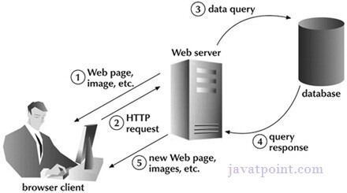
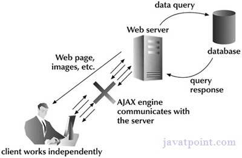

# **I** / Introduccion a `async await` en JavaScript

`async` y `await` son palabras clave en JavaScript que facilitan trabajar con operaciones asíncronas de forma más legible, evitando la complejidad de manejar múltiples promesas encadenadas.

### **`async`**
- Define una función asíncrona que siempre devuelve una promesa.  
- Si dentro de la función retornas un valor, este se envuelve en una promesa automáticamente.

### **`await`**
- Pausa la ejecución de la función `async` hasta que una promesa se resuelve o rechaza.  
- Solo puede usarse dentro de funciones marcadas con `async`.

---

### Ejemplo básico:
```javascript
async function fetchData() {
  try {
    const response = await fetch('https://api.example.com/data');
    const data = await response.json();
    console.log(data);
  } catch (error) {
    console.error('Error:', error);
  }
}
fetchData();
```

1. **Flujo síncrono:** La sintaxis se parece más al código síncrono.  
2. **Manejo de errores:** Usa `try...catch` para manejar errores, como problemas de red.


---


# **II** / Profundizando con `async await` en JavaScript

Las palabras clave `async` y `await` son herramientas modernas introducidas en ECMAScript 2017 (ES8) que simplifican el manejo de operaciones asíncronas. Estas permiten escribir código asíncrono que se lee y se comporta de manera más similar al código síncrono, eliminando la necesidad de anidar múltiples `then` en promesas.

---

### **1. Función `async`**

- **Definición técnica:** Una función declarada con la palabra clave `async` devuelve siempre una **promesa**.  
- Si la función contiene un valor de retorno explícito, este se convierte automáticamente en una promesa resuelta.
- Si se lanza un error dentro de la función, este se transforma en una promesa rechazada.

#### Ejemplo:
```javascript
async function example() {
  return "Hello, World!";
}

example().then(console.log); // "Hello, World!" porque el retorno se envuelve en una promesa.
```

Equivalente sin `async`:
```javascript
function example() {
  return Promise.resolve("Hello, World!");
}
```

---

### **2. Palabra clave `await`**

- **Definición técnica:** Suspende la ejecución de una función `async` hasta que la promesa a la que se aplica se resuelve o rechaza.  
- El valor resuelto de la promesa es "devuelto" al contexto donde se usa `await`.  
- **Restricción:** Solo puede ser utilizado dentro de funciones marcadas con `async`.

#### Ejemplo:
```javascript
async function fetchData() {
  const response = await fetch('https://api.example.com/data');
  const data = await response.json();
  return data;
}

fetchData().then(console.log);
```

---

### **3. Manejo de errores con `try...catch`**

Cuando se usa `await`, los errores dentro de la función deben ser manejados con `try...catch`. Esto captura errores como rechazos de promesas o excepciones lanzadas.

#### Ejemplo:
```javascript
async function fetchData() {
  try {
    const response = await fetch('https://api.invalid-url.com');
    if (!response.ok) {
      throw new Error(`HTTP Error: ${response.status}`);
    }
    const data = await response.json();
    return data;
  } catch (error) {
    console.error("Error al obtener los datos:", error.message);
  }
}

fetchData();
```

---

### **4. Comportamiento síncrono dentro de `async/await`**

Aunque las funciones son asíncronas, `await` introduce un comportamiento "bloqueante" dentro del contexto de la función, pausando la ejecución hasta que la promesa se resuelve.

#### Ejemplo:
```javascript
async function example() {
  console.log("Antes de await");
  const result = await new Promise(resolve => setTimeout(() => resolve("Resultado"), 2000));
  console.log("Después de await:", result);
}
example();
// Output:
// "Antes de await"
// (espera 2 segundos)
// "Después de await: Resultado"
```

---

### **5. Paralelismo con `Promise.all`**

Cuando múltiples operaciones asíncronas pueden ejecutarse en paralelo, usar `await` secuencialmente puede ser ineficiente. Para estas situaciones, se utiliza `Promise.all`.

#### Ejemplo:
```javascript
async function fetchMultipleData() {
  const urls = ['https://api.example.com/data1', 'https://api.example.com/data2'];
  
  // Inicia todas las solicitudes en paralelo
  const promises = urls.map(url => fetch(url));
  
  // Espera a que todas se resuelvan
  const results = await Promise.all(promises);
  const data = await Promise.all(results.map(res => res.json()));

  console.log(data);
}

fetchMultipleData();
```

---

### **6. Ventajas de `async/await`**

- Código más **legible** y cercano al comportamiento síncrono.  
- Más fácil de **depurar**, ya que puedes usar `try...catch` para manejar errores.  
- Se elimina la necesidad de anidar múltiples `.then`.

---

### **7. Limitaciones y consideraciones**

- **Sólo funciona dentro de `async`:** No se puede usar `await` fuera de una función asíncrona.  
- **Bloqueo local:** Mientras `await` espera una promesa, la ejecución de la función está "pausada", pero otras tareas en el Event Loop continúan ejecutándose.  
- **Errores silenciosos:** Si no se maneja correctamente el rechazo de una promesa, puede llevar a comportamientos inesperados.

#### Ejemplo incorrecto:
```javascript
async function example() {
  const result = await fetch('https://invalid-url'); // Si falla, no hay manejo de errores.
}
example(); // Promesa rechazada sin manejar.
```

Solución:
```javascript
async function example() {
  try {
    const result = await fetch('https://invalid-url');
  } catch (error) {
    console.error('Error:', error.message);
  }
}
```

---

### **8. Casos avanzados**

- **Uso con funciones síncronas:** Combina `await` con lógica síncrona para manejar condiciones especiales.  
- **Refresco de tokens:** Usa `async/await` para manejar cadenas complejas de solicitudes que dependen de validaciones o autenticación.


---


# Asynchronous JavaScript / Callbacks, Promises, Async Await
### [Free API for testing](https://jsonplaceholder.typicode.com/)

# Example working with multiple fetch calls in order
To ensure that multiple `fetch` calls are completed in a specific order, you can use the `async/await` syntax in JavaScript. Here's an example of a function that makes three `fetch` calls sequentially and returns the results:

```javascript
async function fetchDataInOrder() {
  try {
    // Make the first fetch call
    const response1 = await fetch('url1');
    if (!response1.ok) {
      throw new Error('Network response was not ok');
    }
    const data1 = await response1.json();
    console.log('Data 1:', data1);

    // Make the second fetch call
    const response2 = await fetch('url2');
    if (!response2.ok) {
      throw new Error('Network response was not ok');
    }
    const data2 = await response2.json();
    console.log('Data 2:', data2);

    // Make the third fetch call
    const response3 = await fetch('url3');
    if (!response3.ok) {
      throw new Error('Network response was not ok');
    }
    const data3 = await response3.json();
    console.log('Data 3:', data3);

    // Return the results
    return { data1, data2, data3 };
  } catch (error) {
    console.error('There was a problem with the fetch operation:', error);
    // Handle errors if needed
    return null;
  }
}
```

In this function:

1. Each `fetch` call is made sequentially, one after the other.
2. The `await` keyword is used to wait for each `fetch` call to complete before moving to the next one.
3. If any `fetch` call encounters an error (i.e., the response is not ok), an error is thrown.
4. The data returned from each `fetch` call is logged to the console, and the final results are returned as an object containing the data from all three calls.

You can call this function and handle the returned data accordingly:

```javascript
fetchDataInOrder()
  .then(data => {
    // Handle the returned data
    console.log('All data:', data);
  })
  .catch(error => {
    console.error('There was a problem:', error);
  });
```

This ensures that the `fetch` calls are completed in order, and you can use the fetched data as needed.

## Que es la asincronía en JavaScript?
- Es la capacidad que tiene este lenguaje de realizar tareas sin bloquear la ejecución del programa principal
- En lugar de esperar a que se complete la tarea para seguir con la siguiente, JavaScript permite hacer muchas tareas en simultaneo e ir manejando a medida que esté lista la info de las tareas anteriores
- Si bien JavaScript está basado en un lenguaje de un sólo hilo (una tarea a la vez), a través de las funciones asincrónicas y los callbacks JS es capaz de realizar múltiples tareas e ir manejando los resultados a medida que estén disponibles.

## Promesas en JavaScript
- Son un tipo de objeto en JavaScript que nos permiten realizar tareas asincronas y luego manejar los resultados
- Una promesa puede fallar o ser exitosa, y esto nos devuelve un valor que utilizaremos en nuestro codigo
- Las promesas nos permiten manejar una secuencialidad de acciones
- Las promesas se usan especialmente para consumir APIs que nos traeran informacion de 3os o de un backend, que traera una demora y necesitaremos mantener una secuencialidad en nuestras acciones en el codigo

## Async, Await
- Es una forma de trabajar promesas utilizando las palabras reservadas async y await
- Async hace que una función sepa que es asincrona
- El await lo usaremos para esperar a que las promesas se cumplan
- El objeto async-await incluye a las promesas, el async await y el fetch para llamar a las APIs


## Asynchronous JavaScript Basics
**Asynchronous programs** are those that have to stop computing while waiting for data to arrive or for some event to occur

JavaScript programs in a web browser are typically **event-driven**, meaning that they wait for the user to click or tap before they actually do anything

JavaScript-based servers typically wait for client request to arrive over the network before they do anything

This kind of asynchronous programming is commonplace in JavaScript

**Promises**, new in ES6 are objects that represent the not-yet-available result of an asynchronous operation

The keywords **async** and **await** are syntactic sugar that simplifies asynchronous programming by allowing to structure Promised-based code as if it was synchronous

Finally, synchronous iterators and the **for/await** loop allows us to work with streams of synchronous events using simple loops that appear synchronous


## Async JS with Callbacks
As its most fundamental level, asynchronous programming in JavaScript is done with *callbacks*
A *callback* is a function that you write and then pass to some other function.
That other function then invokes our function when some condition is met or some asynchronous event occurs


### Async JS using Timers
One of the simplest kinds of asynchrony is using **Timers** that run our code after a certain amount of time has elapsed
```javascript
// Calling a function checkForUpdates once, and after a minute
setTimeout(checkForUpdates, 60000);

// Calling a function checkForUpdates each minute
setInterval(checkForUpdates, 60000);
```

### Async JS using Events
Client-side JavaScript programs are almost universally event driven.
Rather than running some kind of predetermined computation, they typically wait for the user to do something and then respond to the user's actions.
Event-driven JavaScript programs register callback functions for specified types of events in specified context, and the web browser invokes those functions whenever the specified events occur.
These callback functions are called *event handlers* or *event listeners* and they are registered with *addEventListener*
```javascript
// Select element with id okay
let okay = $(".myDivs #okay");

// Register a callback function to be invoked when the user clicks on our okay element
okay.addEventListener("click", applyUpdate);
```

### Async JS with Network Events
Another common source of asynchrony in JavaScript is network request.
Client-side JavaScript code can use the XMLHttpRequest class plus callbacks functions to make HTTP request and asynchronously handle the server's response when it arrives


### Async JS, Callbacks and Events in Node.js
The Node.js server-side JavaScript environment is deeply asynchronous and defines many APIs that use callbacks and events.
The default API for reading the contents of a file, for example, is asynchronous and invokes a callback function when the contents of the file have been read
```javascript
// The "fs" module has filesystem-related APIs
const fs = require("fs");

// An object to hold options for our program
let options {
// Default options would go here
};

// Read a configuration file, then call the callback function
fs.readFile("config.json", "utf-8", (err, text) => {
	if(err) {
		// If there was an error, display a warning but continue
		console.warn("Could not read config file:", err);
	} else {
		// Otherwise, parse the file contents and assign to the options object
		Object.assign(options, JSON.parse(text));
	}

	// In either case, we can now start running the program
	startProgram(options);
});
```
In this example below, we use Node's fs.readFile() function to read the specified file asynchronously and then invoke the callback.
We express the callback as an arrow function


## Promises
Now that we've seen examples of callback and event-based asynchronous programming in client-side & event-side JavaScript environments, we can introduce *Promises*
A Core language designed to simplify asynchronous programming.

A Promise is an object that represents the result of an asynchronous computation.
There is no way to synchronously get the value of a Promise; You can only ask the Promise to call a callback function when the value is ready

At the simplest level, Promises are just a different way of working with callbacks
However, there are practical benefits to using them.

One real problem with callbacks-based asynchronous programming is that it's common to end up with callbacks inside callbacks inside callbacks.
Promises allow this kind of nested callback to be re-expressed as a more linear *Promise chain* that tends to be easier to read.

Another problem with callbacks is that they can make handling errors difficult.
Promises help by standarizing a way to handle errors and providing a way for errors to propagate correctly through a *chain of promises*.

Promises represent the future results of single asynchronous computations.
They cannot be used to represent repeated asynchronous computations.

We can write Promises as an alternative to:
- the *setTimeout()* function
- replace the load event handler of an XMLHttpRequest object, since that callback is only ever called once

We won't use a Promise instead of a "click" event handler of an HTML button-object, since we normally want to allow the user to click a button multiple times


#### Example with Promises
```javascript
const films = [
	{ id: 1, title: 'Midnight Cowboy', year: 1969 },
	{ id: 2, title: 'Easy Rider', year: 1969 },
	{ id: 3, title: 'The Searchers', year: 1956 }
];

const getFilms = () => {

	return new Promise((resolve, reject) => {

		if(films.length === 0) {
			reject(new Error('there are no films'));
		}

		// Simulating data delay
		setTimeout(() => {
			resolve(films);
		}, 1500);

	});
}

// When it's solved
getFilms()
	.then((films) => console.log(films));
	.catch(err => console.log(err.message));
```

#### Example with Async / Await
```javascript
// await is valid only in an async function
async function fetchingFilms () {

	const filmsFetched = await getFilms();
	console.log(filmsFetched);
}

fetchingFilms();

// We can also use try / catch
async function fetchingFilms () {

	try {
		const filmsFetched = await getFilms();
		console.log(filmsFetched);
	} catch (err) {
		console.log(err.message);
	}
}
```

## Synchronous vs Asynchronous JavaScript
#### Basics of Synchronous and Asynchronous
**Synchronous code** starts at the very top of the file and execute all the way to the bottom of the file
All the code will be executed in the exact same order


**Asynchronous code** also starts at the very top, but during that execution, it will run into asynchronous functions where it will split off, and execute that asynchronous code separately from the rest of the code
Asynchronous code execute our async code and the rest of the code at the same time, and it will do that for every asynchronous line
We may end have multiple different threads running in different sections

*Asynchronous code* is harder to work with, because it will be executed in a different order every single time and we'll have to be sure that the code runs no matter the order

*Asynchronous Programming* is very relevant to JavaScript because when making requests to servers we don't our program to be stopped until they get that data

#### Promises & Example
**Promises** give us a more elegant way to handle asynchronous data
```javascript
const posts = [
	{title: "Post One", body: "This is post one" },
	{title: "Post Two", body: "This is post two"}
];

function getPosts() {
	
	setTimeout(() => {
		let output = "";

		posts.forEach((post, index) => {
			output += '<li>' + ${post.title} + '</li>';
		});

		document.body.innerHTML = output;
	}, 1000);
}

function createPost(post) {

	return new Promise((resolve, reject) => {
		
		setTimeout(( => {
		
			post.push(post);
			const error = false;

			if(!error) {
				resolve();
			
			} else {
				reject("Error: Something went wrong");
			}

		}, 2000);
	});
}

createPost({title:"Post Three", body: "This is post three"})
	.then(getPosts)
	.catch(err => console.log(err));

// Promise.all
const promise1 = Promise.resolve("Hello World");
const promise2 = 10;
const promise3 = new Promise((resolve, reject) => {
	setTimeout(resolve, 2000, "Goodbye");
});
const promise4 = fetch("http://jsonplaceholder.typicode.com/users").then(res => res.json());

// Takes an array of promises
Promise.all([promise1, promise2, promise3, promise4]).then((values) => {
	console.log(values);
});
```

#### Async/Await, Fetch & Example
**Async/Await** are syntatic sugar for Promises, easier to read and understand
```javascript
const posts = [
	{title: "Post One", body: "This is post one" },
	{title: "Post Two", body: "This is post two"}
];

function getPosts() {
	
	setTimeout(() => {
		let output = "";

		posts.forEach((post, index) => {
			output += '<li>' + ${post.title} + '</li>';
		});

		document.body.innerHTML = output;
	}, 1000);
}

function createPost(post) {

	return new Promise((resolve, reject) => {
		
		setTimeout(( => {
		
			post.push(post);
			const error = false;

			if(!error) {
				resolve();
			
			} else {
				reject("Error: Something went wrong");
			}

		}, 2000);
	});
}

// Async/Await
async function init() {
	
	# Awaits until createPost() is done, then executes getPost()
	await createPost({title:"Post Three", body: "This is post three"});

	getPost();
}

init();


// Fetch
async function fetchUsers() {

	const res = await fetch("http://jsonplaceholder.typicode.com/users")

	const res = await res.json();

	console.log(data);
} 
```


### Synchronous (Classic Web-Application Model)
A synchronous request blocks the client until operation completes i.e browser is unresponsive
In such case, javascript engine of the browser is blocked
*An example, a full page is refreshed at request time and user is blocked until request completes*
<p align="center">
        
</p>


### Asynchronous (AJAX Web-Application Model)
An Asynchronous request doesn't block the client i.e browser is responsive
At that time, user can perfom another operation also
In such case, javascript engine of the browser is not blocked

*An example, full page is not refreshed at request time and user gets response from the AJAX engine*
<p align="center">
        
</p>


### AJAX / Asynchronous JavaScript And XML
AJAX is a web development technique to create asynchronous web apps
This apps are executed in the client while it maintains asynchronous communication with the server behind the curtains
The keystone is the object **XMLHttpRequest**

AJAX uses a combination of
- A browser's built-in XMLHttpRequest object (to request data from a web server)
- JavaScript and HTML DOM (to display or use the data)

AJAX allows us to
- Update a web page without reloading the page
- Request data from a server - after the page has loaded
- Receive data from a server - after the page has loaded
- Send data to a server - in the background
