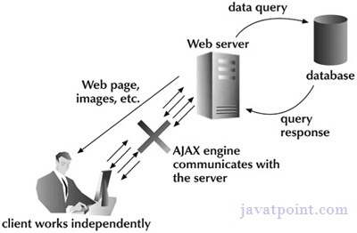

# Asynchronous JavaScript / Callbacks, Promises, Async Await

## Synchronous (Classic Web-Application Model)
A synchronous request blocks the client until operation completes i.e browser is unresponsive
In such case, javascript engine of the browser is blocked
*An example, a full page is refreshed at request time and user is blocked until request completes*

        

## Asynchronous (AJAX Web-Application Model)
An Asynchronous request doesn't block the client i.e browser is responsive
At that time, user can perfom another operation also
In such case, javascript engine of the browser is not blocked

*An example, full page is not refreshed at request time and user gets response from the AJAX engine*

        

## AJAX / Asynchronous JavaScript And XML
AJAX is a web development technique to create asynchronous web apps
This apps are executed in the client while it maintains asynchronous communication with the server behind the curtains
The keystone is the object **XMLHttpRequest**

AJAX uses a combination of
- A browser's built-in XMLHttpRequest object (to request data from a web server)
- JavaScript and HTML DOM (to display or use the data)

AJAX allows us to
- Update a web page without reloading the page
- Request data from a server - after the page has loaded
- Receive data from a server - after the page has loaded
- Send data to a server - in the background