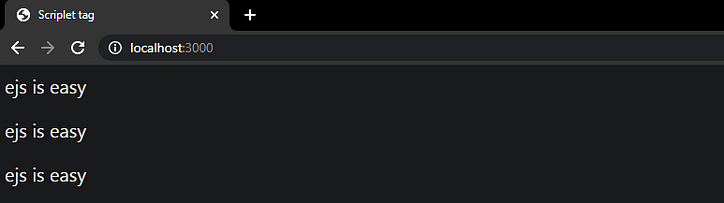
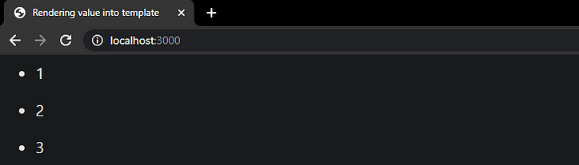

# [EJS todo lo que necesita para empezar](https://ichi.pro/es/ejs-todo-lo-que-necesita-saber-para-empezar-176170883954322)
- EJS es JavaScript integrado. Se encuentra entre los motores de visualización de plantillas más populares para Node.js y Express.js
- Un motor de plantilla es una herramienta que nos permite escribir HTML con etiquetas que insertan variables en el HTML final
- EJS es útil cuando hace falta generar HTML con mucho JavaSCript
- Para generar contenido dinámico, como generar actualizaciones en tiempo real, nos permite reducir la carga de código en gran medida
- **Lo mejor de EJS es crear vistas parciales**. Esto nos permite crear código reutilizable e incluirlo donde sea necesario

```sh
npm install ejs
```

1. Etiqueta **Scriptlet** para ejecutar un bucle for
```js
 <% for(let i = 0 ; i < 3 ; i++)  { %>
        <p>ejs is easy</p>
  <% } %>
```
<p>
    
</p>

2. Etiqueta **Scriptlet** para incrustar una lista
```js
 <% for(let i = 0 ; i < 3 ; i++)  { %>
        <p>ejs is easy</p>
  <% } %>
```
<p>
    
</p>

3. Mostrar sin escapar el valor HTML en la plantilla
```js
<%- include('../template/header')-%>  
<%# the above line will render the HTML code of the header.js file %>
```

## Vistas parciales
```html
<html>   
  <head>
    <title><%= title%></title>
  </head>   
  <body>  
    <%- include('../template/header')-%>  
        Hi, I am <%= name %>. 
    <%- include('../template/footer')-%> 
  </body> 
</html>
```

## Usando condicionales
```html
<% if(condition === true) { %>
 <h3>This h3 tag will be displayed</h3>
<% } else { %
 <p> This p tag will be displayed </p>
<% } %>
```


# [EJS / Embedded JavaScript Templating](https://www.digitalocean.com/community/tutorials/how-to-use-ejs-to-template-your-node-application-es)
- EJS is a simple templating language that lets your generate html markup with plain JavaSCript
- EJS allows us to generate quick apps when we need something simple
- Being able to use partials and pass variables onto our views, we can create very quick apps

*After having our structure and doing Node config to initialize our server, we can move create our EJS partials*

## Creating our EJS partials
#### views/partials/head.ejs
```html
<meta charset="UTF-8">
<title>EJS Is Fun</title>

<!-- CSS (load bootstrap from a CDN) -->
<link rel="stylesheet" href="https://cdnjs.cloudflare.com/ajax/libs/twitter-bootstrap/4.5.2/css/bootstrap.min.css">
<style>
    body { padding-top:50px; }
</style>
```

#### views/partials/header.ejs
```html
<nav class="navbar navbar-expand-lg navbar-light bg-light">
  <a class="navbar-brand" href="/">EJS Is Fun</a>
  <ul class="navbar-nav mr-auto">
    <li class="nav-item">
      <a class="nav-link" href="/">Home</a>
    </li>
    <li class="nav-item">
      <a class="nav-link" href="/about">About</a>
    </li>
  </ul>
</nav>
```

#### views/partials/header.ejs
```html
<p class="text-center text-muted">© Copyright 2020 The Awesome People</p>
```

## Adding EJS partials to View, available on http://localhost:8080
```html
<!DOCTYPE html>
<html lang="en">
<head>
    <%- include('../partials/head'); %>
</head>
<body class="container">

<header>
    <%- include('../partials/header'); %>
</header>

<main>
    <div class="jumbotron">
        <h1>This is great</h1>
        <p>Welcome to templating using EJS</p>
    </div>
</main>

<footer>
    <%- include('../partials/footer'); %>
</footer>

</body>
</html>
```