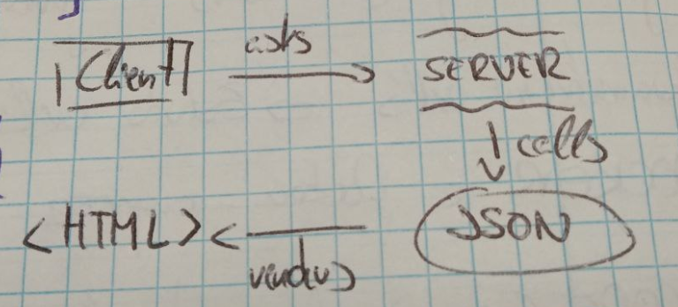

# Using objects or JSON?
Both objects and JSON can be used to represent and manipulate data in a JavaScript application, but they serve different purposes and have different use cases.

1. **Objects**:
   - Objects in JavaScript are key-value pairs, where keys are strings (or Symbols) and values can be of any data type.
   - Objects are useful when you need to represent structured data with named properties.
   - They provide flexibility in terms of adding, updating, and accessing properties dynamically.
   - Objects are commonly used when you need to work with data that has a well-defined structure and behavior associated with it.

   Example:
   ```javascript
   let person = {
       name: "John",
       age: 30,
       gender: "male"
   };
   ```

2. **JSON (JavaScript Object Notation)**:
   - JSON is a lightweight data interchange format that is easy for humans to read and write and easy for machines to parse and generate.
   - JSON is a string representation of data and can be converted to JavaScript objects using `JSON.parse()` and vice versa using `JSON.stringify()`.
   - JSON is commonly used for data interchange between client and server or for storing data in a file.
   - JSON is especially useful when you need to transmit data over the network or store it in a file, as it provides a standardized format that can be easily understood by other systems.

   Example:
   ```json
   {
       "name": "John",
       "age": 30,
       "gender": "male"
   }
   ```

In your JavaScript application, whether you should use objects or JSON depends on your specific requirements:
- If you need to work with data in your application and manipulate it dynamically, using JavaScript objects is more appropriate.
- If you need to transmit data between your application and a server or store data in a file, using JSON for serialization and deserialization is more suitable.

In many cases, you may find yourself using both objects and JSON within your application, converting between them as needed based on your requirements.

# How to write our JSON

Both objects of objects and arrays can be valid structures in JSON, and the choice between them depends on the nature of the data you're representing and how you intend to access and manipulate it in your application.

Here are some considerations:

1. **Objects of Objects**:
   - This structure is suitable when each object has a unique identifier (key), and you need to access objects by their keys.
   - Useful when the data doesn't need to be iterated over in a specific order.
   - Provides a more structured approach when each object has different properties.

   Example:
   ```json
   {
     "city1": {"name": "Buenos Aires", "latitude": -34.6037, "longitude": -58.3816},
     "city2": {"name": "Córdoba", "latitude": -31.4201, "longitude": -64.1888}
   }
   ```

2. **Arrays**:
   - Arrays are suitable when the order of elements is important or when you need to perform operations like iteration, filtering, or mapping over the elements.
   - Useful when all objects share the same structure or when you need to access objects by index.
   - Typically more convenient for representing lists of homogeneous data.

   Example:
   ```json
   [
     {"name": "Buenos Aires", "latitude": -34.6037, "longitude": -58.3816},
     {"name": "Córdoba", "latitude": -31.4201, "longitude": -64.1888}
   ]
   ```

As for the best way to write JSON, there isn't a one-size-fits-all answer. However, here are some tips:

- **Consistency**: Stick to a consistent structure throughout your JSON data.
- **Readability**: Format your JSON for readability by using indentation and line breaks.
- **Validation**: Ensure your JSON is valid by using tools or libraries to validate its syntax.
- **Comments**: JSON doesn't support comments, but you can include comments in your JSON files for documentation purposes if you're not using a strict JSON parser.

Ultimately, the best way to write JSON depends on your specific requirements and the structure of your data. Choose the format that makes the most sense for how you'll be using and manipulating the data in your application.

# Que es JSON?
- **JavaScript Object Notation** es un formato de intercambio de datos
- Sirve para representar datos estructurados como objetos o arrays
- Cuenta con una sintaxis muy parecida a los objetos literales de JavaScript
- Se utiliza para intercambiar información entre servidor y cliente o distintas partes de la aplicación web

# JSON Crash Course
**JSON is a syntax for storing and exchanging data**
**JSON is text, written in JavaScript object notation**

JSON is extremely important in web development, specially when working with APIs

- JSON stands for **JavaScript Object Notation**
- It's a lightweight data-interchange format
- Based on a subset of JavaScript, it's easy to read and write
- Often used with AJAX
- Can be used with most modern languages

### Quick Intro
When exchanging data between a browser and a server, the data can only be text
*JSON is text, and we can convert any JavaScript object into JSON and send JSON to the server*
*We can also convert any JSON received from the server into JavaScript Objects*
This way we can work with the data as JavaScript objects, with no complicated parsing and translations

**Sending data**
```javascript
var myObj = {name: "John", age: 31, city: "New York"};

var myJSON = JSON.stringify(myObj);
```

**Receiving data**
```javascript
var myJSON = '{"name":"John", "age":31, "city":"New York"}';

var myObj = JSON.parse(myJSON);
```


### What is AJAX?
*AJAX* is used for send data back and forth from client and server

**AJAX** stands for **A**synchoronous **J**avaScript **A**nd **X**ML
AJAX uses a combination of both:
A browser built-in **XMLHttpRequest** object (to request data from a web server)
JavaScript and HTML DOM (to display or use the data)

The XMLHttpRequest object can be used to exchange data with a server behind the scenes
This means it's possible to update parts of a web page without reloading the whole page
```javascript
var xhttp = new XMLHttpRequest();

// Sending a request to a server
xhttp.open("GET", "ajax_info.txt", true);
xhttp.send();

// Server response
function loadDoc() {

	var xhttp = new XMLHttpRequest();
	
	xhttp.onreadystatechange = function() {

		if(this.readyState == 4 && this.status == 200) {

			document.getElementById("demo").innerHTML = this.responseText;
		}
	};

	xhttp.open("GET", "ajax_info.txt", true);
	xhttp.send();
}
```

### With AJAX is possible to
- Update a web page without reloading the page
- Request data from a server (after the page has loaded)
- Receive data from a server (after the page has loaded)
- Send data to a server in the background


### Data Types
**Number**: No difference between integer and floats

**String**: String of Unicode characters. Use double quotes

**Boolean**: True or false

**Array**: Ordered list of 0 or more values

**Object**: Unordered collection of key/value pairs

**Null**: Empty value


### JSON Syntax Rules
- Uses **key/value pairs** {"name":"Javito"}
- Uses **double quotes** around KEY and VALUE
- Must use the specified data types
- File type is ".json"
- MIME type is "Application/json"


### JSON Example
```json
{
	"name":"Juan Sanchez",
	"age": 30,
	"address": {
		"street": "Av Figueroa Alcorta",
		"city": "Buenos Aires"
	},
	"children":["Marcelo","Marcela"]
}
```


### JSON.stringify() & JSON.parse()
A common use of JSON is to exchange data to/from a server
When sending data to a web server, the data *has to be a string*
We can convert a JavaScript object with **JSON.stringify()**

Let's say we have in our index.html a js object
```javascript
	var person = {
		name: "Tomas",
		age: 25
	}

	// Converting our person object into a valid JSON
	person = JSON.stringify(person);

	// Returns a JSON string formated correctly
	console.log(person)
```
We can do the exact opposite and turn our string into a JavaScript object with **JSON.parse()**
```javascript
	person = JSON.parse(person)
```

Now with another complex example
```javascript
var person = {
	name:"Juan Sanchez",
	age: 30,
	address: {
		street: "Av Figueroa Alcorta",
		city: "Buenos Aires"
	},
	children:["Marcelo","Marcela"]
}

// Accessing the address object and getting the street property
console.log(person.address.street); # Av Figueroa Alcorta

// Accessing the first children
console.log(person.children[0]);

// Creating an array of objects
var people = [
	{
		name: "David",
		age: 40
	},
	{
		name: "Andrea",
		age: 30
	},
	{
		name: "Andres",
		age: 50
	}
];

// Accesing the second person's age
console.log(people[1].age); // 30

// Looping through an array
var output = "";

for(var i = 0; i < people.length; i++) {

	console.log(people[i].name); # David Andrea Andres

	// Appending a new list of people into our HTML
	output += "<li>" + people[i].name + "</li>";

}

document.getElementById("people").innerHTML = output;
```

### Fetching a JSON with AJAX and outputing onto the screen
Creating a JSON file with a people array
On *people.json*
```json
{
	"people": [
		{
			"name": "David",
			"age": 40
		},
		{
			"name": "Andrea",
			"age": 30
		},
		{
			"name": "Andres",
			"age": 50
		}
	]
}
```
Now we'll send a get request to that people.json file

On *index.html* placed on our localhost
```javascript
var xhttp = new XMLHttpRequest();
	
xhttp.onreadystatechange = function() {

	if(this.readyState == 4 && this.status == 200) {

		// Getting the data
		console.log(xhttp.responseText);

		// Creating a new variable and turning our JSON into a JavaScript object
		var people = JSON.parse(xhttp.responseText);

		var output = "";

		for(var i = 0; i < people.length; i++) {

			output += "<li>" + people[i].name + "</li>";

		}

		// Now we're getting our info from the JSON onto the screen
		document.getElementById("people").innerHTML = output;
	}
};

xhttp.open("GET", "people.json", true);
xhttp.send();
```


### Another example sending JSON Data to a Server
```javascript
const url = 'https://example.example.com/todos/1';

// Sending a GET request without any data to the server
fetch(URL, {method: "GET"})

// Getting JSON data from the raw response
.then(rest => res.json())

// Print the result
.then(console.log);
```


### Another example receiving JSON Data to a Server
```javascript
const url = 'https://example.example.com/todos/1';

const data = {
	"id": 1,
	"title": "My title",
	"completed": false
};

// Sending a post request
fetch(URL, {
	method: "POST",
	body: JSON.stringify(data),
	headers: {
		"Content-type": "application/json; charset=UTF-8"
	}
});
```

## JSON Summary
#### Basics
- Data representation format
- Commonly used for APIs & Configs
- Lightweight and easy to read & write
- Superset of JavaScript (anything written in JSON is valid JavaScript)

#### JSON Types "key":"value"
Strings
Numbers
Booleans
null
Arrays [1,2,3], ["Hello","World"]
Objects {"key":"value"}, {"age":30}

#### Example myWebsites.json
As JSON is a data format for store, send and receive data, we can also store and render our websites with JSON!
<p align="center">
	
</p>

```json
"myWebs":{
	"web1":{"<!DOCTYPE html><html>..."},
	"web2":{"<!DOCTYPE html><html>..."}
}
```

#### Example user.json
```json
{
	"name":"Kyle",
	"friends":[{
		"name":"Joey",
		"friends":["..."]
	}]
}
```

#### Example list.json
```json
[
	{
		"name":"Big Corporation",
		"numberOfEmployees": 10000,
		"CEO":"Mary",
		"rating":3.6
	},
	{
		"name":"Small Startup",
		"numberOfEmployees": 3,
		"CEO":null,
		"rating":4.3
	}
]
```
