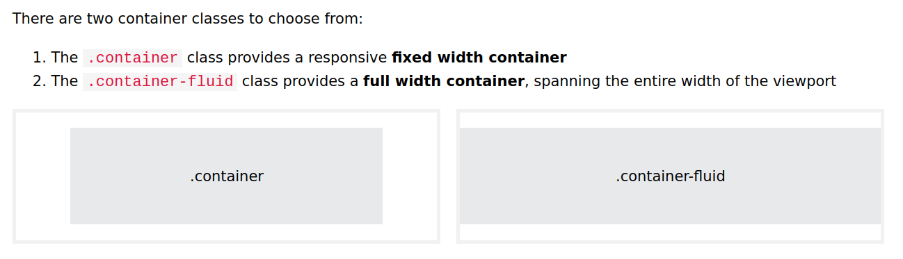

# Bootstrap
Bootstrap is a free front-end framework for faster, responsive & mobile-first web development
Bootstrap includes HTML, CSS based design templates for typography, forms, buttons, tables, navigation, modals, image carousels and many other

## Advanges of Boostrap
- **Easy to use**: Anybody with basic knowledge of HTML & CSS can start using Bootstrap
- **Responsive features**: Bootstrap's responsive CSS adjust to phones, tablets and desktops
- **Mobile-first approach**
- **Browser compatibity**: Bootstrap 5 is compatible with all modern browsers

## Start with Bootstrap 5
- Include Bootstrap 5 from a CDN (Content Delivery Network)
- Download Boostrap 5 from getbootstrap.com

Bootstrap 5 is designed to be responsive for mobile devices. To ensure proper rendering and touch zooming, it's a must to add
```html
<meta name="viewport" content="width=device-width, initial-scale=1">
```
**width=device-width** sets the width of the page to follow the screen-width of the device
**initial-scale=1** sets the initial zoom level when the page is first loaded by the browser

#### Containers
Bootstrap 5 also requires a containing element to wrap site contents
<p align="center">
	
</p>
