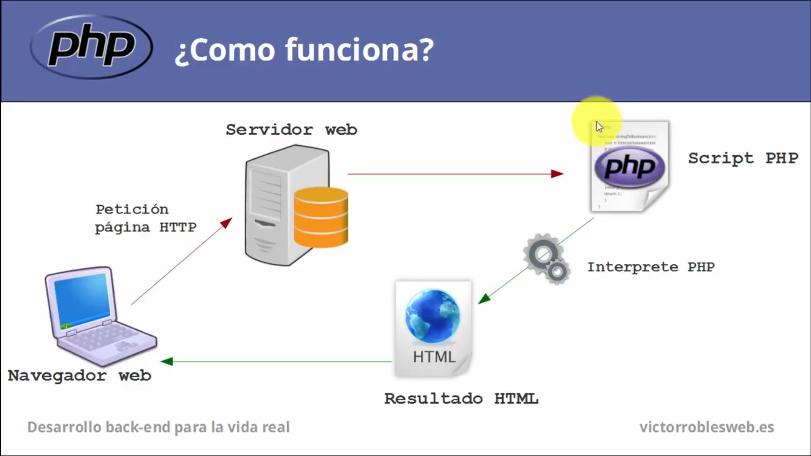

# [PHP Tutorial](https://www.w3schools.com/php/php_intro.asp)
## INTRO
PHP: Hypertext Preprocessor is an open- source scripting language
PHP scripts are executed on the server, the result is returned to the browser as plain HTML

PHP can: 
- contain text, HTML, CSS, JavaScript and PHP code
- generate dynamic page content
- create, open, read, write, delete and close files on the server
- send and receive cookies
- add, delete, modify data on our database
- used to control user-access
- encrypt data
- output not only HTML, but images, pdf files and flash movies, text including XHTML and XML

About PHP:
- Runs on various platforms
- Compatible with almost all servers
- Supports a wide range of Databases
- Free, easy and runs efficiently on the server side

<p align="center">
	
<p>

## Installation
Find a web host with PHP and MySQL support
Install a web server on your pc and then install PHP and MySQL

Creating some .php files and placing them onto our directory will make our server automatically parse them

## PHP Form Handling
Superglobal variables are built-in variables that are always available in all scopes
The PHP superglobals GET and POST are uset to collect form-data


### PHP POST
```php
#$_POST is a superglobal variable which is used to connect form data after sumitting an HTML form with method="post"

#$_POST is also widely used to pass variables
<html>
<body>

<form method="post" action"<?php echo $_SERVER['PHP_SELF']; ?>"
Name: <input type="text" name="fname">
<input type="submit">
</form>

<?php
if($_SERVER["REQUEST_METHOD"] == "POST") {

	$name = $_POST['fname'];

	if(empty($name)) {

		echo "Name is empty";

	} else {

		echo $name;

	}
}
?>
</body>
</html>
```

## PHP Sessions
A session is a way to store data in variables to be used accross multiple pages
Unlike a cookie, the information is not stored on the users computer

The web server does't know who we are and what do we do, because the HTTP address doesn't maintain state
Session variables solve this problem by storing user info to be used across multiple pages (username, favourito color, etc)
By default, session variables last until the user closes the browser

Session variables hold info about one single user and are available to all pages in one application

#### Starting a PHP Session
The session_start() function must be the very first thing in your document, before any HTML tags
```php
<?php
session_start();
?>

<!DOCTYPE html>
<html>
<body>

<?php
$_SESSION["favcolor"] = "green";
$_SESSION["favanimal"] = "cat";

echo "Session variables are set";
?>

</body>
<html>
```

# PHP Basics
```php
<?php
//Display errors
ini_set('display_errors', 1);
ini_set('display_startup_errors', 1);
error_reporting(E_ALL);

session_start();
?>

<!DOCTYPE html>
<html>

<head>

	<meta charset="utf-8">
	<title>PHP Crash Course</title>

	<style>
		body {font-family: FreeMono, monospace; font-size: large; color: white; background: #262626;}
	</style>

</head>

<body>

	
<?php
$firstVariable = "Test";
echo "<p>".$firstVariable."</p>";


// Defining timezone based on the coordinated universal time
date_default_timezone_set('UTC');
echo date('H:i:s');

/* About timers in server side PHP

It wouldn't make much sense as the processing of a PHP script takes place entirely on the server side and you would just delay the overall execution of the script

As an alternative, there is sleep() but that will simply halt the process for a certain time

Timers in PHP make sense when used in long-running scripts (daemons, CLI scripts), but besides that, there is no need for timers

Timers can be blocking and non-blocking. If you're using sleep, then it's a blocking timer because your scropt just freezes for an specific amount of time. For many tasks blocking timers are fine (sending stats every 10 seconds)

Non-blocking timers make sense only in event drive apps
*/

$backtick1 = "Hello";
$backtick2 = "World";
$backtick3 = "from";
$backtick4 = "PHP";

$backtickExample = <<<EOD
I can write everything together as JS backticks! $backtick1 $backtick2 $backtick3 $backtick4!
EOD;

echo "<p>".$backtickExample."</p>";


// Some constants and math
define('PI', 3.1415926);
echo "<p>My defined PI equals: " . PI."</p>";
echo "<p>PHP's pi equals: " . pi() . "</p>";

echo "<p>Random number between 1 and 25: ".rand(1,25)."</p>";


// Ternary operator / condition ? value if true : value if false
$biggestNum = (15 > 10) ? 15 : 10;

echo "<p>Biggest num is ".$biggestNum."</p>";


// For loop
echo "<p>";
for($num = 1; $num < 10; $num++) {
	echo $num;
}
echo "</p>";


// Arrays
$ladsArray = array('Xan', 'Sean', 'Juan', 'John');

echo "<p>Having fun with " . $ladsArray[1] . ", not to mention the whole gang:</p>";

foreach($ladsArray as $lad) {
	echo $lad . " ";
}

// Creating key-value pairs in arrays
$tangoCD = array (
	'Author'=>'Astor Piazzolla',
	'Album'=>'Sur',
	'Year'=>'1988'
);

echo "<p>";
foreach($tangoCD as $key=>$value) {
	echo $key . ' : ' . $value . '<br>';
}
echo "</p>";


// Multidimensional arrays
$tangoCollection = array(
	array('Astor Piazzolla','Adiós Nonino','1969'),
	array('Astor Piazzolla','Libertango','1974'),
	array('Astor Piazzolla','Oblivion','1984'),
	array('Astor Piazzolla','Tango: Zero Hour','1986')
);

for($row = 0; $row < 3; $row++) {

	for($col = 0; $col < 3; $col++){
		
		echo $tangoCollection[$row][$col] . ' ';
	}
	
	echo "<br>";
}


// Common array functions (sort, asort, ksort)

echo "<p>sort() " . sort($ladsArray) . "</p>";

echo "<p>asort() " . asort($tangoCollection) . "</p>";

echo "<p>ksort() " . ksort($tangoCollection) . "</p>";


$randomString = "                This is      a random string!                          ";
echo "<p>";
echo "The randomString is $randomString <br>";
printf ("The randomString is %s <br>", $randomString);
//Triming white spaces to the left
echo ltrim($randomString);
echo "length of ltrim(): " . strlen(ltrim($randomString)) . "<br>";

// Triming white space to the right
echo rtrim($randomString);
echo "length of rtrim(): " . strlen(rtrim($randomString)) . "<br>";

// Triming all white spaces
echo trim($randomString);
echo "length of trim()" . strlen(trim($randomString)) . "<br>";
echo "</p>";


/*Conversion codes
b: integer to binary
c: integer to character
d: integer to decimal
f: double to float
o: integer to octal
s: string to string
x: integer to hexadecimal*/

$decimal = 2.3456;
printf("decimal num = %.2f <br>", $decimal);
printf("10 to binary %b <br>", 10);


// Turning strings into arrays and vice versa
$arrayForString = explode(' ', $randomString, 2);

$stringToArray = implode(' ', $arrayForString);

echo "<p>Array for string: " . $arrayForString . "</p>";

echo "<p>String to array: " . $stringToArray . "</p>";


// Variables and data types
echo "<p>Data type for $biggestNum is " . gettype($biggestNum) . "</p>";

/*Checking other types of data with
is_array, is_bool, is_double, is_int, is_null, is_numeric, is_string*/
echo "<p>Does $biggestNum exist? </p>";

// empty() returns true or false if a ver has a non-zero value
echo empty($biggestNum) ? 'false' : 'true';
echo "<br>";

// isset() returns true or false if a variable exists
echo "<p>Does $biggestNum exist? </p>";
echo isset($biggestNum) ? 'true' : 'false';
echo "<br>";

// functions allows to reuse code, it must begint with a letter, but can contain numbers and underscores

function addNumbers($num1, $num2) {
	return $num1 + $num2;
}

echo "<p>3 + 4 = " . addNumbers(3,4) . "</p>";
?>

</body>

</html>
```