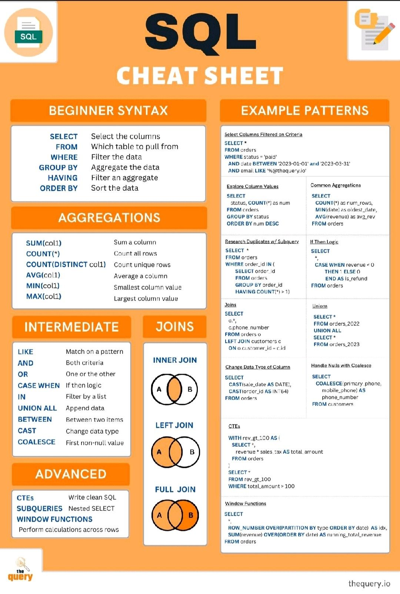
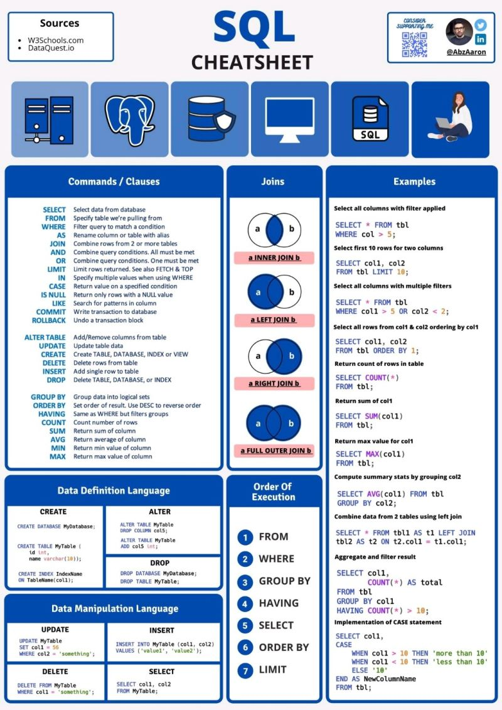
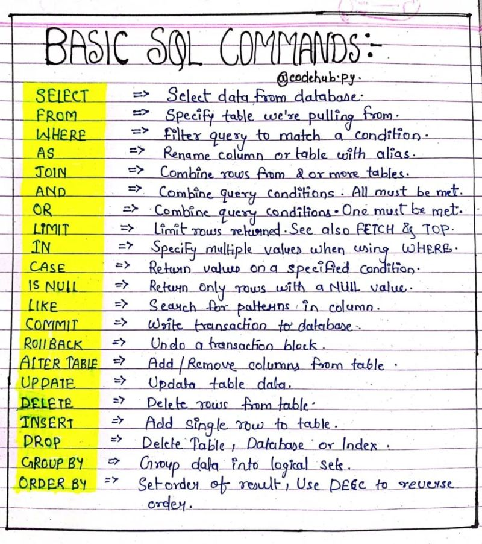

# SQL Cheatsheets
<p>
	
</p>

<p>
	
</p>

<p>
	
</p>


# MySQL
- MySQL is the most popular database system used with PHP
- It's a free and open-source Relational Database Management System (RDBMS)
- MySQL is a database system that *runs on the web and runs on a server*

## How does it works?
- The data in MySQL are store in **tables**
- A table is a collection of related data,it consists in **columns** & **rows**

## MySQL Installation
```sh
# Installing mysql client
sudo apt install mysql-client-core-8.0

# Installing mysql server
sudo apt install mysql-server

# check mysql version
mysql -V
```

## Differences between MySQL client and MySQL server
*MySQL server* package will install the mysql database, and we can use *MySQL client* client to send commands to any MySQL Server

**MySQL Client** interacts with **MySQL Server**

- MySQL Client gives *"mysql"* command line program
- MySQL Server allows to run a MySQL server that can host multiple databases

# Accessing MySQL
```sh
sudo mysql -u root -p

# Accesing mysql
create database newDatabase;
show databases;
```