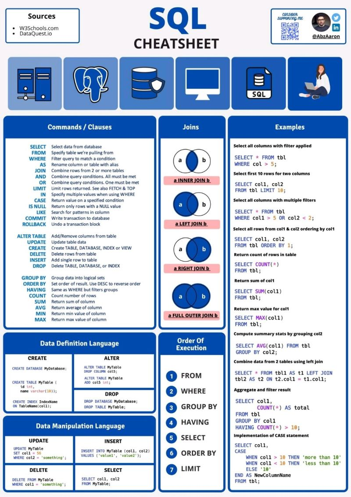
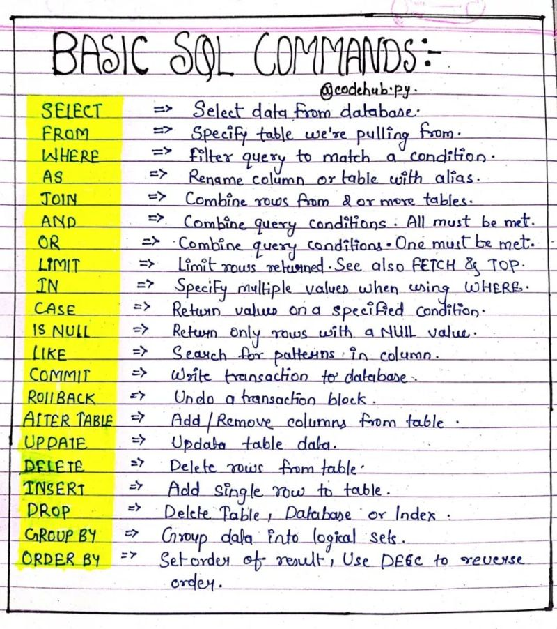
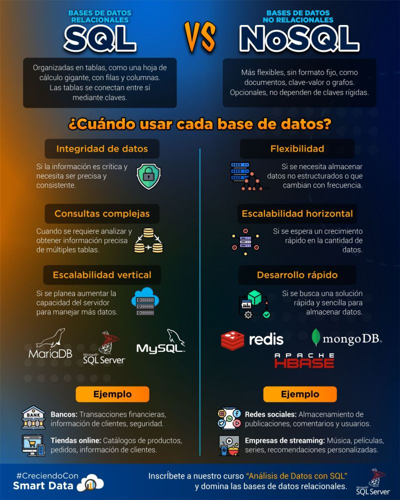
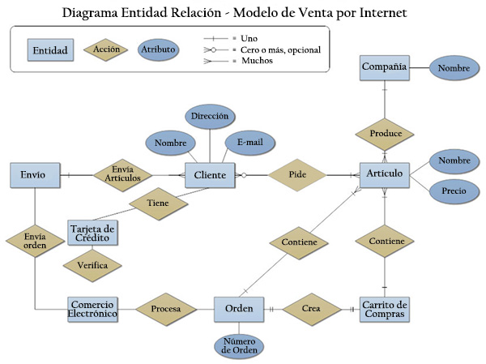

## **¿Qué son las bases de datos relacionales?**  

Las **bases de datos relacionales** (RDB, por sus siglas en inglés: *Relational Database*) son un tipo de base de datos que almacena y organiza la información en **tablas** relacionadas entre sí. Estas tablas están estructuradas en filas y columnas, donde cada fila representa un registro único y cada columna representa un atributo del dato.  

---

## **1. Características principales**  

✅ **Uso de tablas** 📊  
- Cada tabla almacena datos sobre una entidad específica (por ejemplo, *usuarios*, *productos*, *pedidos*).  

✅ **Relaciones entre datos** 🔗  
- Las tablas se vinculan entre sí mediante **claves primarias** y **claves foráneas**.  

✅ **Integridad y consistencia** ✅  
- Se aplican restricciones para garantizar que los datos sean coherentes y correctos.  

✅ **Uso de SQL (Structured Query Language)** 📜  
- Se usa SQL para realizar operaciones como consultas, inserciones, actualizaciones y eliminaciones.  

✅ **Normalización** 🔄  
- Se aplica un conjunto de reglas para evitar la redundancia de datos y mejorar la eficiencia del almacenamiento.  

---

## **2. Elementos clave**  

### **🔹 Tablas**  
Estructuras donde se almacenan los datos, organizadas en filas y columnas.  

Ejemplo de una tabla **usuarios**:  

| id | nombre     | email                | edad |
|----|-----------|----------------------|------|
| 1  | Juan Pérez | juan@example.com     | 30   |
| 2  | Ana Gómez | ana@example.com       | 25   |

### **🔹 Clave primaria (Primary Key - PK)**  
Es una columna o conjunto de columnas que identifica de forma **única** cada fila en una tabla.  

Ejemplo:  
En la tabla `usuarios`, la columna `id` es la **clave primaria** porque cada usuario tiene un identificador único.  

```sql
CREATE TABLE usuarios (
    id INT PRIMARY KEY,
    nombre VARCHAR(50),
    email VARCHAR(100) UNIQUE,
    edad INT
);
```

### **🔹 Clave foránea (Foreign Key - FK)**  
Es una columna que establece una **relación** entre dos tablas, apuntando a la clave primaria de otra tabla.  

Ejemplo:  
Una tabla `pedidos` que tiene una relación con `usuarios` mediante la clave foránea `usuario_id`:  

```sql
CREATE TABLE pedidos (
    id INT PRIMARY KEY,
    usuario_id INT,
    fecha DATE,
    total DECIMAL(10,2),
    FOREIGN KEY (usuario_id) REFERENCES usuarios(id)
);
```

Aquí, `usuario_id` en la tabla `pedidos` se relaciona con `id` en `usuarios`, asegurando que cada pedido pertenece a un usuario válido.  

---

## **3. Tipos de relaciones en bases de datos relacionales**  

Las relaciones permiten estructurar los datos de manera eficiente. Existen **tres tipos principales**:  

### **🔹 Relación 1 a 1 (One to One, 1:1)**  
Cada registro en una tabla tiene **exactamente un** registro relacionado en otra tabla.  

Ejemplo:  
Un usuario tiene **una** dirección única.  

| usuarios | dirección |
|----------|----------|
| id (PK)  | id (PK, FK) |
| nombre   | usuario_id (FK) |
| email    | calle |

```sql
CREATE TABLE direccion (
    id INT PRIMARY KEY,
    usuario_id INT UNIQUE,
    calle VARCHAR(100),
    FOREIGN KEY (usuario_id) REFERENCES usuarios(id)
);
```

---

### **🔹 Relación 1 a Muchos (One to Many, 1:N)**  
Un registro en una tabla puede estar relacionado con **varios** registros en otra tabla.  

Ejemplo:  
Un usuario puede tener **muchos** pedidos.  

| usuarios | pedidos |
|----------|--------|
| id (PK)  | id (PK) |
| nombre   | usuario_id (FK) |
| email    | fecha |

```sql
CREATE TABLE pedidos (
    id INT PRIMARY KEY,
    usuario_id INT,
    fecha DATE,
    FOREIGN KEY (usuario_id) REFERENCES usuarios(id)
);
```

---

### **🔹 Relación Muchos a Muchos (Many to Many, N:M)**  
Un registro en una tabla puede estar relacionado con **varios** registros en otra tabla y viceversa.  
Se usa una **tabla intermedia** para gestionar la relación.  

Ejemplo:  
Un estudiante puede inscribirse en varios cursos, y un curso puede tener varios estudiantes.  

| estudiantes | cursos | inscripciones |
|------------|--------|---------------|
| id (PK)    | id (PK) | id (PK) |
| nombre     | nombre  | estudiante_id (FK) |
| email      | profesor | curso_id (FK) |

```sql
CREATE TABLE inscripciones (
    id INT PRIMARY KEY AUTO_INCREMENT,
    estudiante_id INT,
    curso_id INT,
    FOREIGN KEY (estudiante_id) REFERENCES estudiantes(id),
    FOREIGN KEY (curso_id) REFERENCES cursos(id)
);
```

---

## **4. Ventajas de las bases de datos relacionales**  
✅ **Organización estructurada** 📊  
Los datos están bien organizados en tablas con relaciones bien definidas.  

✅ **Consistencia e integridad** ✅  
Se pueden aplicar reglas para evitar datos duplicados o erróneos.  

✅ **Eficiencia y escalabilidad** ⚡  
Optimización mediante índices y normalización para manejar grandes volúmenes de datos.  

✅ **Seguridad** 🔒  
Permite controlar accesos con permisos y roles.  

✅ **Consulta eficiente con SQL** 📝  
El lenguaje SQL permite manipular y consultar datos de manera sencilla y potente.  

---

## **5. Ejemplo práctico en MySQL**
Creemos una base de datos para una tienda en línea con dos tablas: `clientes` y `pedidos`.  

```sql
CREATE TABLE clientes (
    id INT PRIMARY KEY AUTO_INCREMENT,
    nombre VARCHAR(50),
    email VARCHAR(100) UNIQUE
);

CREATE TABLE pedidos (
    id INT PRIMARY KEY AUTO_INCREMENT,
    cliente_id INT,
    total DECIMAL(10,2),
    fecha DATE,
    FOREIGN KEY (cliente_id) REFERENCES clientes(id)
);
```

### **Insertar datos**
```sql
INSERT INTO clientes (nombre, email) VALUES ('Juan Pérez', 'juan@example.com');

INSERT INTO pedidos (cliente_id, total, fecha) VALUES (1, 150.75, '2024-02-16');
```

### **Consultar datos con JOIN**
```sql
SELECT clientes.nombre, pedidos.total, pedidos.fecha 
FROM clientes 
JOIN pedidos ON clientes.id = pedidos.cliente_id;
```

🔹 Resultado:
| nombre     | total  | fecha      |
|------------|--------|------------|
| Juan Pérez | 150.75 | 2024-02-16 |

---

## **Conclusión**  
Las bases de datos relacionales permiten almacenar y gestionar datos de forma eficiente, utilizando tablas interconectadas mediante claves primarias y foráneas. Su organización estructurada, junto con SQL, las hace ideales para aplicaciones como sistemas de gestión, comercio electrónico, redes sociales y más. 🚀


---

## SQL Cheatsheets
<p>
	
</p>

<p>
	
</p>


---

## Bases de datos Relacionales vs No Relacionales
<p align="center">
   
</p>

# Desarrollo de una base de datos
1. **Requisitos y análisis**:
   - Comprender los requisitos del sistema y las necesidades de almacenamiento de datos.
   - Analiza la documentación del proyecto para identificar los datos que necesitan ser almacenados y procesados.

2. **Diseño conceptual**:
   - Utiliza *técnicas de modelado de datos, como el Modelo Entidad-Relación (ER), para representar las entidades y sus relaciones.*
   - Identifica las entidades principales y las relaciones entre ellas, sin preocuparte por los detalles de implementación.

3. **Diseño lógico**:
   - *Transforma el modelo conceptual en un modelo lógico utilizando el Modelo Relacional* o un modelo de datos específico del sistema.
   - Define las tablas, atributos y relaciones, así como las claves primarias y foráneas.

4. **Diseño físico**:
   - Basándote en el modelo lógico, diseña la estructura física de la base de datos.
   - Define el esquema de la base de datos, incluyendo los tipos de datos, índices, restricciones de integridad y otras características específicas del motor de base de datos que estés utilizando.

5. **Implementación**:
   - Crea la base de datos física utilizando el diseño y el esquema definidos en las etapas anteriores.
   - *Utiliza SQL u otras herramientas de gestión de bases de datos para crear tablas, definir índices, establecer restricciones y cargar datos iniciales si es necesario.*

6. **Pruebas y validación**:
   - Realiza pruebas exhaustivas para asegurarte de que la base de datos cumple con los requisitos funcionales y no funcionales.
   - Verifica la integridad de los datos, la velocidad de acceso y la seguridad.
   - Identifica y resuelve cualquier error o problema que surja durante las pruebas.

7. **Despliegue**:
   - Implementa la base de datos en el entorno de producción, siguiendo las mejores prácticas de seguridad y configuración.
   - Realiza copias de seguridad y establece procedimientos de recuperación de desastres para proteger los datos.

8. **Mantenimiento y optimización**:
   - Realiza tareas de mantenimiento regular, como la aplicación de parches y la optimización de consultas para mejorar el rendimiento.
   - Realiza ajustes en el diseño de la base de datos según sea necesario para adaptarse a cambios en los requisitos del sistema o para mejorar el rendimiento.
   - Realiza copias de seguridad regulares y verifica la integridad de los datos para garantizar la disponibilidad y la seguridad de la base de datos.

El desarrollo de una base de datos es un proceso iterativo y colaborativo que requiere la participación de analistas de datos, desarrolladores de bases de datos y otros interesados para garantizar que la base de datos cumpla con los requisitos del sistema y las necesidades del negocio.


# [Modelo Entidad - Relacion](https://www.lifeder.com/modelo-entidad-relacion/)
Un modelo de entidad relación (modelo E-R) es el diseño de la estructura lógica de una base de datos, que luego se podrá implementar como una base de datos real. Los componentes principales del modelo E-R son un conjunto de entidades y de relaciones.

Es una herramienta gráfica fácil de usar para modelar datos, ampliamente utilizada en el diseño de bases de datos, que ayuda a identificar las entidades que existen en un sistema y las relaciones entre ellas.

<p align="center">
    
</p>


# [Modelo Relacional](https://www.lifeder.com/modelo-relacional-base-datos/)
El modelo relacional de base de datos es un método para estructurar datos utilizando relaciones mediante estructuras en forma de cuadrícula que consisten en columnas y filas.

Desde entonces se ha convertido en el modelo base de datos dominante para las aplicaciones comerciales. **El modelo relacional se define como la base de datos que permite agrupar sus elementos de datos en una o más tablas independientes, que pueden relacionarse entre sí utilizando campos comunes a cada tabla relacionada.**

<p align="center">
    
</p>


# Optimización de consultas en una BBDD
La optimización de consultas en una base de datos consiste en el proceso de mejorar el rendimiento y la eficiencia de las consultas SQL para que se ejecuten más rápidamente y utilicen menos recursos del sistema. Esto es crucial en entornos donde la base de datos maneja grandes volúmenes de datos y las consultas son frecuentes.

Entre las técnicas comunes optimización de consultas se destacan:

1. **Uso de índices**:
   - Los índices son estructuras de datos que aceleran la búsqueda de registros en una tabla.
   - Se crean en columnas que se utilizan con frecuencia en las cláusulas `WHERE`, `JOIN` y `ORDER BY` de las consultas.
   - Al utilizar índices, las consultas pueden evitar escanear todas las filas de una tabla y acceder directamente a las filas relevantes.

2. **Escritura de consultas eficientes**:
   - Escribir consultas SQL eficientes es fundamental para la optimización de consultas.
   - *Utilizar cláusulas WHERE para filtrar datos en lugar de recuperar todos los registros y luego filtrarlos en la aplicación*.
   - Evitar el uso excesivo de funciones costosas en las cláusulas WHERE, como las funciones de agregación o las funciones que requieren cálculos complejos.

3. **Análisis de los planes de ejecución**:
   - Los motores de base de datos generan planes de ejecución para cada consulta, que describen cómo se ejecutará la consulta.
   - Analizar estos planes puede revelar oportunidades para optimizar consultas.
   - Algunas bases de datos proporcionan herramientas para visualizar y analizar los planes de ejecución.

4. **Optimización de JOIN**:
   - Los `JOIN` son operaciones costosas en términos de rendimiento si no se optimizan correctamente.
   - Se pueden utilizar diferentes tipos de `JOIN` (`INNER JOIN`, `LEFT JOIN`, etc.) dependiendo de los datos que se necesiten.
   - Considerar la necesidad de índices en las columnas de `JOIN` para mejorar el rendimiento.

5. **Caching de consultas**:
   - *Almacenar en caché los resultados de consultas frecuentes puede reducir el tiempo de ejecución de las consultas y el uso de recursos del sistema*.
   - Sin embargo, la caché debe ser invalidada y actualizada cuando los datos subyacentes cambien.

6. **Particionado de tablas**:
   - El particionado de tablas divide grandes tablas en partes más pequeñas, lo que puede mejorar el rendimiento al reducir el tiempo de búsqueda y reducir el bloqueo de recursos.
   - Esto es especialmente útil en entornos de alta concurrencia o con grandes volúmenes de datos.

La optimización de consultas es un proceso continuo que requiere análisis, prueba e iteración para mejorar el rendimiento de la base de datos a medida que cambian los requisitos y el volumen de datos. Es importante monitorear el rendimiento de la base de datos de forma regular y aplicar las técnicas de optimización según sea necesario para garantizar un rendimiento óptimo.


# Integridad Referencial
**La integridad referencial se establece al vincular una clave foránea en una tabla secundaria con la clave primaria correspondiente en una tabla principal.**

La integridad referencial en bases de datos es un concepto que garantiza que las relaciones entre tablas se mantengan de manera consistente y que los datos sean precisos y confiables. Se basa en la idea de que las relaciones entre tablas deben reflejar relaciones reales entre entidades en el mundo del dominio de la aplicación.

En un contexto de bases de datos relacionales, la integridad referencial se logra a través de las siguientes prácticas:

1. **Claves primarias y foráneas**:
   - *Las claves primarias son atributos o combinaciones de atributos que identifican de forma única cada fila en una tabla.*
   - *Las claves foráneas son atributos en una tabla que establecen una relación con la clave primaria de otra tabla.*
   - **La integridad referencial se establece al vincular una clave foránea en una tabla secundaria con la clave primaria correspondiente en una tabla principal.**

2. **Restricciones de integridad referencial**:
   - Las bases de datos permiten definir restricciones de integridad referencial que aseguran que las relaciones entre tablas se mantengan consistentes.
   - *Una restricción de integridad referencial puede especificar acciones que se deben realizar cuando se inserta, actualiza o elimina filas en una tabla relacionada.*
   - Las acciones comunes incluyen `CASCADE` (eliminar o actualizar automáticamente filas relacionadas), `RESTRICT` (no permitir la operación si viola la integridad referencial) y `SET NULL` (establecer valores nulos en las filas relacionadas).

3. **Garantizar la consistencia de los datos**:
   - La integridad referencial garantiza que los datos se mantengan consistentes a lo largo del tiempo y que no haya datos huérfanos o desvinculados en la base de datos.
   - Por ejemplo, si una fila en una tabla principal se elimina, las filas relacionadas en las tablas secundarias también deben eliminarse o actualizar su relación para mantener la coherencia de los datos.

4. **Aplicación de políticas de negocio**:
   - La integridad referencial no solo se trata de mantener la coherencia de los datos, sino también de asegurar que los datos cumplan con las reglas y políticas de negocio.
   - *Las restricciones de integridad referencial pueden reflejar requisitos específicos del negocio, como la necesidad de que cada pedido tenga un cliente asociado o que no se puedan eliminar registros de productos si hay pedidos pendientes.*

En resumen, la integridad referencial en bases de datos es fundamental para mantener la consistencia y la precisión de los datos al garantizar que las relaciones entre tablas se mantengan de manera coherente y que las operaciones de manipulación de datos se realicen de manera segura y controlada.


# [Indices en las BBDD](https://keepcoding.io/blog/indices-de-tablas-en-bases-de-datos/)
*Los índices de tablas en bases de datos son una estructura de datos que mejora la velocidad de las operaciones, de modo que permite un acceso más rápido a las filas de una tabla.*

**Igual que los índices de un libro, que nos ubica en cada tema o capítulo. Los índices de tablas en bases de datos funcionan de la misma manera**, en lugar de buscar a través de cada fila de una tabla, el SQL Server puede buscar el índice para encontrar las filas que necesitas. Existen varios tipos de índices
1. **Indice agrupado:** En este tipo de de índice, las filas de datos se almacenan en la tabla a partir de la clave del índice agrupado. Cada tabla puede tener un sólo índice agrupado.

2. **Indice único:** Este índice asegura que todos los valores en la columna del índice son únicos. Puedes tener varios índices únicos en una tabla, pero sólo uno puede ser la clave primaria.

```sql
-- Crea un indice en la columna name de la tabla series, podria acelerar las consultas que buscan series por nombre
CREATE INDEX idx_name ON series(name);

-- Eliminar los indices que ya no son necesarios
DROP INDEX;
```

- Debemos usar los índices cuando tenemos consultas que devuelven un pequeño % del total de datos, un índice puede localizar rápidamente las filas con los valores que estamos buscando

- También debemos usarlos cuando ejecutamos regularmente operaciones de `JOIN` en varias tablas. Los índices sobre las columnas utilizadas en la condición `JOIN` pueden acelerar estas operaciones

- No debemos abusar de los índices de tablas en bases de datos, porque consumen recursos de almacenamiento y procesamiento. Además cada vez que se insertan, actualizan o eliminan datos en la tabla, los índices correspondientes también deben actualizarse.


# Indexacion adecuada en las bases de datos
*La indexación adecuada en bases de datos es el proceso de crear índices en las tablas de la base de datos para mejorar el rendimiento de las consultas al permitir una búsqueda más rápida y eficiente de datos.* 

Los índices son estructuras de datos que almacenan un subconjunto de los datos de la tabla en una estructura ordenada, lo que permite a la base de datos realizar búsquedas más eficientes. Algunos aspectos clave de la indexación adecuada son:

1. **Identificar columnas clave**:
   - *El primer paso en la indexación adecuada es identificar las columnas que se utilizan con frecuencia en las consultas, especialmente en las cláusulas* `WHERE`, `JOIN` y `ORDER BY`.
   - Estas columnas clave suelen ser candidatas para la creación de índices.

2. **Tipo de índices**:
   - Las bases de datos ofrecen diferentes tipos de índices, como índices de árbol B, índices de hash y índices de texto completo.
   - La elección del tipo de índice depende del tipo de consultas que se realicen con mayor frecuencia y de las características específicas de los datos.

3. **Evaluación del impacto en el rendimiento**:
   - Antes de crear un índice, es importante evaluar el impacto que tendrá en el rendimiento de la base de datos.
   - Los índices pueden mejorar el rendimiento de las consultas de lectura, pero pueden ralentizar las operaciones de escritura y ocupar espacio adicional en disco.
   - Es importante equilibrar los beneficios de rendimiento de un índice con sus posibles efectos secundarios en el rendimiento de la base de datos en general.

4. **Actualización y mantenimiento de índices**:
   - Los índices deben actualizarse y mantenerse regularmente para garantizar que reflejen con precisión los cambios en los datos subyacentes.
   - Las operaciones de carga masiva de datos o de actualización pueden afectar el rendimiento de los índices, por lo que es importante considerar estrategias para minimizar estos impactos.

5. **Indexación compuesta**:
   - En ocasiones, crear índices compuestos que abarquen múltiples columnas puede ser beneficioso para mejorar el rendimiento de consultas complejas.
   - Sin embargo, es importante tener en cuenta que los índices compuestos pueden ocupar más espacio en disco y requerir más recursos de mantenimiento.

En resumen, la indexación adecuada en bases de datos es fundamental para mejorar el rendimiento de las consultas al permitir una búsqueda más rápida y eficiente de datos.

