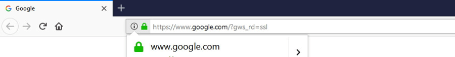
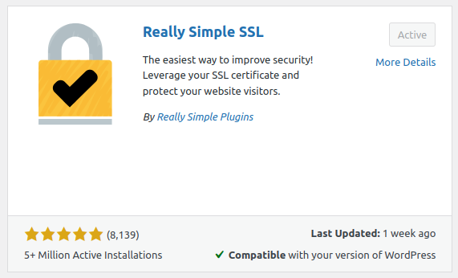
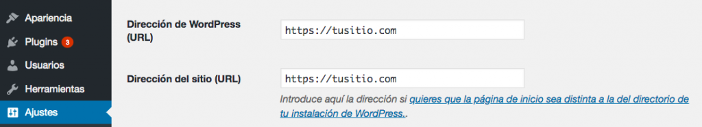

## WordPress Block Editor
[WordPress Block Editor Documentation](https://wordpress.org/support/article/wordpress-editor/)

## Wordpress paso a paso
Sea cual sea la url de nuestro sitio, agregando **/wp-admin** a nuestra página accederemos al menú de administración de nuestro sitio.

## Actualizar e instalar certificado SSL
En *Dashboard / Updates* instalar actualizaciones necesarias.
En *mydomain***/wp-admin** ir a Plugins, Add New, install *Really Simple SSL*.

## Cambiar la url de las publicaciones
- *https://* Protocolo

- *myurl.com/* Dominio

- *about*/ Slug
Ajustar en Settings/Permalink/Post name para que la url sea
**http://apex/sample-post/**
y no *http://apex/2021/04/06/sample-post*

## Conceptos básicos de Wordpress
Wordpress se estructura el contenido del sitio en 4 elementos
- **Categorías**: Clasifican el contenido, se usan para agrupar contenidos relacionados entre sí y mantener un orden jerárquico y generar subcategorías.
- **Etiquetas**: Palabras clave para búsquedas internas dentro de nuestra web. Son los metadatos que describen detalles específicos del contenido.
- **Entradas**: Son el contenido informacional que tiene la web.
- **Páginas**: El contenido estático, es aquel contenido que difícilmente va a cambiar, como la sección de contactos, inicio, quiénes somos, etc. Páginas, no entradas, que no cambian su información a lo largo del tiempo.

## Wordpress Dashboard
La barra superior es un acceso directo para las funcionalidades que tenemos en el panel lateral.

#### Entradas y Páginas
Wordpress está construído en torno a estos dos conceptos básicos.
Las **entradas** son publicaciones de un web, artículos listados en orden cronológico.
Las **páginas** son usadas para un contenido más estático, un contenido que se modifica con muy poca frecuencia.

Recomendable instalar el editor clásico. Se puede previsualizar o ver el código html.
Creada nuestra entrada, podemos crear nuestra categoría

## Plugins
- **SSL**: *Really Simple SSL*
- **Plugins constructores**: *Elementor*, Divi o Beaver Builder
- **Formulario de contacto**: *WP Forms*, Contact Form 7 o Gravity Forms
- **Optimizacion de imagenes**: Shortpixel, Smush 
- **Sliders**: Slider Revolution
- **Plugins sociales**
- **Plugins traductores**
- **Plugins de correo**: Mailchimp
- **Plugins eCommerce**: WooCommerce

# ES / SSL & HTTPS Config
Para cualquier sitio web es necesario definir estandares de seguridad solidos
Tanto SSL *Secure Sockets Layer* como HTTPS *Secure Hypertext Transfer Protocol* son clave para esto
SSL y HTTPS funcionan de la mano, primero hay que obtener el certificado y luego configurar Wordpress para que cargue HTTPS

## SSL
SSL es una tecnología que crea una conexión segura entre un sitio web y un navegador
Los sitios web que utilizan SSL tiene certificados que te permiten saber que tu información privada está segura durante cada transferencia

	

- Los datos de los usuarios en nuestra web serán más seguros
- La web será más confiable
- Clave para el SEO

**Para instalar el certificado SSL en nuestro sitio Wordpress, instalaremos el plugin Really Simple SSL**

	

## HTTPS
Asi como configuramos el SSL, también debemos configurarlo para transmitir datos mediante el Protocolo de transferencia de hipertexto seguro HTTPS. HTTPS aplica estándares de seguridad más altos que HTTPS
Para configurarlo, el sitio web necesita tener un certificado SSL

**Para configurar HTTPS en Wordpress, iremos a Settings, General Settings y escribir https en los campos de la url**

	

